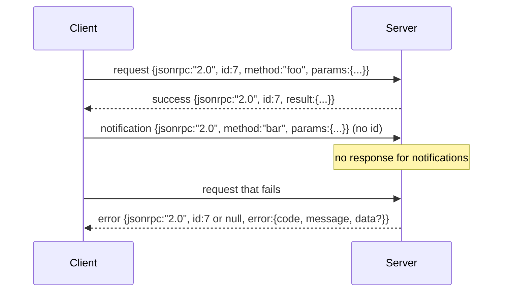

# 基于换行分隔 stdio 的 JSON-RPC 2.0

> 模型 client 和 tool server 之间的 transport，就是跑在 stdio 上的 JSON-RPC。自己手搓一遍，你才知道每一层 framing 到底在替你付什么成本。

**类型：** Build
**语言：** Python
**前置要求：** 第 13 阶段第 01-07 课、第 14 阶段第 01 课
**预计时间：** ~90 分钟

## 学习目标
- 通过 stdin/stdout 说 JSON-RPC 2.0，framing 采用按行分隔的 JSON。
- 正确映射 5 个标准错误码（-32700、-32600、-32601、-32602、-32603），并给出对得上的语义。
- 区分 request、response、notification 和 batch，而不是发明新的 envelope key。
- 每一行最多吞掉一个 parse error，不能把后续整条流一起毒死。
- 用 `io.BytesIO` 做一个可自终止 demo，让这节课不用起子进程也能跑。

## 为什么 JSON-RPC 还在当通用语

2026 年，一个 coding agent 在一场 session 里会同时跟十来个 tool server 说话。每个 server 要么是单独的进程，要么是远端 endpoint。线上的线协议其实十多年都没怎么变：JSON-RPC 2.0 还是那套。它能活到现在，不是因为完美，而是因为它两页纸、足够对称，而且不强迫你在 streaming、batching、transport coupling 里三选一。

JSON-RPC 可以同样跑在 stdio、socket、websocket、HTTP 上。只要 client 和 server 都守规矩，client 就能驱动一个自己没见过的 server。

这节课做的是 stdio 变体。每个请求一行 JSON，每个响应一行 JSON，transport 边界就是 `\n`。

## Wire Shape

一共 4 种 envelope。两种由 client 发，两种由 server 回。



notification 没有 `id`，server 就不能回它。如果 server 对 notification 也写回响应，client 根本不知道该把这条消息挂回哪个调用点。正是这一条规则，把 framing 的复杂度压了下来。

batch 则是一个 JSON 数组，里面装 request 或 notification。server 返回一个响应数组，顺序可以不同，但每个非 notification 条目都要对应一个响应。如果整个 batch 全是 notification，server 什么都不回。

## 5 个错误码

```text
-32700  Parse error      JSON 解析失败
-32600  Invalid Request  envelope 形状错了
-32601  Method not found
-32602  Invalid params
-32603  Internal error
```

`-32000` 到 `-32099` 保留给 server 自定义错误。其余值交给应用自己定。这节课只守 5 个标准码。如果 handler 抛错，transport 就把它包成 `-32603`，并在 `data.exception` 里带上异常类名。

parse error 有一条特殊规则：响应里的 `id` 必须是 `null`，因为请求连解析都没成功，自然拿不到 id。

## 换行 framing 与 BytesIO Demo

transport 每次读一整行字节，直到 `\n`。如果一行解析失败，就写回一条 `-32700` 且 `id: null` 的错误，然后继续读下一行。整条流不能因此报废。

这节课里我们用一对 `io.BytesIO` 包起来充当 stdin/stdout。server 读请求直到 EOF，为每条请求写响应，然后退出。client 再把响应读回来。既不用 spawn 进程，也不用处理 timeout。因为 Python 的 `io` 接口给的是同样的 `.readline()` / `.write()` 契约，所以行为和真实子进程管道是一致的。

## 方法分发

transport 不知道系统里到底有哪些方法。它只把 `(method, params)` 交给 harness 提供的 `handler(method, params)`。handler 返回结果，或者抛异常。这里定义 3 个异常类来映射特定错误码：

```text
MethodNotFound -> -32601
InvalidParams  -> -32602
Anything else  -> -32603 with exception name in data
```

transport 不该知道 tool registry。registry 在 handler 背后。这种分层是故意的：transport 只管 JSON-RPC，registry 只管 tool shape，dispatcher（第 23 课）再把两者粘起来。

## 流上的错误行为

```text
client writes              server reads             server writes
---------------            -----------              -------------
{...valid request...}      parses ok                {...response, id matches...}
{...broken json...         parse fails              {id:null, error: -32700}
{...valid request...}      parses ok                {...response, id matches...}
{...missing method...}     invalid envelope         {id:X, error: -32600}
```

一行坏 JSON，不能停整个 loop。缺 `method` 字段，也不能停。handler 抛错，同样不能停。transport 一直读到 EOF 为止。

## Notification 与非对称流

notification 是 fire-and-forget。harness 会用它发进度事件、取消信号和日志行。一个长时间运行的 tool 可以靠 notification 侧向流式汇报状态，而不用每次都 round-trip。

这节课实现了一个 outbound notification helper：`write_notification`。server 可以在处理 request 期间用它写出进度。demo 里会展示这种形状：请求进来，handler 发两条进度 notification，最后再写最终响应。

## 怎么读代码

`code/main.py` 定义了 `StdioTransport`、解析辅助函数 `parse_request`、3 个写辅助函数（`write_response`、`write_error`、`write_notification`），以及主分发循环 `serve`。错误码常量放在模块顶层。

`code/tests/test_transport.py` 覆盖了：

- 5 个标准错误码
- notification 不应有响应
- batch 输入输出
- 坏 JSON 后继续读流
- handler 在处理中途写 notification 的非对称流程

## 往前走

这份 transport 足够支撑后面的课程。生产 transport 通常会再补 3 件事：

- 一个能跨转发链存活的 correlation id
- 一条取消通道（如 `$/cancelRequest`）
- 一次 content-type negotiation handshake，让同一条 socket 能说 JSON-RPC 也能说 Streamable HTTP

注意，这些都不会改变 wire 本身，只是在外面再加一层元数据。
