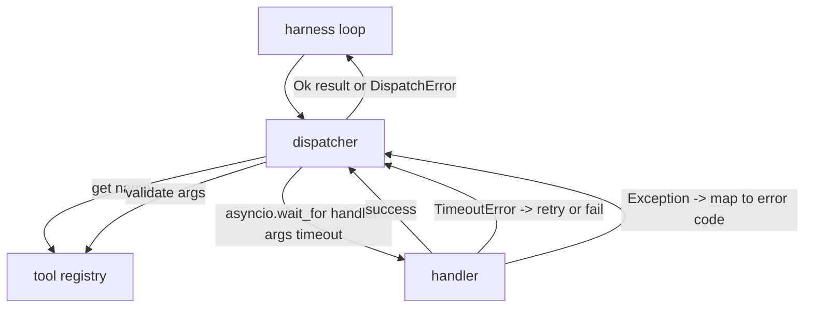
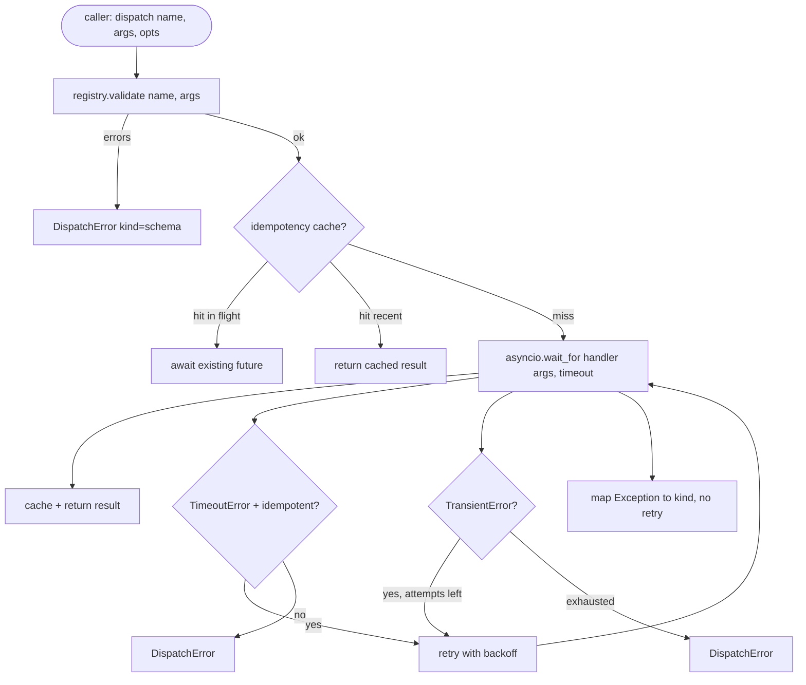

# Function Call Dispatcher

> dispatcher 是 harness 为 schema 上每一条承诺买单的地方。timeout、retry、dedupe、错误映射，全压在这一道接缝上。

**类型：** Build
**语言：** Python
**前置要求：** 第 13 阶段第 01-07 课、第 14 阶段第 01 课
**预计时间：** ~90 分钟

## 学习目标
- 给每次 tool 调用包一层超时控制，保证 loop 拿到的是带类型的错误，而不是直接挂死。
- 用指数退避加 jitter 做重试，并设最大尝试次数。
- 基于 idempotency key 去重重试，避免“慢的原调用还没回来，重试又起了一次”。
- 把 handler 异常和 transport 故障统一映射到 harness 已经看得懂的错误信封里。
- 给并行 dispatch 加并发上限，防止一次 fan-out 40 个 tool call 把 event loop 打爆。

## Dispatcher 在哪一层

它夹在 harness loop（第 20 课）和 tool registry（第 21 课）中间。transport（第 22 课）把输入喂进 loop；loop 把 tool call 交给 dispatcher；dispatcher 找 registry、校验参数、跑 handler，最后返回结果或者一个 JSON-RPC 风格的错误信封。



只有 dispatcher 知道 timer、retry 和 idempotency。loop 不知道，registry 不知道，handler 也不该知道。这种隔离本身就是目的。

## 超时

每个 tool 都有默认超时。registry record 里带 `timeout_ms`，dispatcher 也允许调用方按单次调用覆写。实现上用 `asyncio.wait_for`。一旦 timeout，handler task 会被取消，dispatcher 返回 `DispatchError(kind="timeout")`。

但 timeout 默认不等于“可以安全重试”。一个 `db.write` 超时了，不代表它没写进去；直接 retry 很可能把数据写两遍。所以 dispatcher 必须看 registry 里的 `idempotent` 标志：可幂等的 tool 才自动重试，不可幂等的直接失败。

## 指数退避重试

重试策略固定为最多 3 次，退避指数增长，并带一点随机抖动：

```text
attempt 1  -> delay 0
attempt 2  -> delay 0.1s * (1 + random[0..0.5])
attempt 3  -> delay 0.4s * (1 + random[0..0.5])
```

只对 `timeout` 和 `transient` 错误重试。`schema`、`not_found`、`internal` 都不重试。schema 错误是确定性的，重试只会烧预算。

retry loop 还必须尊重 harness 预算。如果调用方剩余 tool call 预算已经是 0，dispatcher 第一轮就要 fail fast，返回 `kind="budget_exceeded"`。

## Idempotency Key 去重

“重试和原调用同时在飞”是真实线上事故。第一次调用卡在 4.9 秒，5 秒超时一到，retry 起飞；结果原调用其实还在后端执行，于是两次请求一起打进去。若 tool 是 `payments.charge`，那就是双扣款。

dispatcher 接受一个可选的 `idempotency_key`。若同一个 key 当前还在飞，新来的调用就直接 await 那个 in-flight future；若 key 刚跑完，60 秒内还保存在缓存里，直接返回缓存结果，吸收迟到重试。

key 必须由调用方来派生。harness 可以用 `f"{step_id}:{tool_name}:{hash(args)}"`。dispatcher 不替你生 key，因为如果单纯按参数 hash，两次语义不同但参数恰好相同的调用就会被错判成同一个。

## 错误信封

失败的 dispatch 一律收敛成一个形状：

```text
DispatchError
  kind        : "timeout" | "transient" | "schema" | "not_found" | "internal" | "budget_exceeded"
  message     : str
  attempts    : int
  jsonrpc_code: int   (one of -32601, -32602, -32603)
```

harness loop 再用 `kind` 决定下一步。`schema` 和 `not_found` 走 `on_error` 并触发 replan；`timeout` 和 `transient` 也走 `on_error`，但是否 replan 取决于尝试次数；`budget_exceeded` 则触发 `on_budget_exceeded`。

## Fan-out 的并发上限

裸跑 `gather(*calls)` 会让所有协程同时起飞。40 个 tool call，就是 40 个 socket 或 40 条子进程管道。大多数后端根本扛不住。

dispatcher 把 `gather` 包在 semaphore 里。默认并发上限是 8。每次 dispatch 先拿 semaphore，结束后释放。调用方看到的仍是 gather 形状，但底层调度被压住了。

## 单次调用流程



## 怎么读代码

`code/main.py` 定义了 `Dispatcher`、`DispatchError` 和 `TransientError`。dispatcher 构造时吃进一个 registry。唯一入口是异步的 `dispatch(name, args, ...)`。每次尝试的 timeout 在 `_run_with_retries` 里用 `asyncio.wait_for` 套上。`gather_bounded(calls)` 负责按并发上限跑一组 dispatch。

`code/tests/test_dispatcher.py` 覆盖：

- timeout 触发
- transient 错误时重试
- schema 错误不重试
- idempotency 去重（同一个 key 的两个并发调用最终只打到一次 handler）
- 并发上限（验证 semaphore 真在工作）

测试里只用 `asyncio.sleep(0)` 和基于 `Counter` 的确定性 handler，所以跑起来是毫秒级，不依赖真实 wall-clock。

## 往前走

生产 dispatcher 很快会再加两件事。第一是结构化日志：每次 `dispatch.attempt`、`dispatch.retry` 都单独打点。第二是熔断器：某个 tool 在一个时间窗里连续失败 N 次，就直接进入 cool-down，新的 dispatch 立即返回 `kind="circuit_open"`，而不是继续撞后端。

这两样都能加在当前契约之上，不需要改 handler。第 24 课会把 dispatcher 接到一个 plan-and-execute agent 上，让你看到前面四块是怎么一起跑起来的。
