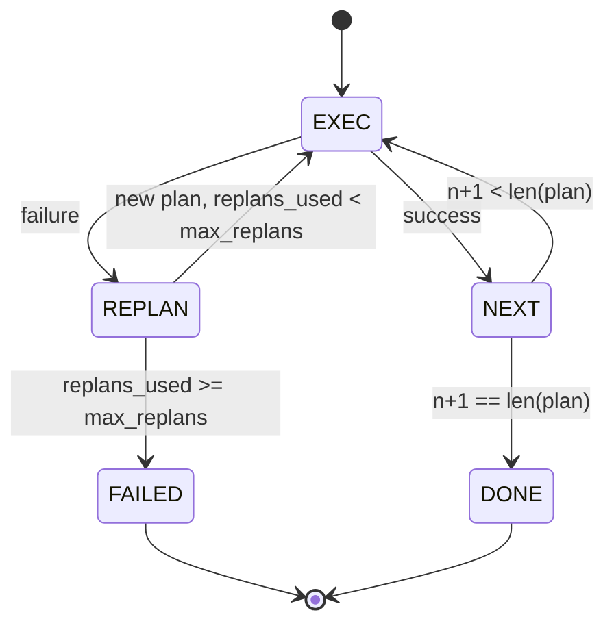

# Plan-Execute 控制流

> 扛不住失败的 plan，本质上只是脚本。能在失败后 replan 的脚本，才配叫 agent。先把 replanner 搭出来。

**类型：** Build
**语言：** Python
**前置要求：** 第 13 阶段第 01-07 课、第 14 阶段第 01 课
**预计时间：** ~90 分钟

## 学习目标
- 把 plan 表示成一组有序、带类型的 step，让 executor 能理解进度与结果。
- 顺序执行 step，并在失败时可控地把控制权交回 planner。
- 从当前 cursor 位置携带上一次错误重新规划，让下一版 plan 真正吃到上下文。
- 每次 plan 修订都发出一份 diff，好让 tracer 或 UI 看清 plan 为什么变了。
- 强制执行两种硬预算：step 上限和 replan 上限。

## Plan and Execute，不是 chain-of-thought

chain-of-thought agent 只是一直吐 token，然后把“工具调用到底在哪结束”这件事丢给 loop 去猜。plan-and-execute agent 先吐一份结构化 plan，再由 harness 按确定性方式去执行。plan 是可以被 harness 直接审视的数据，执行则是 harness 把这些数据通过 dispatcher 跑起来。

它天然拆成两块：

- planner：负责产 plan
- executor：负责跑 plan

真正有意思的是 executor 失败时怎么办。只有 3 条路：

```text
1. Abort         (直接失败，把错误往上抛)
2. Skip          (标记这步失败，继续后面的)
3. Replan        (把错误交回 planner，从当前 cursor 起一份新 plan)
```

能选第 3 条的，才不是死板脚本。

## Step 形状

```text
Step
  id              : int           (在同一版 plan 内单调递增)
  tool_name       : str
  args            : dict
  expected_outcome: str           (planner 声明的成功条件)
  result          : Any | None
  error           : str | None
```

`expected_outcome` 是 planner 顺手写下的一句短话，说明它预期这步产出什么。executor 不强制校验它；它的价值在于两处：replanner 修 plan 时可以读它，事件流也可以把它发出去，供 tracer 告诉你“这步本来是想干这个”。

## Planner 形状

```python
def planner(goal: str, history: list[Step], last_error: str | None) -> list[Step]:
    ...
```

它应该是纯函数。`goal` 是用户目标，`history` 是已经执行过的 step（结果和错误都已写回），`last_error` 首次为 `None`，后续则是最近一次失败信息。planner 返回的是“从当前 cursor 往后”的下一版 plan。

planner 不知道 executor，不知道 retry，也不知道 timeout。它唯一职责就是产 plan。

## Executor

executor 本身是个小状态机。每个 step 通过 dispatcher 跑完后，结果只有三类：成功、可重规划失败、致命失败。可重规划失败把控制权还给 planner；致命失败（比如预算打满、replan 上限耗尽）直接返回 `FAILED`。



## 修订时发 Plan Diff

planner 在失败后回一版新 plan 时，executor 要发一条 `plan.diff` 事件，至少带 3 个字段：

```text
removed: list of step ids that were in the old plan and are not in the new
added  : list of step ids in the new plan that were not in the old
revised: list of step ids whose tool_name or args changed
```

UI 或 tracer 就能把被删掉的 step 画删除线，把新增的高亮出来。重点不在 diff 具体格式，而在于“修 plan”必须是可见事件，不能静默改写。

## 两种预算，都是硬上限

`max_steps` 限制整个 session 的 step 总执行数，包含 replan 后新增的 step，默认 12。一个线性的 5 步 plan，如果中途 replan 两次、每次又多出 3 步，总执行数就是 16，直接超限。此时 executor 应拒绝继续 replan，并返回 FAILED。

`max_replans` 限制第一次 plan 之后还能重规划多少次，默认 5。它甚至比 step 预算更关键。一个 planner 如果坏到连续 5 次都吐同一份坏 plan，你不该等 step 预算慢慢把它拖死，而该尽快、明确地告诉上层：replan 用完了。

## 这节课的 deterministic planner

这节课不直接调模型，而是内置一个 deterministic planner，根据 `last_error` 不同走不同分支：

```text
last_error is None    -> 生成一份 4 步 plan
last_error matches X  -> 生成一份绕开 X 的 3 步 plan
last_error matches Y  -> 生成一份优雅放弃的 2 步 plan
otherwise             -> 返回 []，表示没法继续 replan
```

这已经足够把 executor 的所有关键路径打透：线性成功、replan 一次、replan 两次、replan 预算耗尽，以及 step 预算耗尽。

## 结果形状

```text
SessionResult
  status      : "completed" | "failed"
  reason      : str     ("goal_met" | "step_budget" | "replan_budget" | "no_plan")
  history     : list[Step]
  revisions   : list[PlanDiff]
  events      : list[Event]
```

第 20 课的 harness loop 可以直接消费这个结果。第 23 课的 dispatcher 负责真正执行每个 step。第 21 课的 registry 校验 step 的 args。第 22 课的 transport 则能把整个流通过 JSON-RPC 对外暴露给模型 client。

## 怎么读代码

`code/main.py` 定义了 `PlanExecuteAgent`、`Step`、`PlanDiff`、`SessionResult` 和 deterministic planner。executor 核心是一条 `run(goal)`，返回 `SessionResult`。plan diff 是通过比较 step id 和 `(tool_name, args)` tuple 算出来的。

`code/tests/test_agent.py` 覆盖：

- 线性成功
- 中途失败并 replan 一次
- replan 耗尽后返回 `failed:replan_budget`
- step 预算耗尽
- `plan.diff` 事件格式

## 往前走

一旦你把它接到真实模型上，最先想补的两个扩展通常是：

- **部分 plan 缓存。** 前 3 步已经成功、第 4 步失败时，不该每次都重跑前 3 步。executor 已经有 `history`，剩下就看 planner 会不会读。
- **并行分支。** 当前 executor 严格串行。若 planner 能发出独立分支（例如 `gather_step`），就能通过 dispatcher 并发跑多个 tool call。

这两件事都会显著加复杂度。正因为如此，先把线性 executor 钉住，才是正路。这节课做的就是这件事。
