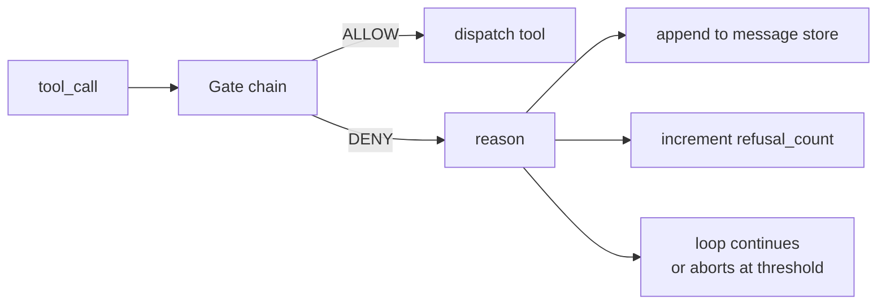
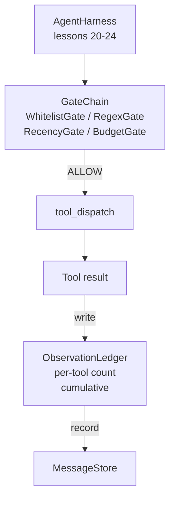

# 顶点课 25：Verification Gate 与 Observation Budget

> 没有 verification layer 的 agent harness，就像披着风衣的愿望。这节课把决定权交给一条确定性的 gate chain：tool call 能不能发、模型最多能看多少输出、什么时候 loop 必须停，因为它已经读太多了。整条链由一组小而明确的 gate 加上一份 observation ledger 组成，ledger 负责记录模型看过的每一份 token。

**类型：** Build
**语言：** Python（stdlib）
**前置要求：** 第 19 阶段 · 20-24（Track A1：agent loop、tool registry、message store、prompt builder、model router），第 14 阶段 · 33（instructions as constraints），第 14 阶段 · 36（scope contracts），第 14 阶段 · 38（verification gates）
**预计时间：** ~90 分钟

## 学习目标

- 实现一个 `VerificationGate` 协议，暴露确定性的 `evaluate(call)` 方法。
- 把 budget、recency、whitelist、regex 这些 gate 串成一条带短路语义的 chain。
- 用按 tool 和 turn 建索引的 `ObservationLedger` 跟踪每一次 observation。
- 在累计 observation budget 将被打穿时拒绝 tool call。
- 返回结构化的 `GateDecision` 记录，供下游 observability 吃进去。

## 问题所在

一旦 agent harness 让模型自由调用 tool，三个坑基本一小时内就会出现。

第一个坑是 observation 无上限。对一个 20 万行的 repo 做一次 grep，半百万 token 直接灌进下一轮。模型每 KB 只真正用到一个匹配，剩下全是上下文浪费。token 账单更大，agent 反而更差。

第二个坑是 recency 失真。一个长任务积了 50 次 tool call，模型还把第 3 turn 的第一份 `read_file` 当成活状态反复读。第 47 turn 的编辑根本进不了 prompt，因为 prompt builder 先序列化了最早的 observation。

第三个坑是权限爬升。一个研究任务本来只该调用 `web_search`，结果模型随手发明了个 tool name，harness 又默认宽松，于是它最后跑了 `shell`。等有人去看 trace 的时候，`/tmp` 里已经躺了一坨垃圾文件，顺手还 curl 了一下私有 API。

verification gate 就是那个负责说“不”的部件。它不是模型，不是 judge，而是一个对 `(call, history, ledger)` 做确定性计算的函数，只返回 ALLOW 或 DENY，并附上 reason。reason 会被记日志、回给模型，然后 loop 决定继续还是中止。

## 核心概念



gate 就是任何实现了 `evaluate(call, ctx) -> GateDecision` 的东西。chain 是一组有序列表。遇到第一个 deny 就短路返回。顺序很关键：便宜的结构性 gate 要先跑，昂贵的 token 预算 gate 要后跑。

这节课自带 4 种 gate：

- `WhitelistGate`。允许的 tool name 是一组显式集合。集合外一律 deny。这是最便宜的 gate，先跑。
- `RegexGate`。对 tool args 跑正则。适合拦 `rm -rf` 这种 shell 调用，或禁止 HTTP 打内网 IP。它只看 call payload。
- `RecencyGate`。模型只允许看到最近 N 个 turn 的 observation。更老的 observation 要被 mask。若一个 tool call 产出的结果只会落进已经过期的窗口，它就该被拒绝。
- `BudgetGate`。整个 session 中模型累计读过的 token 有上限。ledger 一旦告诉你上限到了，后续所有 tool call 都拒绝。

Observation ledger 负责账本。每次成功 tool call 都写一行：tool name、turn、输出 token 数、累计 token 数。它至少能回答两个问题：模型总共看了多少，以及在某个 tool 上看了多少。budget gate 用第一个答案；你在练习里会写一个 per-tool budget gate，用第二个。

## 架构



harness 先问 chain。chain 点头，tool 才能跑；tool 跑完后 ledger 记账，结果追加进 message store。若 chain 拒绝，模型就收到一条 refusal system message，而 loop 决定是重试还是中止。

## 你要构建什么

实现由一个 `main.py` 加测试组成：

1. `Observation` 和 `ToolCall` dataclass，定义 wire shape。
2. `ObservationLedger`，记录 `(turn, tool, tokens)`，并暴露 `cumulative()` 和 `per_tool(name)`。
3. `GateDecision`，携带 `(allow, reason, gate_name)`。
4. `VerificationGate` 协议；每个 gate 都实现 `evaluate(call, ctx)`。
5. `GateChain`，包住一组有序 gate，第一个 deny 就返回，否则全部通过即 allow。
6. 一个极小的 synthetic agent loop demo。共 3 个 turn，第 3 个 turn 触发 budget gate，loop 用干净的 refusal 退出，并给出非零 refusal count。

token counter 故意只用一个很蠢的 `len(text) // 4` 估算。重点是 gate plumbing，不是 tokenizer。上生产时再换成真实 tokenizer。

## 为什么 chain 顺序重要

deny 总比 allow 便宜。`WhitelistGate` 是 O(1) 的哈希查找；`RegexGate` 是 O(pattern * argv)`；`RecencyGate` 要读 message store 的一小段；`BudgetGate` 要看整本 ledger。顺序应该按成本从低到高排，这样被拒绝的 call 会尽早短路，不会把昂贵逻辑白跑一遍。

顺序还应该按 blast radius 排。Whitelist 是最强约束：这个 tool 根本不在契约里。Regex 次之：这个参数形状不在契约里。Recency 再后：调用本身合法，但上下文窗口已经老了。Budget 放最后，因为它本质上只在前面都过了时才有意义。

## 它如何接进 Track A

前几课已经给了你 loop、tool registry、message store、prompt builder 和 model router。这节课补的是模型与工具之间的那一层。第 26 课会把 ALLOW 之后真正执行 tool call 的 sandbox 接上去。第 27 课的 eval harness 会把 refusal count 当作质量信号之一。第 28 课会把 gate decision 写进 OpenTelemetry span。第 29 课把所有东西缝成一个能跑的 coding agent。

## 运行方式

```bash
cd phases/19-capstone-projects/25-verification-gates-observation-budget
python3 code/main.py
python3 -m pytest code/tests/ -v
```

demo 会逐 turn 打印 trace，包括每次 gate decision，并以 0 退出。测试覆盖 ledger、每个 gate 的单测、chain 的短路行为，以及 synthetic loop 的端到端流程。
