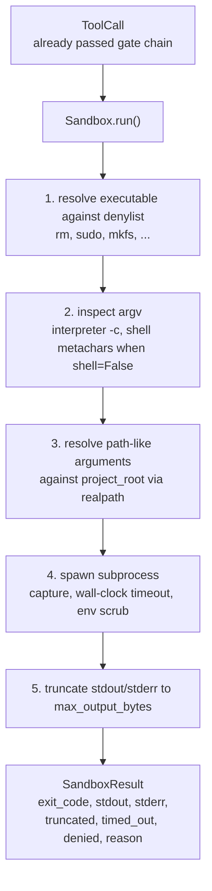
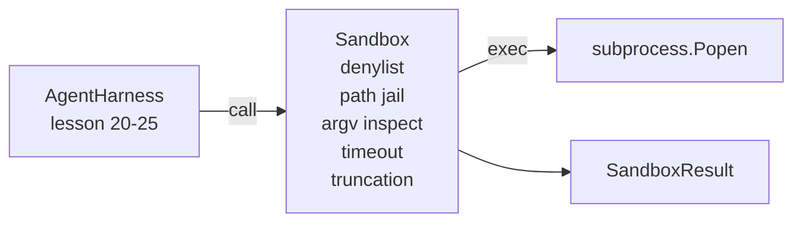

# 顶点课 26：带 Denylist 与 Path Jail 的 Sandbox Runner

> verification gate 决定一个 tool call 应不应该跑，sandbox 决定它真跑的时候到底会发生什么。这节课交付一个 subprocess runner：它会拒绝危险可执行文件、拒绝危险 argv 形状、把所有文件路径关进 project root、截断超长输出，并在 wall-clock timeout 到达时杀掉失控进程。它是夹在模型与操作系统之间的第二道防线。

**类型：** Build
**语言：** Python（stdlib）
**前置要求：** 第 19 阶段 · 25（verification gates 与 observation budget），第 14 阶段 · 33（instructions as constraints），第 14 阶段 · 38（verification gates）
**预计时间：** ~90 分钟

## 学习目标

- 构建一个 `Sandbox` 类，对 `subprocess.run` 做 timeout、capture 和 truncation 封装。
- 按命令名走 denylist，按 argv 结构走 inspector，拒绝危险调用。
- 拒绝任何解析后落在 project root 之外的 path 参数。
- 在 shell 模式关闭时拒绝 shell 元字符。
- 返回结构化 `SandboxResult`，供 observability 和 eval harness 消费。

## 问题所在

一个能直接 shell out 的 coding agent，一轮里就可能装后门、导出密钥、把开发机搞坏，或者顺手刷一笔云账单。成本最低的防御当然是别给它 shell；第二低的，就是做一个知道该拒绝什么的 sandbox。

真实 trace 里最常见的 3 类故障如下。

第一类是危险可执行文件。模型在修路径问题时，很容易祭出 `sudo`、`chmod -R 777`、`rm -rf`、`mkfs`、`dd`。这些根本不该出现在 agent run 里。denylist 要按名字和 alias 把它们拦掉。

第二类是 argv 花活。模型被告知“不能开 shell”之后，会借解释器偷渡：`python3 -c "import os; os.system('rm -rf /')"`、`bash -c '...'`、`node -e '...'`、`perl -e '...'`。sandbox 必须知道：解释器带 `-c` / `-e`，本质上就是换皮 shell。

第三类是路径逃逸。用户让它读 `./src/main.py`，它最后去读 `../../etc/passwd`。sandbox 必须把所有 path 参数走 `os.path.realpath`，再检查前缀是否仍在 root 里。

这不是内核级安全沙箱。一个有意攻击者如果真的拿到执行权，依然能想办法逃。这个 sandbox 的目标是开发期护栏：把最常见、最蠢、最容易造成破坏的调用大声拒绝掉。

## 核心概念



sandbox 有 4 个拒绝轴：命令名、argv、路径、结构。四者都先在纯函数层面检查；全部通过之后，subprocess 才真正启动。

`SandboxResult` 的 exit code 约定如下：0 表示成功，非零表示进程失败，外加三个 sentinel 语义：拒绝是 `-100`，timeout 是 `-101`，截断则保留真实 exit code，但把 `truncated` flag 置上。后续课程不再去 parse stderr，而是直接读这个结构化结果。

## 架构



denylist 是一个 `frozenset`，装的是可执行文件 basename。alias（如 `/bin/rm`、`/usr/bin/rm`）最终都会归并到同一个 basename。argv inspector 则识别解释器形状：如果 `argv[0]` 是解释器，且后面某个参数以 `-c` 或 `-e` 开头，就直接拒绝。若调用未显式要求 shell，出现 `;`、`|`、`&`、`>`、`<`、反引号、`$()` 这些 shell 元字符也要拒绝。

path jail 是最细的部分。sandbox 构造时吃一个 `project_root`。任何“看起来像路径”的参数（包含 `/` 或命中已有文件）都会先走 `os.path.realpath`，再与 root 的 realpath 做前缀比较。若解析后的目标不在 root 之下，就拒绝。也正因为用的是 realpath，所以 symlink 逃逸同样会被抓住。

## 你要构建什么

实现由 `main.py` 和测试目录组成：

1. `SandboxResult` dataclass：`exit_code`、`stdout`、`stderr`、`truncated`、`timed_out`、`denied`、`reason`、`duration_ms`
2. `SandboxConfig` dataclass：`project_root`、`max_output_bytes`、`timeout_seconds`、`denylist`、`interpreter_block`
3. `Sandbox` 类：`run(argv, *, shell=False, cwd=None)` 返回 `SandboxResult`
4. 内部拒绝辅助函数：`_check_executable_denylist`、`_check_argv_interpreter`、`_check_shell_metachars`、`_check_path_jail`
5. 输出截断逻辑：置上清晰的 `truncated` flag，并在输出流中加 marker 行
6. 文件底部 demo：依次跑一组合法调用和攻击式调用，逐个展示结果

sandbox 默认用 `subprocess.run` 且 `shell=False`，同时打开 `capture_output=True`。wall-clock timeout 依赖 `timeout` 参数；发生 `TimeoutExpired` 时，sandbox 会杀掉进程组并合成一份 `SandboxResult`。

## 为什么这不是真沙箱

这节课的 sandbox 没有 namespace、cgroup、seccomp、gVisor、Firecracker，没做任何内核级隔离。subprocess 能做到的事，sandbox 也做得到。它的保护是结构性的：最常见的危险调用会被拒绝，而且拒绝会写进 observability，而不是悄悄跑过去。

生产 agent 还要继续叠：放进无特权 Docker、放进 microVM、drop capabilities、把 project root 挂成只读、scratch dir 单独读写、配内存和 CPU 的 ulimit、把环境变量削成白名单。第 29 课会稍微碰一点，但完整的操作系统隔离不在这一课里。

## 运行方式

```bash
cd phases/19-capstone-projects/26-sandbox-runner-denylist
python3 code/main.py
python3 -m pytest code/tests/ -v
```

demo 会先建一个临时目录，丢一份干净文件进去，再跑一串合法与对抗调用。合法调用成功，拒绝调用返回 `denied=True` 与 reason，timeout 返回 `timed_out=True`，截断则置 `truncated=True`。最后 demo 以 JSON 表格形式打印结果，并以 0 退出。
