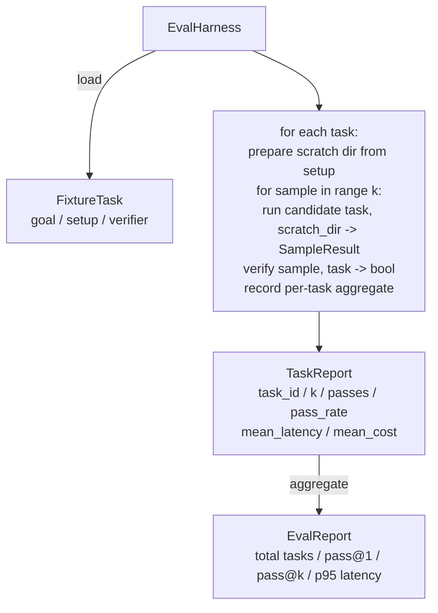

# 顶点课 27：带 Fixture Tasks 的 Eval Harness

> coding agent 的上限，取决于你拿什么任务集去量它。这节课会做一套 evaluation harness：吃进一目录 fixture task，把每个 task 喂给候选 agent，用确定性 verifier 评分，再聚合成 pass@1、pass@k、平均延迟和平均成本。harness 就是那份能分清“回归”与“重构”的真值源。

**类型：** Build
**语言：** Python（stdlib）
**前置要求：** 第 19 阶段 · 25（verification gates），第 19 阶段 · 26（sandbox runner），第 14 阶段 · 30（eval-driven agent development），第 14 阶段 · 19（SWE-bench 与 GAIA benchmarks）
**预计时间：** ~90 分钟

## 学习目标

- 把 fixture task 定义成目标、setup、verifier 组成的三元组。
- 对每个 task 跑多次 sample，并计算 pass@1 与 pass@k。
- 聚合 latency 和 cost，给出均值与 95 分位。
- 把确定性 verifier（文件 diff、exit code、regex match）做成可复用函数。
- 产出结构化 JSON 报告，供回归跟踪脚本直接吞。

## 问题所在

没有 eval harness 的 agent benchmark，通常会死在三种故障里。

第一种是假通过。agent 说自己修好了，人工扫一眼 diff，套件就被标绿。三周后同一个 bug 又从回归测试里冒出来，因为 agent 当时只是推理得很像样，并没有真的修对。

第二种是静默回归。prompt template 改了一版，某个响亮任务提升 4%，某个不显眼任务却掉了 14%。没有 goldset 和逐 task 分数，回归就一路溜进 main，直到客户来报错。

第三种是任务集漂移。周一 eval 跑了 100 个任务，周五只跑了 95 个，因为有人把 5 个 fixture 改名了。pass rate 看起来像涨了 5%，其实纯属统计幻觉。

harness 的意义就是把这些幻觉打回事实：每次都按可复现顺序跑完全部 fixture，再用确定性 verifier 返回 true/false。

## 核心概念

```mermaid
flowchart LR
  F1[fixtures/task_001/<br/>task.json + expected/] --> Harness
  F2[fixtures/task_002/<br/>...] --> Harness
  Harness[Harness<br/>for each task:<br/>setup / run agent k samples /<br/>verify each sample /<br/>record latency, cost]
  Harness --> Report[EvalReport<br/>pass@1 / pass@k<br/>mean ms / mean cost]
```

一个 `FixtureTask` 是一个小 JSON，再加一个可选的 `expected/` 目录。JSON 至少声明：

- `id`
- `goal`：喂给 agent 的 prompt
- `setup`：要放进 scratch dir 的文件
- `verifier`：调用哪一个 verifier，以及参数

3 种 verifier 形状已经能覆盖绝大多数有用任务：

- `file_equals`：agent 跑完后，把某个文件与 expected 内容做精确比对。适合“必须按这个方式修”的任务。
- `regex_match`：对指定文件内容跑正则。适合“函数必须存在并返回 X”这种存在多种等价写法的任务。
- `shell_exit_zero`：通过第 26 课的 sandbox 执行一条 shell 命令，只有 exit code 为 0 才算通过。适合“测试必须全过”。

harness 对每个 task 跑 `k` 次。pass@k 可以表示成 `1 - (1 - p)^k`，其中 `p` 是经验通过率；同时 harness 也会把原始通过次数一起报出来，让你看到方差。latency 按 sample 的 wall-clock 统计。cost 则吃 agent 自报的 token、USD 或二者之一，然后给出逐 task 与总量聚合。

## 架构



candidate 是一个 callable：`Callable[[FixtureTask, str], SampleResult]`。harness 自己用 `tempfile.mkdtemp()` 准备 scratch dir，并把路径当普通字符串传进去。harness 不关心 candidate 是怎么工作的。它可以是一个确定性 patch applier，也可以是真实 LLM agent，甚至是 fuzzer。harness 只认 `SampleResult` 这个契约。

## 你要构建什么

`main.py` 里会交付：

1. `FixtureTask` dataclass
2. `SampleResult` dataclass：`success_self_reported`、`latency_ms`、`cost_units`、`edits`
3. `TaskReport`、`EvalReport` dataclass，并带 `to_dict()`
4. `VerifierRegistry`，把 verifier name 映射到函数。内置 verifier 有 `file_equals`、`regex_match`、`shell_exit_zero`
5. `EvalHarness` 类：对一整个任务目录跑 candidate，返回 `EvalReport`
6. `tasks/` 里自带 5 个 fixture：
   - `fizzbuzz` 里的 off-by-one
   - `factorial` 缺 return
   - error message 拼写错误
   - 空函数体
   - linked-list traversal 的 off-by-one
7. 一个确定性的参考 candidate：`apply_known_fixes`，用于演示 pass@1 = 1.0
8. demo：打印 EvalReport JSON，并以 0 退出

fixture task 由 `tasks/` 下的 JSON 和配套 `buggy/`、`expected/` 目录组成。harness 先把 buggy 拷进 scratch dir，再交给 candidate，最后按 expected 做验证。

## 为什么要看 pass@k，不只是 pass@1

真实 LLM agent 天生随机。pass@1 = 0.6 看起来像半残，但 pass@5 = 0.95 往往说明模型大多数时候知道正确答案，只是在早期 sample 里选错了。那该修的可能是 sampling 与 ranking，而不一定是模型本身。

但 pass@k 不能单独看，因为它很容易把真实失败洗白。一个模型 20 次里只蒙对 1 次，你并没有一个可用 agent。所以 harness 会同时报 pass@1 和 pass@k。

## 它如何接进 Track A

第 25 课给了 gate chain，第 26 课给了 sandbox。`shell_exit_zero` verifier 会直接走 sandbox。第 28 课把每次 harness run 包进 OTel trace。第 29 课则拿 bunded fixture 之一跑完整端到端 demo，并断言参考 candidate 的 pass@1 = 1.0。

## 运行方式

```bash
cd phases/19-capstone-projects/27-eval-harness-fixture-tasks
python3 code/main.py
python3 -m pytest code/tests/ -v
```

demo 会打印 EvalReport JSON，包含 pass@1、pass@5、平均延迟，以及逐 task 细分。退出码为 0。测试覆盖 verifier 函数、pass@k 计算、fixture 加载，以及 harness 对 bundled 参考 candidate 的端到端流程。
