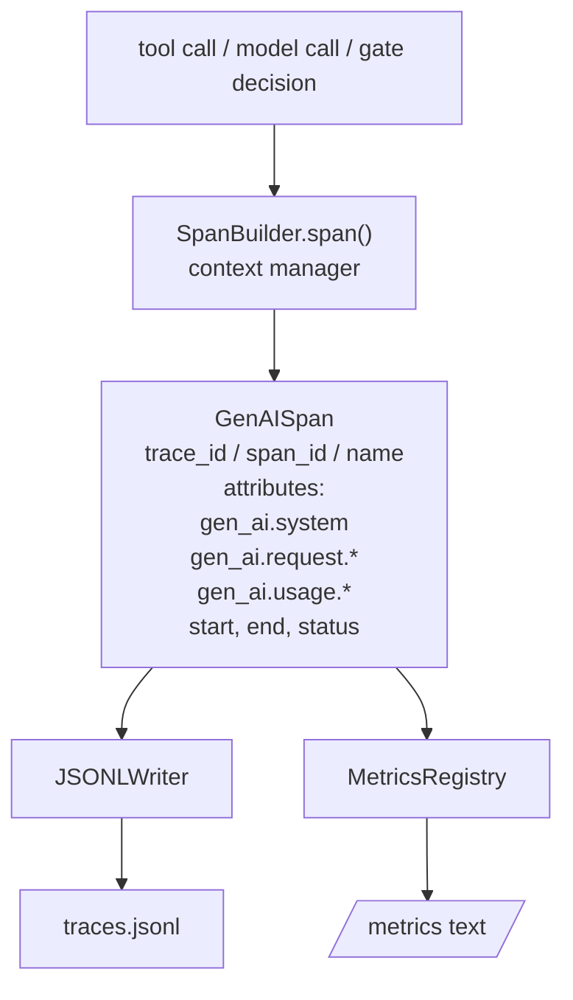
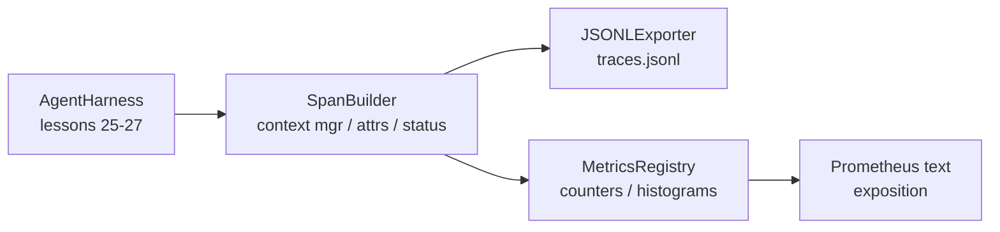

# 顶点课 28：用 OTel GenAI Span 与 Prometheus Metrics 做 Observability

> 没有 observability 的 agent harness，就是一个花钱的黑盒。这节课手搓一个 span builder：它产出的记录符合 OpenTelemetry GenAI semantic conventions，把 span 逐行写入 JSONL 文件，并同时暴露 Prometheus 文本格式的 counter 与 histogram。整个实现只用 Python stdlib，离线可跑。

**类型：** Build
**语言：** Python（stdlib）
**前置要求：** 第 19 阶段 · 25（verification gates），第 19 阶段 · 26（sandbox），第 19 阶段 · 27（eval harness），第 13 阶段 · 20（OpenTelemetry GenAI），第 14 阶段 · 23（OTel GenAI conventions）
**预计时间：** ~90 分钟

## 学习目标

- 构建一个符合 OpenTelemetry GenAI semantic conventions 的 span 数据类。
- 实现一个 JSONL exporter，每行写一条自洽 span。
- 带标签实现 counter 和 histogram，并导出为 Prometheus 文本格式。
- 用 span context manager 包裹任意 callable，记录 duration、status 和异常。
- 验证导出的 span 能经 `json.loads` roundtrip，并匹配规范形状。

## 问题所在

一个线上 coding agent，每个 turn 至少会产生三类产物：模型调用、工具执行、verification gate decision。没有结构化 telemetry，这三样几乎都没用。

第一种故障是 trace 缺失。周二出了问题，手头只剩一份 500 行 chat log。你完全不知道当时跑了哪个 tool、多长时间、prompt 吃了多少 token、gate 有没有拒过调用。只能瞎猜。

第二种故障是 trace 不可解析。harness 写了 span，却用了自己拍脑袋的字段名。Grafana、Honeycomb、Jaeger 甚至本地 CLI 都读不懂。团队栈里的现成工具全废了。

第三种故障是 metrics 不可聚合。你也许能在单条 trace 里看到一个慢 tool call，但回答不了“过去一小时 `read_file` 的 p95 latency 是多少”，因为你只有 trace，没有聚合指标。

OpenTelemetry GenAI semantic conventions 就是为这事存在的。它定义了一组跨 LLM 框架共享的标准 attribute key。只要 harness 按这个规范写，任何 OTel 兼容后端都能读。

## 核心概念



harness 里的每个操作都产一条 span。span 带 trace id（整次 agent invocation）、span id（当前操作）、name（如 `gen_ai.chat`、`gen_ai.tool.execution`）、一组符合 GenAI conventions 的 attributes、开始结束时间和 status。

GenAI 规范至少会统一这些 key：`gen_ai.system`（provider，如 `anthropic`、`openai`）、`gen_ai.request.model`、`gen_ai.request.max_tokens`、`gen_ai.usage.input_tokens`、`gen_ai.usage.output_tokens`、`gen_ai.response.model`、`gen_ai.response.id`、`gen_ai.operation.name`，以及工具相关的 `gen_ai.tool.name` 与 `gen_ai.tool.call.id`。

exporter 输出 JSONL：每行一个 JSON 对象。这是最简单的离线格式，既能流式消费，也能 grep，也方便导入。真实 OTel exporter 会说 OTLP gRPC；这节课的 JSONL exporter 就是离线等价物。

metrics 则和 trace 并排存在。每次 tool call 让 counter 自增，例如 `tools_called_total{tool="read_file"}`；每次延迟写入 histogram，例如 `tool_latency_ms{tool="read_file"}`。两者都用 Prometheus 文本 exposition 格式导出，这是事实上的 pull-based 标准。

## 架构



span builder 是个小类，核心方法是 `span(name, attrs)`，返回一个 context manager。进入时记 start time，退出时记 end time，若抛了异常则附带异常，再把完结后的 span 推给 exporter。

metrics registry 本质上就是两个字典。counter 用 `{(name, frozen_labels): int}`；histogram 先把原始样本存在列表里，导出时再按 Prometheus bucket 格式汇总。

## 你要构建什么

`main.py` 里会交付：

1. `GenAISpan` dataclass：`trace_id`、`span_id`、`parent_span_id`、`name`、`attributes`、`start_unix_nano`、`end_unix_nano`、`status`、`status_message`、`events`
2. `SpanBuilder` 类，提供 `span(name, attrs, parent=None)` context manager
3. `JSONLExporter` 类，`export(span)` 追加一行
4. `Counter` 与 `Histogram` 类，以及 `MetricsRegistry`
5. `prometheus_exposition(registry)`，产出 Prometheus 文本
6. `wrap_tool_call(name)` decorator，负责自动发 span 并更新 metrics
7. demo：合成一次完整 agent invocation（`gen_ai.chat` span 包住 tool span），写出 `traces.jsonl`，打印 Prometheus exposition，并以 0 退出

span id 和 trace id 都是 16-byte 十六进制字符串，来自 `os.urandom`，与 OTel 的 W3C trace context 一致。exporter 自己不应该抛异常；即便 IO 报错，也应让 harness 继续跑。

histogram 使用固定 bucket 集（OTel 针对毫秒延迟的常用默认：5、10、25、50、100、250、500、1000、2500、5000、10000、+Inf）。样本先存列表，导出时再现算每个 bucket。

## 为什么手搓而不是直接上 opentelemetry-sdk

OTel Python SDK 是真实依赖，但它也很重：几千行代码、真正的 exporter、额外 runtime 成本，全都超出一节课的预算。手搓版的价值在于让你看清 wire format。到生产里，你再把同一组 attribute 接回真实 SDK，批处理、OTLP exporter 和 resource detection 都会白送。

conventions 本身很稳。只要 key 对得上，这节课导出的格式到 2030 年也照样能被解析，因为 OTel 对 GenAI attribute 名只会新增，不会反向破坏。

## 它如何接进 Track A

第 25 课给了 gate chain，第 26 课给了 sandbox，第 27 课给了 eval harness。第 28 课的任务就是让这三者都可观测。第 29 课会把端到端 demo 的每一步都包进 span，并在结束时打印 Prometheus 文本。

## 运行方式

```bash
cd phases/19-capstone-projects/28-observability-otel-traces
python3 code/main.py
python3 -m pytest code/tests/ -v
```

demo 会在工作目录里生成一个 `traces.jsonl`（结束前会清理），然后打印三条示例 span，再打印 counters 与 histograms 的 Prometheus exposition。测试覆盖 span 序列化 roundtrip、标准 GenAI attribute 是否存在、counter 是否自增正确，以及 histogram exposition 的 bucket 计数。
