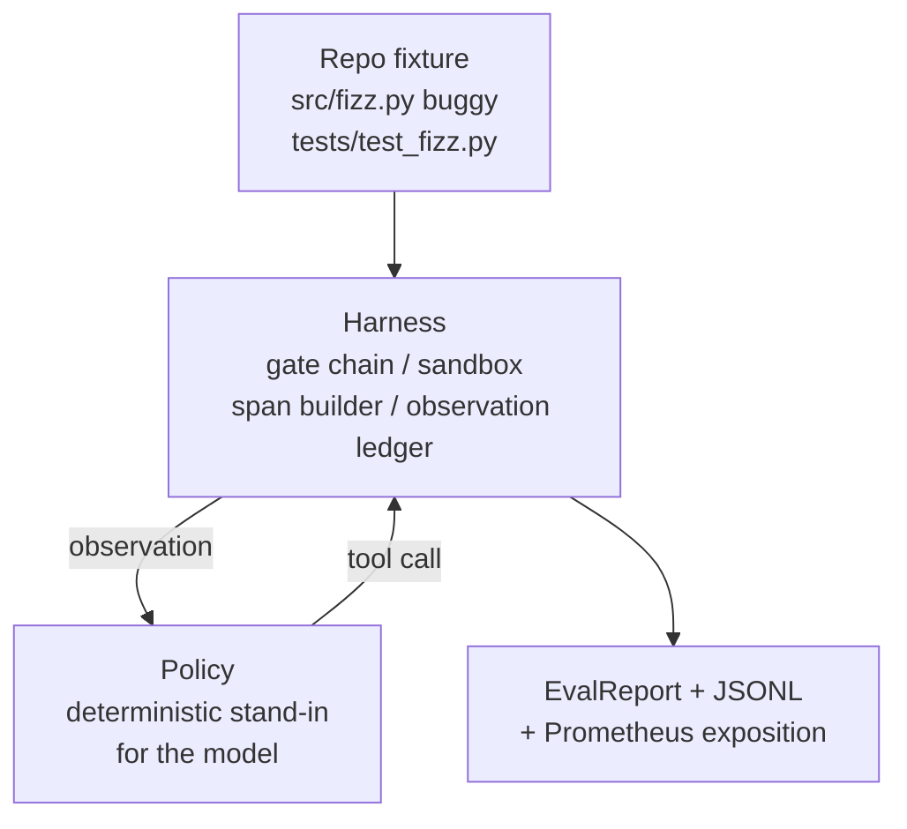
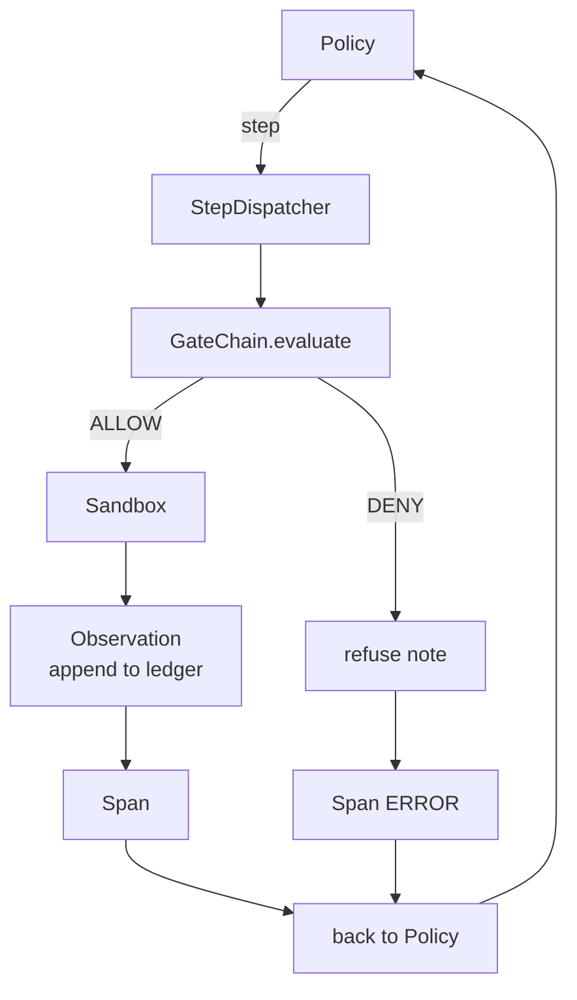

# 顶点课 29：把端到端 Coding Agent 跑在 Harness 上

> 这是 Track A 的回报时刻。这节课把 gate chain、sandbox、eval harness 和 OTel span 全缝进一个真的能跑的 coding agent 里，让它在一个多文件 Python 项目上修一个真实但小规模的 fixture bug。agent policy 是确定性的，不是 LLM；正因为如此，这节课可复现，也更清楚地说明：真正有价值的一直是 harness，本来就不是模型。契约完全一致，以后换成真实模型，只是把 policy 那道缝替换掉。

**类型：** Build
**语言：** Python（stdlib）
**前置要求：** 第 19 阶段 · 25（verification gates），第 19 阶段 · 26（sandbox），第 19 阶段 · 27（eval harness），第 19 阶段 · 28（observability），第 14 阶段 · 38（verification gates），第 14 阶段 · 41（workbench for real repos），第 14 阶段 · 42（agent workbench capstone）
**预计时间：** ~90 分钟

## 学习目标

- 把 gate chain、sandbox、eval harness 和 span builder 组合成一个单一 agent loop。
- 实现一个确定性 policy，靠 `read_file`、`run_tests`、`write_file` 修掉 fixture bug。
- 在整条端到端运行里强制执行全局 step budget 和 observation token budget。
- 为整次运行发出完整的 OTel GenAI trace 与 Prometheus metrics。
- 验证 agent 在少于 12 步内修好 fixture，且对合法工具 0 次 gate trip。

## 问题所在

大多数 agent demo 单拆开都很漂亮：sandbox 自己看起来没问题，eval harness 自己也没问题，span emitter 也一样。真拼起来，接缝就开始漏。

gate chain 明明说 ALLOW，sandbox 却因为 chain 没想到的理由把它拒了。eval harness 给了 pass，OTel trace 却显示 agent 自称用过的 tool 实际上被 gate 拒绝了。Prometheus counter 本该加一次，却加了两次。observation budget 已经超了，但 agent 还在跑，因为 chain 记了预算，sandbox 却根本不知道。

这节课就是整个 Track A 的 integration test。agent 必须按顺序完成 4 件事：读项目、跑测试、从失败信息定位 bug、写修复、重跑测试并停下。每一步都走 gate chain，每次 tool execution 都经过 sandbox，每个 step 都包在 span 里，eval harness 最后给整次 run 打分。

## 核心概念



agent 的 policy 是个状态机，一共 5 个状态：

- `SURVEY`：先读项目结构，然后转去 `RUN_TESTS`
- `RUN_TESTS`：执行测试；若已通过，直接成功停机，否则转去 `INSPECT`
- `INSPECT`：读取失败相关源文件，然后转去 `FIX`
- `FIX`：写入修复后的文件，再转去 `VERIFY`
- `VERIFY`：重跑测试；通过则成功停机，不通过则失败停机

每个状态都对应一次 tool call。每次 tool call 都会穿过 gate chain。若某次调用被 deny，agent 必须把 refusal 写进 trace，并立即停机。

fixture bug 是 `fizz.py` 里的一个 off-by-one。确定性 policy 通过正则解析测试失败信息，构造修复后的文件内容。以后换成 LLM，也只是把“谁来决定修什么”换掉，harness 契约完全不变。

## 架构



整节课是自洽的。前面几课的关键原件都会在 `main.py` 里用最小可运行形态重写一遍：gate、sandbox、ledger、span。命名和第 25-28 课保持完全一致，这样概念映射不会含糊。

## 你要构建什么

`main.py` 里会交付：

1. 从第 25-28 课复制来的最小 harness primitives：`GateChain`、`Sandbox`、`ObservationLedger`、`SpanBuilder`、`MetricsRegistry`
2. `CodingAgentPolicy` 类：5 状态状态机
3. `Repo` helper：把 bundled buggy fixture 准备进 scratch dir
4. `AgentRun` 类：驱动 policy，通过 harness 分发 tool call，返回 `AgentRunReport`
5. 一个 bundled fixture（`fixture_repo/`）：含 `src/fizz.py`、`tests/test_fizz.py` 和一份 expected 树，供 eval harness 使用
6. demo：完整跑一遍 policy，打印逐步 trace，断言 pass，并打印 metrics

bundled fixture 形状和第 27 课的 task 结构一致：一个 buggy 文件 + 一个测试文件。测试失败消息里包含足够的信息，能让确定性 policy 推导出修复。真实 LLM 也会走同样的 loop，只是更慢、记忆更广，但 harness 预期不会因此变化。

## 为什么 policy 不是 LLM

真实 LLM 需要 API key、网络调用和不可验证的随机性。可这节课关心的从来都不是模型，而是 harness。本课用确定性 policy，意味着它能在任何开发机上零外部依赖跑起来，测试还能断言精确步数。

这份 policy 其实就是 LLM agent 的严格子集：读 repo、看失败测试、定位行、写修复。LLM 只是沿着同一套 harness 契约，做得更广一些而已。

## Demo 会断言什么

端到端 demo 在退出前会显式断言 5 件事，测试也会再断言一次：

- policy 在 12 步内修好 fixture
- observation budget 从未超限
- 对合法工具 0 次 gate denial
- trace 里每一步都有对应 span
- Prometheus exposition 中至少包含 `tools_called_total{tool="read_file"}` 和 `tool_latency_ms` histogram

## 它如何接进 Track A

这节课就是集成验证。第 25 课写了 gate chain，第 26 课写了 sandbox，第 27 课写了 eval harness，第 28 课写了 observability，第 29 课证明它们作为系统能一起工作。再往后扩展真实 agent，很自然：把确定性 policy 换成模型，把 bundled fixture 换成真实仓库任务，把 JSONL exporter 换成 OTLP。

## 运行方式

```bash
cd phases/19-capstone-projects/29-end-to-end-coding-task-demo
python3 code/main.py
python3 -m pytest code/tests/ -v
```

demo 会打印逐 step trace、最终 eval report，以及 Prometheus exposition，并以 0 退出。测试覆盖 policy 的状态转移、合成 tool call 的 gate refusal、bundled fixture 的端到端 run，以及 step budget 约束。
