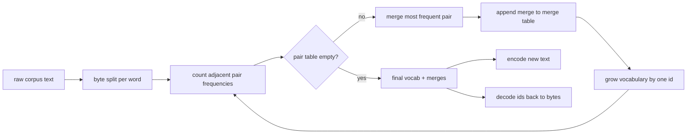
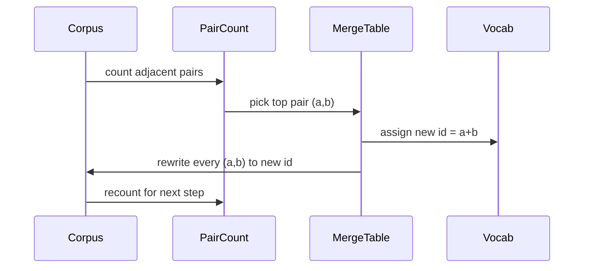

# 从零实现 BPE Tokenizer

> 输入是 bytes，输出是 ids，再把 ids 还原回同一串 bytes。把现代文本模型几乎都还在使用的 tokenizer 亲手搭出来。

**类型：** Build
**语言：** Python
**前置要求：** 第 04 阶段课程、第 07 阶段 transformer 课程
**预计时间：** ~90 分钟

## 学习目标
- 从原始文本语料训练一份 Byte-Pair Encoding 词表：反复合并出现频率最高的相邻 symbol pair。
- 实现一张确定性的 merge table，并把它应用到新文本上，产出 subword id 流。
- 对任意 UTF-8 输入做到无损 round-trip：文本 -> ids -> 文本。
- 预留并保护特殊 token（`<|endoftext|>`、`<|pad|>`），保证它们在训练和解码中不会被破坏。
- 解释为什么对通用 tokenizer 来说，byte-level alphabet 是正确的下限。

## 框架

语言模型从来没见过文本，它只见过整数。把字符串映射到整数列表，再从整数列表映回字符串的那一层，就是 tokenizer。这里一旦做错，后面所有 loss curve 测到的都是错东西。

通用文本模型最主流的 subword tokenizer 家族就是 Byte-Pair Encoding。思路很小：从一套已知 alphabet 出发，找出训练语料里最常见的相邻 symbol pair，把它们合并成一个新 symbol。词表还没长到目标大小前，就一直重复。对新文本做编码时，复用同一张 merge 列表，顺序也必须完全一致。

这节课做的是 byte-level 版本。alphabet 不是 Unicode code point，而是 256 个原始 byte。正是这个选择，保证 tokenizer 能处理任意 UTF-8 输入，而不用退回所谓 unknown token。

## Pipeline

训练侧和推理侧共享同一张 merge table。这就是契约。若推理时改了 merge 顺序，解出来的 id 流就变了。

## Byte Alphabet

前 256 个 id 固定保留给原始 byte `0x00` 到 `0xFF`。这保证了：哪怕一个 merge 都还没学到，任何输入字符串也一定能先被表达出来。byte block 之后，再手工预留一小段给特殊 token。训练循环绝不把这些特殊 id 当作 merge 目标，因为我们在 pretokenized 流里压根不放它们。

pretokenizer 会先按空白和标点把语料切开，再让训练看到这些 token。若不先切，BPE merge 会很乐于跨词边界学习，最终词表会塞满整句常见短语。切开之后，merge 主要留在词内，泛化会更好。

## 训练循环

每一步训练做 3 件事：遍历语料中的每个词，统计当前 symbol 序列里所有相邻 pair 的出现频率，并按词本身出现次数加权；选出频率最高的那个 pair；把所有该 pair 都改写成一个新 symbol，id 为词表里下一个空槽。最后把这次 merge 记下来。

每一步的成本与“当前语料被表示为 symbol 序列后的总长度”线性相关。对百万词量级语料、目标词表一万上下的情况，这个循环通常几秒内就能跑完，因为 symbol 序列会随着 merge 逐步缩短。

## 编码新文本

推理时绝不再重新统计 pair。它只按训练时学到的 merge 顺序依次应用。对一个新词，encoder 先把它拆成 bytes，再扫描当前序列里“rank 最低、也就是最早学到且能应用”的 merge，执行一次合并，再重新扫描。直到 merge table 中没有任何一条还能命中当前序列，编码结束。

“按 rank 排序应用”正是编码确定性的来源，也让推理行为与训练时在同一输入上的处理一致。先学到的 merge，优先级永远更高。

## 特殊 Token

特殊 token 是 byte 流天然产不出来的 id。本课手工保留两个就够了：

- `<|endoftext|>`：预训练时分隔文档，告诉模型“新文档从这开始，别让上一份上下文泄露过来”
- `<|pad|>`：把短序列补齐成矩形 batch；训练时 loss mask 会把它盖掉

encoder 支持一个 flag，决定输入里是否允许特殊 token。关掉时，`<|endoftext|>` 和 `<|pad|>` 会被当作普通字符串按 bytes 编。打开时，这两个字面串会直接映射到保留 id，并且不参与任何 merge。

## Round-Trip 保证

编码再解码，必须精确回到原始输入 bytes。decoder 只做一件事：按顺序拼接每个 id 展开的 byte 串。因为每个 id 不是原始 byte，就是由两个已知 id 递归拼出来的，所以展开最终一定能落回原始 byte。最后再把这些 bytes 按 UTF-8 还原成字符串。

这节课的测试会在 3 类输入上钉死这个性质：一条未见过的句子、一条带 emoji 的句子，以及一条字面上含有 `<|endoftext|>` 的句子。

## 这节课不做什么

它不实现像大厂生产 tokenizer 那样的 regex-heavy pretokenizer。本课只做一个简单的空白与标点切分，已经足够在小语料上学出靠谱 merge，而且与后续课程的契约完全兼容。下一课会把 tokenizer 当成黑盒，直接在其上构建 sliding-window dataset。

它也不并行化 pair counter。对几千词量级的小语料，纯 Python loop 完全够快。更大语料上，最自然的扩展就是分词并行计数、最后 reduce。

## 怎么读代码

`main.py` 里有 4 个关键对象：`BPETokenizer` 持有词表、merge table 与 special-token table；`train` 是训练循环；`encode` 是推理路径；`decode` 负责 byte 拼接。底部 demo 会用内置小语料训练一个 tokenizer，拿一条 held-out 句子做 encode，再 decode 回来打印。`code/tests/test_bpe.py` 会钉住 round-trip、特殊 token 保留，以及 merge 顺序。

把 demo 跑起来。然后把目标词表大小从 300 改到 600，看 held-out 句子的编码长度怎么下降。那条曲线，就是 BPE 的压缩曲线。
