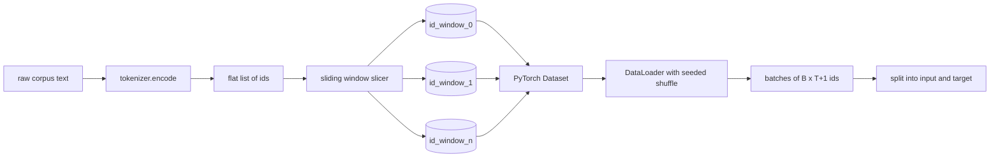
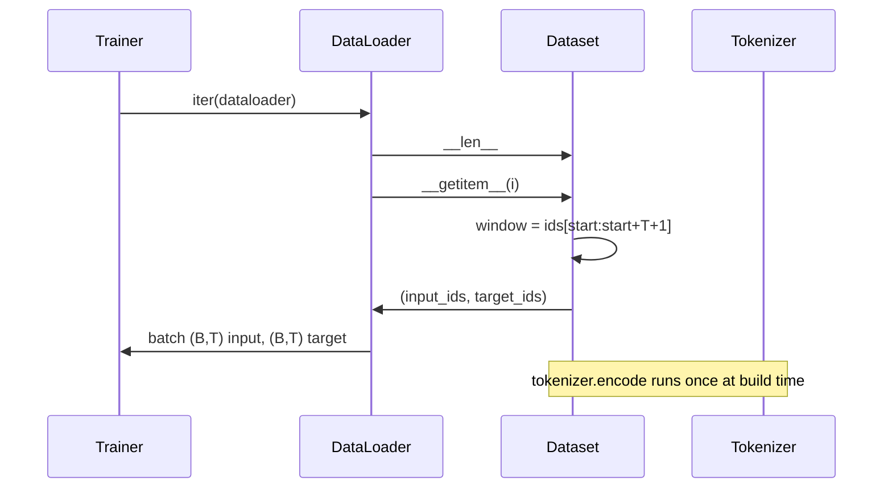

# 带 Sliding Window 的 Tokenized Dataset

> 一次预训练，本质上就是从 token ids 到梯度的函数。这节课构建的，就是把 ids 稳定送进去的那条传送带。

**类型：** Build
**语言：** Python
**前置要求：** 第 04 阶段课程、第 07 阶段 transformer 课程、本阶段第 30 课
**预计时间：** ~90 分钟

## 学习目标
- 只调用一次 tokenizer，把原始语料转换成 token id 流。
- 用可配置 overlap stride，把 id 流切成定长窗口。
- 构建一个 PyTorch Dataset，为 next-token prediction 返回 input/target tensor。
- 再用带每轮固定随机种子的 DataLoader 包住它。
- 理解 stride、冗余和有效数据集大小之间的权衡。

## 框架

预训练每次读一批 token ids，更新一次模型。每个 batch 的形状早被训练契约钉死。对 causal LM 来说，batch 包含 `(B, T)` 的 input ids 和 `(B, T)` 的 target ids，其中 target 只是 input 左移一位。数据管线的职责，就是从可能数 GB 的原始文本中，稳定、可复现地按需产出这种形状。

这节课就做整条管线。上一课的 tokenizer 把文本变成一条很长的平坦 id 列表。sliding window 再把这条列表切成训练样本。自定义 Dataset 把它们暴露成 tensor。DataLoader 负责 batch 和带已知随机种子的 shuffle。

## 形状契约

causal LM 吃的是 `(B, T)` 形状的 id，`B` 是 batch size，`T` 是 context length。位置 `t` 的 target 就是位置 `t+1` 的 input，所以每个训练样本底层其实要覆盖 `T+1` 个原始 id。window stride 决定了相邻样本之间重叠多少。

slicer 不会越过语料末尾。如果最后一段不足以填满 `T+1`，本课直接丢掉。你当然也可以用 `<|pad|>` 填尾巴，但那会额外引入 loss mask 复杂度，所以本课不做。

## 为什么要 Sliding Window

预训练语料就是一条超长 id 流。若模型只看完全不重叠的窗口，那么它每次都会在同一批边界上训练。调整 stride 的意义，就是把这些边界挪动起来，让模型见到更多样的“预测下一个 token”局面。

- stride = `T`：完全不重叠
- stride = `T // 2`：50% 重叠，数据集规模约翻倍
- stride = `1`：最大重叠，数据集规模约放大 `T` 倍

代价是每个 epoch 计算更多；好处是边界更多样。多数真实预训练会取 stride = context length，因为语料本来就远大于模型一轮能吃完的数据，边界多样性的收益相对没那么重要。

## Dataset 类

PyTorch Dataset 只要求两个方法：`__len__` 返回样本数，`__getitem__` 返回单个样本。我们的 Dataset 存的是编码后的 id 流和 stride。索引时现算窗口起点，因此无论 stride 产出多少个样本，内存里都只保留一份 id 流。

左移一位的逻辑发生在 `__getitem__` 内：`input = window[:-1]`，`target = window[1:]`。两者都是 PyTorch long tensor。训练循环直接把 target 当 ground truth。

## 确定性 Shuffle

`shuffle=True` 的 DataLoader 依赖 PyTorch 的随机生成器。只要你显式传一个 `torch.Generator`，并按 epoch 固定 seed，就能保证重启后看到同样的数据顺序。这对“只改一个超参数，比两条 loss curve”很关键。不然两次训练数据顺序都不一样，loss 分叉根本不能说明问题。

本课的 seed 契约很简单：`epoch_seed = base_seed + epoch_index`。构造 DataLoader 时给 base seed，trainer 在每个 epoch 开头把 `epoch_index` 加上去。同样的 base seed，会在每次重跑里给出完全同样的顺序。

## Batch Sampler

PyTorch 默认 sampler 会在不放回的前提下均匀随机抽索引。这正是预训练想要的。对小数据集微调来说，也一样适用。DataLoader 通过反复调用 `__getitem__` 取出 `B` 个样本，再沿 batch 维堆叠。由于每个样本长度天生一致，这里完全不需要 padding 逻辑。

本课把 `num_workers` 固定为 0，好让思路干净。上生产时你可以开 worker 并行 `__getitem__`。对我们这套“纯内存切片”来说，worker 收益不大，但同一个 Dataset API 本来就支持它。

## 怎么数样本数

若 id 流长度为 `N`，context length 为 `T`，stride 为 `S`，样本数就是：

`max(0, 1 + (N - (T + 1)) // S)`

这节课把这个公式做成 Dataset 的静态方法，让 trainer 无需遍历整个数据集就能提前算出每个 epoch 的总 step 数。

## 这节课不做什么

它不做磁盘流式读取。语料会被完整编码进内存，作为一整块 tensor 持有。对几百万 id 规模的数据来说，这不过几十 MB，完全适合本课。以后若要做 disk streaming，本质上只是换存储层，而 Dataset 契约不需要变。

它也不专门处理多文档边界。本课把语料视为一条连续 id 流。若原始语料本来由多篇文档组成，那就在构建语料时插入 `<|endoftext|>`。模型会自己学到如何跨边界预测。

## 怎么读代码

`main.py` 里有两个类和一个 helper。`SlidingWindowDataset` 是 PyTorch Dataset；`make_dataloader` 返回带固定随机种子的 DataLoader；`_encode_corpus_to_ids` 负责一次性 tokenizer 调用。底部 demo 会现场搭一个小 tokenizer，编码一份内置语料，再构建 dataset 和 dataloader，打印一个 batch，并断言形状契约。`code/tests/test_dataset.py` 会钉住窗口数公式、左移一位性质、确定性 shuffle 和 stride 权衡。

跑一遍 demo。然后把 context length 从 16 改成 32，看每个 epoch 的样本数怎么掉下去。那就是你的 steps-per-epoch 预算。
