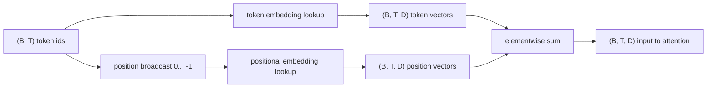
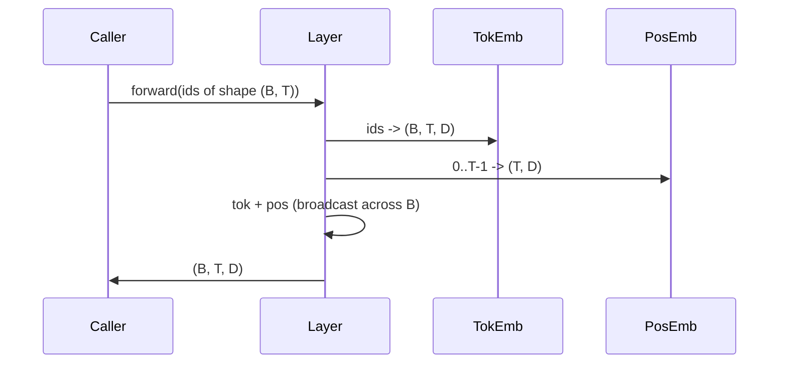

# Token Embedding 与 Positional Embedding

> ids 只是整数，模型要的是向量。中间有两张 lookup table 挡着，而位置那张表怎么选，会直接影响模型能学到什么。

**类型：** Build
**语言：** Python
**前置要求：** 第 04 阶段课程、第 07 阶段 transformer 课程、本阶段第 30 和 31 课
**预计时间：** ~90 分钟

## 学习目标
- 构建一张 token embedding lookup table，把词表 id 映射到稠密向量。
- 构建一张按位置索引的 learned positional embedding lookup table。
- 构建一个无参数、按位置索引的固定 sinusoidal positional embedding。
- 把 token embedding 和 positional embedding 组合成 transformer block 的单一输入。
- 对比 learned 与 sinusoidal 两种 positional embedding 在长度泛化和参数量上的差异。

## 框架

模型第一次接触 token id，是在 token embedding 矩阵上做一次行查找。这个矩阵每个词表 id 对应一行，每列对应模型维度。查出来的向量，就是后续网络临时视为“这个 id 含义”的东西。反向传播只更新本次前向真正用到的那些行。训练久了，这些行的几何结构就会在不同方向上编码相似性。

但 token id 自己不带顺序。模型还需要第二种信号，告诉它位置 1 和位置 17 不一样。最主流的两种选择是：

- learned positional embedding：另一张 lookup table，每个位置一行
- fixed sinusoidal positional embedding：一个无参数的数学公式

两者差别很真。learned table 是参数，因此天然受训练时最大上下文长度的约束；sinusoidal 在理论上无参数，公式也可延伸到任意位置。但这节课里的 `SinusoidalPositionalEmbedding` 会在构造时预先算出一张固定长度表，到 `forward` 超出 `max_context_length` 就直接 raise，所以本课里两者都会强制最大上下文长度。即便表足够长，模型本身在训练长度之外也可能依旧表现很差。

这节课会把两者都实现一遍，并与 token embedding 组合成下一课 attention block 的输入。

## 形状契约

embedding 阶段的输入是 `(B, T)` 形状的 token ids，输出是 `(B, T, D)` 形状的张量，其中 `D` 是模型维度。batch 里每个样本都共享同样的 context length `T`，每个位置都共享同样的向量维度 `D`。



组合方式是求和，不是拼接。求和能让整条网络始终保持固定的 `D`，也让模型可以在每个 feature 维度上自己决定：当前该让 token 含义占主导，还是让位置信号占主导。

## Token Embedding 矩阵

token embedding 是一个 `(V, D)` 形状的参数张量，`V` 是词表大小。PyTorch 里对应 `nn.Embedding(V, D)`。初始化时，参数通常来自一个小高斯分布，均值 0、标准差大概 `0.02`，这也是 transformer 体系里的常见做法。重要的不是精确数值，而是整个 run 保持一致。

前向本质上就是索引。PyTorch 把 `(B, T)` 的 int64 ids 映射成 `(B, T, D)` 的 float：就是去矩阵里 gather 那几行。反向只会把梯度累积到本轮实际碰过的行；没出现在 batch 里的行，这一步梯度就是 0。

有个细节。token embedding 和模型末尾的 output projection 常常会共享权重（weight tying）。一旦共享，每次反向不仅会从输入侧触碰 embedding，还会从输出侧触碰到每一行。本课把两者拆成独立模块讲，但在完整模型里，同一块矩阵完全可以兼任两者。

## Learned Positional Embedding

learned positional embedding 是第二个 `nn.Embedding`，形状为 `(max_context_length, D)`。索引 key 是位置 id：`0, 1, 2, ..., T-1`。前向时，位置向量会沿 batch 维广播。

它的缺点也很直接：若模型只训练到位置 `T-1`，那你就不能在推理时去查位置 `T`，因为那一行根本不存在。生产里的 decoder-only 模型若走这条路，最大上下文长度就必须提前 baked into architecture。

## Sinusoidal Positional Embedding

sinusoidal positional embedding 是一个“位置到向量”的函数。位置 `p` 和特征维 `i` 会生成：

```python
angle = p / (10000 ** (2 * (i // 2) / D))
emb[p, 2k]     = sin(angle)
emb[p, 2k + 1] = cos(angle)
```

这个函数没有参数。每个位置都对应唯一向量。不同 feature 维度上的波长按几何级数变化，因此低维编码粗粒度位置，高维编码细粒度位置。

用 `sin` 和 `cos` 成对出现带来的关键性质是：位置 `p + k` 的向量，可以表示成位置 `p` 向量的一个线性函数。于是 attention 层就很容易学到相对位移，比如“往回看 5 个 token”。模型不需要再额外学习一个独立参数去表达这种 offset。

本课在构造时一次性预计算完整的 sinusoidal table，前向时只做索引。

## 组合

整条输入管线按顺序只做 3 步：读 token ids、查 token vectors、加 positional vectors、返回结果。



求和时的位置张量会沿 batch 维自动广播。PyTorch 能直接处理，因为在 `unsqueeze` 之后，位置张量形状就是 `(1, T, D)`。

## 对比分析

这节课会拿同一批输入跑 learned 和 sinusoidal 两种方案，并打印两类诊断：

第一类是参数量。learned 方案会比纯 token embedding 多出 `max_context_length * D` 个参数；sinusoidal 额外参数是 0。

第二类是相邻位置 embedding 的 cosine similarity。sinusoidal 的衰减连续且可预期，因为底层就是连续函数。learned 方案在初始化时通常近似随机，因为每一行独立采样；训练后它往往也会学出相对平滑的结构，但那需要模型自己从数据中发现。

## 这节课不做什么

它不实现 rotary positional encoding（RoPE）或 AliBi。生产里这两种更常见。它们遵守的形状契约与这里一致：都是对 `(B, T, D)` 的向量施加位置相关变换，只是施加位置不在输入层，而在 attention projection 阶段。下一课要做 attention block，其中一个可选扩展就是把 rotary 融进 query/key projection。

它也不训练 embedding。只要谈训练，你就需要 loss；有 loss 就需要模型输出；有输出就得先有 attention 和 LM head。这就是后面两课的内容。

## 怎么读代码

`main.py` 里定义了 3 个模块：`TokenEmbedding` 封装 `nn.Embedding(V, D)`，`LearnedPositionalEmbedding` 封装 `nn.Embedding(L, D)`，`SinusoidalPositionalEmbedding` 则预计算表并把它注册成 buffer。`EmbeddingComposer` 把 token embedding 和 positional embedding 绑在一起。底部 demo 会打印形状、参数量和相邻位置相似度诊断。`code/tests/test_embeddings.py` 会钉住形状、broadcast 行为、参数量和 sinusoidal 公式。

跑一下 demo，然后把模型维度 `D` 从 64 改成 32，看 sinusoidal 波长带是怎么变的。
