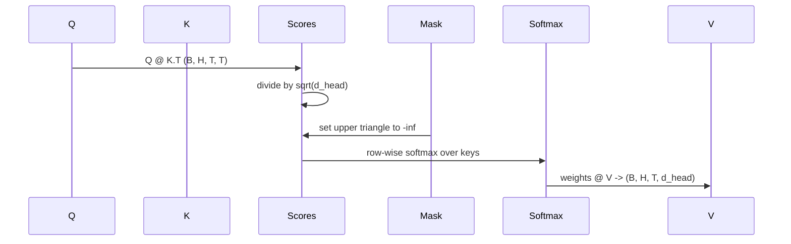

# Multi-Head Self-Attention

> 一次线性投影，三种视角，H 个并行 head，再加一张 mask。这就是模型真正使用的 attention block。

**类型：** Build
**语言：** Python
**前置要求：** 第 04 阶段课程、第 07 阶段 transformer 课程、本阶段第 30-32 课
**预计时间：** ~90 分钟

## 学习目标
- 用单个线性层实现 batched 的 Query/Key/Value projection，再切分成 H 个 head。
- 用正确的归一化和 dtype 处理实现 scaled dot-product attention。
- 加上一张 causal mask，阻止当前位置看到未来 token。
- 对固定输入检查每个 head 的 attention weight，并解释不同 head 在看什么。
- 在 toy task 上训练一个小 attention block，观察 loss 下降以及 head 的分工。

## 框架

attention 的作用，是让一个 token 的表示从同一序列里的其他 token 那里拉信息。self-attention 的意思是：query、key、value 都来自同一份输入。multi-head 的意思是：同一次 projection 会被拆成 H 个并行 attention 子问题，最后再把它们拼回去。

高效实现的套路是：用一个线性层把 `D` 直接投到 `3 * D`，再切成 Q/K/V 三种 view，然后 reshape 成 H 个 head，每个 head 的大小是 `D // H`。后面的 matmul、softmax 和 weighted sum 都是 batched tensor 操作，所以 H 个 head 会并行跑在加速器上。

这节课就把这块搭起来，并补上 causal mask，让同一份代码能直接当作 decoder-only language model 的 attention layer。下一课会把它塞进完整 transformer，后面一课再拿它训练。

## 形状契约

输入是 `(B, T, D)`，输出还是 `(B, T, D)`。mask 形状是 `(T, T)`，或者能广播成它。block 内部的中间张量形状是 `(B, H, T, d_head)`，其中 `d_head = D // H`。硬约束只有一条：`D % H == 0`。

```mermaid
flowchart LR
    A["(B, T, D) input"] --> B[Linear D -> 3D]
    B --> C["split into Q, K, V"]
    C --> D["reshape to (B, H, T, d_head)"]
    D --> E["scores = Q @ K.T / sqrt(d_head)"]
    E --> F[apply causal mask]
    F --> G[softmax over keys]
    G --> H["context = weights @ V"]
    H --> I["reshape to (B, T, D)"]
    I --> J[output Linear D -> D]
    J --> K["(B, T, D) output"]
```

这块里真正带参数的只有两层线性层：QKV projection 和 output projection。mask、softmax、matmul、reshape 全部无参数。

## QKV 拆分

最朴素的实现会有 3 个独立线性层，分别生成 Q、K、V。更高效的实现只用 1 个线性层，直接输出 `3 * D` 维，然后再拆开。数学上两者完全等价，因为 3 次 `(D, D)` 矩阵乘法，本来就等价于一次把 3 个矩阵竖着拼起来的 `(3D, D)` 乘法。

高效版本更快，因为加速器只发起一次 matmul。初始化也更方便，因为三个子矩阵住在同一块参数张量里，可以一起初始化。

## Head 重排

切完之后，Q、K、V 都还是 `(B, T, D)`。要把它们变成 H 个并行 attention 子问题，就得先 reshape 成 `(B, T, H, d_head)`，再 transpose 成 `(B, H, T, d_head)`。此时 head 维已经挨着 batch 维，PyTorch 就会把每个 head 的 attention 当成 `B * H` 个独立小实例一起跑。

`d_head` 维保持在最后，这样 `Q @ K.transpose(-2, -1)` 才会沿它收缩。得到的结果就是每个 head 的 `(B, H, T, T)` attention score。

## 缩放

softmax 前要先除以 `sqrt(d_head)`。若不缩放，dot product 会随着 `d_head` 增长而迅速变大，把 softmax 推进“一个位置吃掉几乎全部概率、其他位置全接近 0”的区间。到了那一段，梯度会非常小，学习容易停住。除以 `sqrt(d_head)` 的目的，就是把 score 的方差大体稳在不同 head size 下都差不多的量级。

## Causal Mask

decoder-only language model 在预测下一个 token 时，只允许看过去，不能偷看未来。mask 的作用就是强行保证这件事。具体做法是：在 softmax 前，把 `(T, T)` score 矩阵里对角线以上的所有位置替换成负无穷。softmax 一跑，这些位置的权重自然变成 0。

mask 在构造时会被注册为 buffer，这样它天然跟着模型走设备，也不在梯度图里。mask 的尺寸按最大 context length 一次性建好，前向时只取左上角 `(T, T)` 这一块。

## Output Projection

head 内 context 向量算完后，张量还是 `(B, H, T, d_head)`。要先 transpose 回 `(B, T, H, d_head)`，再 reshape 成 `(B, T, D)`，最后再过一层 `(D, D)` 的 output projection。它的意义是让模型能在 block 内重新混合各个 head 的信息。若没有这层，H 个 head 只有到更深层才会重新交叉，约束太死。

## 检查 Attention Weight

本课会给 `forward` 增加一个 `return_weights=True` 的调试开关。打开时，block 会额外返回 `(B, H, T, T)` 形状的每头 attention weight。demo 会把短输入上某个 head 的 heatmap 打出来，让你看见因 causal mask 形成的下三角结构，以及每个位置关注哪里。

一个训练好的模型里，不同 head 会学到不同模式：有的 head 爱盯上一个 token，有的会看序列起点，有的则分布得很均匀。这个 inspection hook 就是后续解释性分析的入口。

## 训练 Demo

`main.py` 底部的 demo 会把 attention block 接到一个极小的 LM head 上，在一个 repeat task 上训练。输入的每一行都是“同一个随机 id 重复整个上下文长度”；target 则是左移一位，因此模型真正要学的是“下一个 token 和前一个 token 一样”。loss 用 cross-entropy。若取 H=4、D=32、T=12、vocab=64，loss 会从随机猜测附近（大约 `log(64) ~ 4.16`）一路掉到明显低于 `1.0`，在 CPU 上跑 3 个 epoch 就能看到。

这个 demo 的意义不是得到一个有用模型，而是确认 block 的每个部分都能通梯度，head 也确实能在一个答案非常明确的任务上学到东西。

## 这节课不做什么

它不加 feed-forward block。真实 transformer layer 是 attention + 双层 MLP，并在两者外面各包一层 residual 和 layer norm。下一课会把这些补齐。

它不实现 rotary 或 AliBi positional encoding。它们也在同一个 block 里用，但属于另一节教学单元。当前 block 只要在 Q 和 K 进 matmul 前插一个变换，就能兼容二者。

它也不实现推理期的 KV cache。缓存 key/value 是让 autoregressive decoding 变快的关键优化。那会改 K/V 的形状契约，但不会改 Q。这个话题应该放到 inference 课里讲。

## 怎么读代码

`main.py` 定义了 `MultiHeadSelfAttention`。类里持有两层线性层和一张注册好的 mask buffer。前向顺序是：projection、reshape、打分、mask、softmax、加权求和、reshape 回去、再做 output projection。底部 demo 会搭一个小模型：token/positional embedding + attention + LM head，在 copy task 上训 3 个 epoch，并打印 loss curve 和 per-head heatmap。`code/tests/test_attention.py` 会钉住形状契约、causality、softmax 性质、head 拆分以及梯度流。

把 demo 跑起来，然后把 `n_heads` 从 4 改成 8（保持 `d_model=32`，这样 `d_head=4`），看看 heatmap 怎么变。
