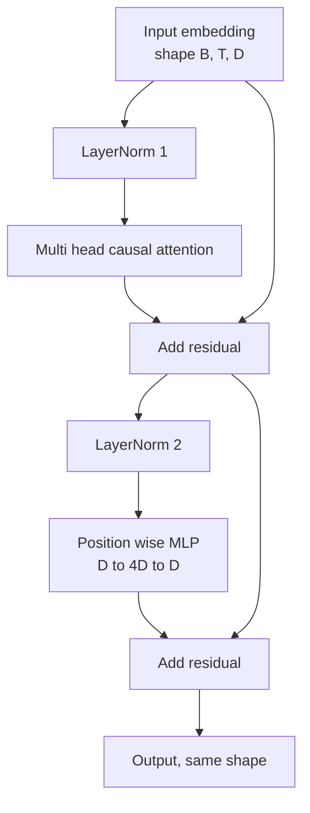
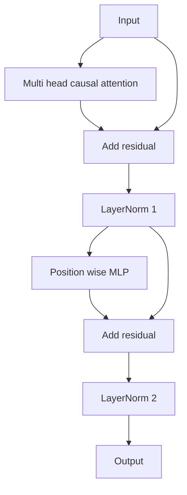

# 从零实现 Transformer Block

> 一个 block，就是现代 decoder LLM 的最小单位：layer norm、multi-head attention、residual、MLP、residual。pre-LN 变体在没 warmup 的情况下也能稳训；post-LN 则是原论文的写法。这节课把两者并排搭出来，再看在常见学习率下，谁能扛住 12 层堆叠。

**类型：** Build
**语言：** Python
**前置要求：** 第 19 阶段第 30-33 课（tokenizer、embedding、attention 数学、batched data loader）
**预计时间：** ~90 分钟

## 学习目标

- 用 PyTorch 从 4 个基本部件拼出一个 transformer block：LayerNorm、multi-head causal attention、residual connection、position-wise MLP。
- 把 LayerNorm 摆成两种配置（pre-LN 和 post-LN），并解释为什么其中一种可以在没有 warmup 的情况下稳定训练。
- 在 multi-head attention 内正确实现 causal masking，让 token `i` 看不到 `j > i`。
- 在 12 层堆叠上跟踪两种变体的梯度流，并用实测信号读出差异，而不是嘴上玄学。
- 把 block 作为可直接复用的单元，供下一课组装 1.24 亿参数 GPT。

## 问题所在

transformer 就是同一个 block 重复很多次。只要第一次把 block 写错，重复 12 次之后，你得到的模型要么在第一轮训练就发散，要么后半辈子都得靠 warmup 补锅。本课里你会看到的两种失败并不稀奇，而是大多数初学者第一次堆 block 时就会撞上的：

- attention layer 偷看未来
- LayerNorm 摆错位置，深层 residual signal 根本压不住

好消息是，修法非常机械。整个 block 只有两条 residual path、也只有两处 LayerNorm 摆放位点。位置一旦选对，后面只是工程记账。

## 核心概念

每个 decoder-only transformer block，都是一个从 `(batch, sequence, embedding)` 映回相同形状的函数。内部真正做事的是两个子层。



这就是 pre-LN 变体。LayerNorm 放在 residual branch 里面，也就是每个子层之前；residual connection 则把未归一化的信号一路往前带。

post-LN 变体则把 LayerNorm 移到 residual add 之后：



形状完全一样，训练行为却不一样。post-LN 下，沿 residual path 往回传的梯度必须穿过 LayerNorm。堆到 12 层、学习率设成 `3e-4` 时，这条梯度会衰减得足够快，逼得你不得不用 warmup。pre-LN 则让 residual path 保持未归一化，梯度能更顺地回到 embedding 层。因此从 GPT-2 往后，pre-LN 才成了默认配置。

### Causal Multi-Head Attention

attention 子层会把输入投成 query、key、value 三份。每一份都从 `(B, T, D)` reshape 到 `(B, H, T, D/H)`，其中 `H` 是 head 数。scaled dot-product attention 会按 head 计算 `softmax(Q K^T / sqrt(d_k))`，再把上三角 mask 成负无穷，经 softmax 置零后乘上 `V`。所有 head 再被拼回 `(B, T, D)` 并做一次 output projection。让模型变成“因果”的只有这张 mask；忘了它，你训练的就是一个会作弊的模型。

### MLP

position-wise MLP 会把同一个两层网络独立地应用到每个 token 上。隐藏层宽度是 embedding 宽度的四倍，激活用 GELU，第二层线性后接 dropout。MLP 内部 token 彼此不通信，所有 token mixing 都在 attention 层里发生。

### Residual Connection 到底做了什么

它做了两件事。第一，它让梯度能沿着“加法路径”跨深度传递，保持 12 层堆叠下的梯度规模。第二，它让每个 block 学的是对当前表示的“增量更新”，而不是整块重写。也正因如此，block 才能扩到深层。

## 动手构建

`code/main.py` 会实现：

- `class LayerNorm`：带可学习 scale/shift、带 eps、按 token 向量归一化
- `class MultiHeadAttention`：含 `num_heads`、`head_dim = d_model // num_heads`、fused QKV projection、注册好的 causal mask，以及 attention/residual dropout
- `class FeedForward`：两层线性、GELU、dropout
- `class TransformerBlock`：通过 `pre_ln` flag 切换 pre-LN / post-LN
- 一个 demo：构造 6 层 pre-LN 栈和 6 层 post-LN 栈，输入完全一致，然后打印 (a) 输出形状，(b) 一次 backward 后 embedding 上的梯度范数

运行方式：

```bash
python3 code/main.py
```

输出里会同时给出两种堆叠的形状检查与梯度范数。你通常会看到：在同样学习率下，pre-LN 栈的 embedding gradient 比 post-LN 大一个量级左右，这就是“pre-LN 不靠 warmup 也能训”的实证信号。

## Stack

- `torch`：负责张量计算、autograd 和 `nn.Module`
- 不用 `transformers`，不用预训练权重，整个 block 都从基础原语自己搭

## 生产里常见的三个模式

**Fused QKV Projection。** 若用 3 个独立线性层，你就要付 3 次 kernel launch 和 3 次 matmul。改成一层宽度 `3 * d_model` 的线性层，再沿最后一维拆开，数学完全一样，但每个加速器上都更快。这也是 GPT-2、LLaMA、Mistral 等参考实现都在用的路径。

**注册成 buffer 的 causal mask。** mask 只依赖最大上下文长度。构造时用 `register_buffer` 分配一次，前向时按当前 `T` 切左上角。若你每次 forward 现建一张 mask，长上下文下它会变成 allocator hotspot。

**dropout 只放两处，不放三处。** dropout 应该放在 attention softmax 后（attention dropout）以及 MLP 第二层线性后（residual dropout）。若直接往 residual 自身上打 dropout，你会破坏那条维持梯度流动的加法恒等路径。早期不少实现犯过这个错，训练稳定性直接跟着掉。

## 上手使用

- 这节课里的 block，下一课拼 GPT 时可以原封不动塞进去。
- pre-LN 是现代开源权重 LLM 的默认形态；post-LN 则是 2017 原始论文的写法。两者你都懂，基本就能看懂市面上绝大多数 decoder 架构。
- 把 GELU 换成 SiLU，你就靠近 LLaMA 家族了；把 LayerNorm 换成 RMSNorm，也同样如此。骨架本质没变。

## 练习

1. 给 block 里的所有线性层加一个 `bias=False` 开关。现代开源权重 LLM 大多不带 bias。算一下在 12 层、768 维模型里能省多少参数。
2. 用手搓的 RMSNorm 替换 `nn.LayerNorm`，并验证输出形状不变。
3. 加一个 flag，返回第一头 attention weight 的 `(B, T, T)` 张量。把上三角画出来，确认 softmax 后那里全是 0。
4. 写一个 sanity check：输入一份 `(2, 16, 384)` 张量，设 `H=6`，分别跑 pre-LN 和 post-LN，在相同初始化、dropout=0 的前提下断言二者前向输出不相等（例如 `not torch.allclose`）。

## 关键术语

| 英文 | 大家嘴上怎么说 | 它实际指什么 |
|------|-----------------|------------------------|
| Pre-LN | “Pre norm” | LayerNorm 放在 residual branch 里、每个子层之前；residual 携带未归一化信号 |
| Post-LN | “Post norm” | LayerNorm 放在 residual add 之后；2017 原论文写法，需要 warmup |
| Causal mask | “Triangle mask” | 把 attention logits 上三角设为负无穷，使 token i 不能读 token j（当 j > i） |
| Fused QKV | “Combined projection” | 一层宽度 3D 的线性层替代三层 D 宽线性层；一次 kernel、一次 matmul |
| Residual stream | “Skip connection” | 那条自顶向下流过每个 block 的未归一化张量；每个 block 都是在它上面加增量 |

## 延伸阅读

- 第 7 阶段第 02 课：attention 数学本体
- 第 7 阶段第 05 课：encoder-decoder 版的完整 transformer 骨架
- 第 10 阶段第 04 课：这个 block 接入训练流程的方式
- 第 19 阶段第 35 课：把 12 个这样的 block 组装成 GPT
