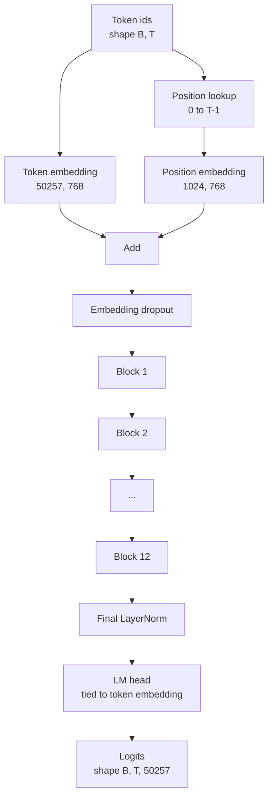
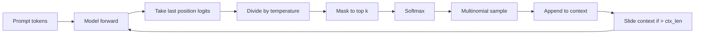

# GPT 模型组装

> 12 个 block 叠起来，再加 token embedding、learned position embedding、最后一个 LayerNorm，以及一颗绑定权重的 language model head。这就构成了整个 1.24 亿参数的 GPT 模型。这节课把这些零件拼成一个能跑的类，数参数确认它真的是参考 124M 形状，再用 multinomial sampling、temperature 和 top-k 生成文本。

**类型：** Build
**语言：** Python
**前置要求：** 第 19 阶段第 30-34 课
**预计时间：** ~90 分钟

## 学习目标

- 把第 34 课的 transformer block 组装成完整 GPT：token embedding、position embedding、N 个 block、最终 LayerNorm、language model head。
- 复现 124M 参数配置：词表 50257、上下文 1024、embedding 768、12 个 head、12 层。
- 把 language model head 权重绑到 token embedding 上，并解释为什么这能在这个尺度上省掉约 3800 万参数。
- 用 multinomial sampling、temperature scaling、top-k truncation 和滑动窗口上下文，从 prompt 生成文本。
- 对照 124M 目标，测参数量和一次前向的开销。

## 问题所在

单个 transformer block 自己什么都干不了。你得先把 token ids 变成向量，混入位置信息，穿过整堆 block，再投回词表 logits。四步少任意一步，模型要么前向直接挂掉，要么位置漂移，要么根本不会“说话”。

模型的尺寸也不是随便的。参考 GPT-2 small 恰好是 1.24 亿参数，也就是上面那组配置。这里没有魔法：

- 50257 × 768 是 token table
- 1024 × 768 是 position table
- 12 个 block，每个大约 700 万参数，总计约 8400 万
- 最终 head 通过 weight tying 复用 token table

把这些拼起来，才能落在 124M 左右。若你组出来的模型参数量对不上参考值，十有八九就是 wiring 某处接错了。

## 核心概念



token ids 先变成 token vector，位置 id 再变成 position vector。两者相加之后进 stack。最终 LayerNorm 是在 block 之外、几乎所有现代变体都保留的那块。LM head 则直接复用 token embedding 矩阵，这就是 weight tying。

### Weight Tying

token embedding 的形状是 `(vocab, d_model)`。language model head 则要把 `d_model` 投回 `vocab`，也就是它的转置。把两者绑定起来，意思就是“同一块参数张量，用两次”。对词表 50257、`d_model=768` 来说，这一块矩阵本身就是约 3800 万参数。若不绑，你付两次；绑上之后只付一次，而且梯度信号更干净，因为 embedding 和 head 一起更新。

### Position Embedding 是 Learned，不是 Sinusoidal

GPT-2 用的是 learned position embedding。position table 本质上就是一个 `(1024, 768)` 的参数张量。每次前向时，模型会查位置 `0..T-1` 的向量，再把它加到 token embedding 上。这是最朴素的位置方案（RoPE、AliBi、T5 relative bias 都是替代），但它正是 124M 参考模型使用的那一种。

### 生成：Temperature、Top-k、Multinomial

生成是自回归的。每一步，模型都会对每个位置给出整个词表的 logits。你只取最后一个位置的 logits，先除以 temperature，再可选地把 top-k 以外的 logits 设成负无穷，softmax 成概率，最后从这个分布里采一个 token。



三只旋钮，对应三种行为：

- temperature 接近 0：趋近 greedy
- temperature = 1：保留模型原始分布
- top-k = 1：纯 greedy
- top-k = 40：裁掉长尾

它们组合出来的生成行为差很多。下一课的训练环节会把生成样本当作定性评估信号。

## 动手构建

`code/main.py` 会实现：

- `class GPTConfig` dataclass，带 124M 默认值：
  `vocab_size=50257`、`context_length=1024`、`d_model=768`、`num_heads=12`、`num_layers=12`、`mlp_expansion=4`、`dropout=0.1`、`use_bias=True`、`weight_tying=True`
- `class GPTModel`：包含 token embedding、position embedding、embedding dropout、12 个 `TransformerBlock`、最终 LayerNorm，以及在 flag 打开时绑到 token embedding 的 `lm_head`
- `count_parameters` helper：按唯一参数计数，因此会正确识别 weight tying
- `generate` 函数：实现 temperature、top-k、multinomial 与 sliding-window context
- 一个 demo：构造模型，打印参数量与 124M 参考值对照，并用固定 prompt 生成一段短文本，证明整条管线是通的

运行方式：

```bash
python3 code/main.py
```

输出包括：参数量与 124M 参考值对照、一段随机 prompt 的生成 token ids，以及 `lm_head` 与 token embedding 在开启 tying 时确实共享 storage 的确认。

为了让 demo 跑得快，脚本还会额外跑一个 tiny config（`d_model=64`、`num_layers=2`）做完整端到端生成。124M 配置会被建出来，但只验证参数量和单次 forward。

## Stack

- `torch`：负责张量计算、autograd 与模块封装
- `code/main.py` 会在本地重新实现第 34 课的 block 结构

## 生产里常见的三个模式

**把 residual projection 初始化得更小。** attention 的 output projection 和 MLP 的第二层线性都会直接喂进 residual add。若你用和其他线性层相同的初始化标准差，residual stream 会随着深度一路膨胀，把最终 LayerNorm 顶进高温区。对这两处，把标准差按 `1 / sqrt(2 * num_layers)` 缩一下，12 层内 residual 才更稳。

**缓存位置 id 张量，不要每次重算。** `torch.arange(T)` 每次 forward 都会分配新内存。更好的做法是在 `__init__` 里为最大上下文长度分配一次，调用时只切前 `T` 个，省掉分配器的来回折腾。

**在参数层面做 weight tying，不是 copy 一份。** `lm_head.weight = token_embedding.weight` 才是真共享；copy 没意义。优化器应该只更新一块参数，autograd 也只应该累积到一处。若你只是 copy，embedding 和 head 很快就会漂离彼此，weight tying 的所有收益都没了。

## 上手使用

- 本课的 `GPTModel`，下一课训练时可以直接接上。
- 把 learned position embedding 换成 RoPE，你就基本进入 LLaMA 家族了，而 block 和 head 不用动。
- 再把 GELU 换成 SiLU、LayerNorm 换成 RMSNorm，就把 LLaMA 剩下那点关键变化也补上了。
- `generate` 函数并不绑定这个模型，只要你能给出 logits，任何来源都能复用这套采样循环。第 37 课读入预训练 GPT-2 权重时，照样可以直接用它生成。

## 练习

1. 把 LM head 与 token embedding 解绑，再重新数参数，验证差值是否是 `50257 × 768 ≈ 3800 万`。
2. 把 learned position embedding 换成构造时计算好的 sinusoidal table，确认模型仍能 forward，且参数量减少 `786,432`。
3. 给 generation 加一个 `greedy=True` 开关，跳过采样直接取 argmax，确认跨 run 完全确定。
4. 加一个 `repetition_penalty`：对 prompt 或已生成历史里出现过的 token，把其 logit 除以某个常数后再 softmax。用固定 prompt 验证值大于 1 时会减少重复。
5. 在 `top_k` 旁边再加一个 `top_p`（nucleus）sampling，并做一个两行断言：保留 token 的累计概率应不小于 `top_p`。

## 关键术语

| 英文 | 大家嘴上怎么说 | 它实际指什么 |
|------|-----------------|------------------------|
| Weight tying | “Tied embeddings” | LM head 与 token embedding 共享同一参数张量；省下 `vocab × d_model` 参数，并符合 GPT-2 参考实现 |
| Position embedding | “Learned positions” | 一个 `(context length, d_model)` 的独立表，与 token vector 相加，并端到端学习 |
| Sliding window context | “Context cap” | prompt 加生成历史超过上下文长度后，丢掉最旧 token，只保留窗口内内容 |
| Top-k sampling | “K truncation” | 只保留最大的 K 个 logits，其余设为负无穷，再对剩余分布做 softmax |
| Temperature | “Sampling temperature” | softmax 前把 logits 除以 T；T<1 变尖锐，T=1 保持原分布，T>1 变平 |

## 延伸阅读

- 第 19 阶段第 34 课：本模型所堆叠的 block
- 第 19 阶段第 36 课：驱动本模型训练的 loop
- 第 19 阶段第 37 课：如何把预训练 GPT-2 权重装进这套架构
- 第 7 阶段第 07 课：next-token prediction 的数学
- 第 10 阶段第 04 课：同一架构上的原始 pretraining 流程
