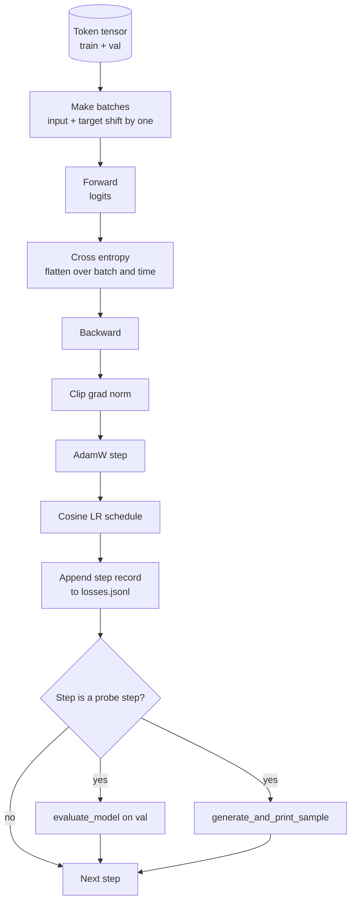

# 训练循环与评估

> 不会测量的 loop，一定会撒谎。这节课构建真正驱动 GPT 模型训练的那条 loop：带 weight decay 分组的 AdamW、warmup + cosine 学习率计划、`calc_loss_batch` helper、在 held-out 数据上跑的 `evaluate_model`、每隔 K 步就跑一次的 `generate_and_print_sample` 定性探针，以及一份可画图的 JSONL loss 日志。以后你搭的每个 decoder LLM，骨架都离不开这套东西。

**类型：** Build
**语言：** Python
**前置要求：** 第 19 阶段第 30-35 课
**预计时间：** ~90 分钟

## 学习目标

- 构建一条训练 loop，用正确的 input/target 对齐方式为 next-token prediction 计算 cross-entropy loss。
- 配置 AdamW，让 weight decay 只落在权重张量上，而不落在 LayerNorm 和 bias 上。
- 实现带线性 warmup 与 cosine decay 的学习率计划，并能读出每一步实际 LR。
- 在 held-out split 上用 `evaluate_model` 跑评估，让 eval loss 可以跨 run 对比。
- 每隔 K 步用 `generate_and_print_sample` 生成一段定性样本，在 loss curve 先崩之前抓到异常。
- 把每一步的 loss 持久化到 JSONL，这样训练日志能被重载、绘图和交付。

## 问题所在

一个训练脚本如果只会打印 loss，但除此之外什么都不做，会在三处同时失明。它不知道 loss 降下来到底是不是对的（模型也许只是过拟合训练集）；它不知道发散是不是已经开始（有的 run 会先 spike 一步再恢复，有的则一步直接崩掉）；它更不知道模型到底学会了什么（loss 只是标量，样本生成出来才像人话）。这三类失败，只有肯测才看得到。

本课的 loop 从三个方向测：

- 每一步都记录训练 batch 上的 loss
- 每隔 K 步在 held-out batch 上记录一次 loss
- 每隔 K 步对固定 prompt 生成一段 continuation

最终日志落到 JSONL，上面写的就是 loop 自己留下的证词。

## 核心概念



真正不那么显然的两块，是 loss 对齐和 AdamW 的 decay 分组。

### Loss 对齐

模型要在每个位置预测“下一个 token”。若输入 batch 是 `[t0, t1, t2, t3]`，那目标 batch 必须是 `[t1, t2, t3, t4]`。cross-entropy 是在展平后的 `(batch * seq, vocab)` 上对 `(batch * seq,)` 的目标做计算。若你忘了做左移，模型学的就是“预测自己”，loss 可以轻松收敛到 0，但模型实际上什么都没学到。

### AdamW 的 Decay Split

weight decay 要正则化的是权重张量，不是归一化层的 scale，也不是 bias。把 decay 落到 LayerNorm scale 上，会慢慢把 scale 压到 0，直接毁掉归一化。落到 bias 上通常数学上问题不大，但纯属浪费。标准做法是：所有矩阵形状的张量（线性层权重、embedding 表）放 decay 组；看起来像 scale 或 shift 的参数全部放 no-decay 组。

### Warmup + Cosine Schedule

warmup 会在最初几百步把学习率从 0 线性爬到目标值，让 optimizer state 有时间长出来。之后 cosine decay 再把学习率慢慢衰回 0，给训练末期一个更细的步长。这一套是开源 LLM 训练里最常见的 schedule，因为它能显著减少“前一千步”和“最后一千步”最脆的阶段。

### Held-Out 评估

`evaluate_model` 会在 validation split 上跑固定批次数，累积 loss，再除以 batch 数返回均值。不开梯度，不开 dropout。只要 seed 和 split 固定，这个数就是可复现的。训练 loss 和 held-out loss 并排看，才看得出过拟合。

### 定性采样是更早的预警

一个训练 loss 看起来一路往下的模型，也可能生成出来全是同一个 token，那它就是坏了。反过来，一个 loss 曲线看起来没那么漂亮的模型，也可能已经能吐出明显更成形的词。定性探针常常比单个标量更早暴露问题。

## 动手构建

`code/main.py` 会实现：

- `make_batches(token_ids, batch_size, context_length)`：把长 token tensor 切成 input/target 对
- `calc_loss_batch(model, inputs, targets)`：前向、展平并返回标量 cross-entropy
- `evaluate_model(model, val_loader, max_batches)`：无梯度跑固定数量 validation batch，并返回平均 loss
- `generate_and_print_sample(model, prompt, max_new_tokens)`：调用第 35 课的 generation 函数，在固定 prompt 上打印样本
- `build_param_groups(model, weight_decay)`：生成 AdamW 需要的两组参数
- `cosine_with_warmup(step, warmup_steps, total_steps, max_lr, min_lr)`：给定 step 返回当前 LR
- `train(...)`：主训练 loop，负责写 `outputs/losses.jsonl`，并每隔 `eval_every` 步打印 eval loss 与样本
- 一个 demo：在合成数据上训练一个 tiny model，跑少量 step，输出 JSONL 日志，并在 probe 点打印 eval loss 与生成样本；CPU 下不到一分钟

运行方式：

```bash
python3 code/main.py
```

输出包括：逐 step 的 loss、每个 probe step 的 eval loss、每个 probe step 的生成样本，以及最终的 `outputs/losses.jsonl`。这份 JSONL 可以逐行 `json.loads` 再画图。

## Stack

- `torch`：负责 autograd、optimizer 和模块系统
- `main.py` 本地重实现了第 35 课的 `GPTModel` 及相关模块

## 生产里常见的三个模式

**Gradient norm clipping 不是可选项。** 某个坏 batch（异常数据、学习率尖峰、数值边角）完全可能给你一记超大梯度，直接抹掉几个小时训练成果。`backward` 之后、`step` 之前加一发 `torch.nn.utils.clip_grad_norm_(params, max_norm=1.0)`，能把 optimizer 控在安全区间。`1.0` 是多数配置都扛得住的默认值。

**可恢复的 JSONL 日志，而不是 pickle。** 每一步一条 `{"step": int, "train_loss": float, "lr": float}` 的 JSONL 记录非常耐摔：中途崩了，文件还是可读；可以 grep，可以几十行 Python 画图，也可以直接从最后一条恢复。反过来，pickle 状态和模块布局绑得太死，一重构就容易废。

**Eval batch 要来自固定切片。** validation token 在脚本启动时就要切好，而不是边跑边抽。可复现的前提，就是每次 run 看到的 eval batch 完全一致。否则你比较的不是模型差异，而是 batch 顺序噪声。

## 上手使用

- 本课的 loop 与真实 124M 模型训练用的是同一骨架。把合成 token tensor 换成 `datasets` 风格的 loader，主体逻辑根本不用改。
- JSONL 日志本身就是交付物，它把“训练过程”变成证据。下一课会直接拿它来对比 freshly trained checkpoint 与 pretrained one。
- 定性 sample probe 没有任何单一标量能完全替代。

## 练习

1. 给 `weight_decay_groups()` 写单测，确认 scale / bias 落进 no-decay 组，而线性层和 embedding 权重落进 decay 组。
2. 把合成随机 token 换成一个小文本文件的 bytes，让 demo 在真正可读文本上训练。确认生成样本使用的是文件里出现过的字符。
3. 给 cosine schedule 加一个 `min_lr = 0.1 * max_lr` 的下限，再画一次图。
4. 除了 JSONL 日志，每逢 `eval_every` 再存一份 checkpoint。再加一个 `resume_from` 开关，能读回 model state 和 optimizer state。
5. 每步记录 throughput（tokens per second），确认它稳定落在一个窄带内。

## 关键术语

| 英文 | 大家嘴上怎么说 | 它实际指什么 |
|------|-----------------|------------------------|
| Loss alignment | “Shift by one” | 输入位置 0..T-1，目标位置 1..T；cross-entropy 在展平后的形状上计算 |
| Decay split | “Two groups” | AdamW 接收两组参数：带 decay 的矩阵权重，和不带 decay 的 scale/bias |
| Warmup | “Ramp” | 学习率先从 0 爬到目标值，让 optimizer state 有时间稳定 |
| Eval batches | “Held-out batches” | validation token 的一段固定切片，在脚本启动时就确定好，每次 probe 都完全一致 |
| Qualitative probe | “Sample print” | 每隔 K 步用固定 prompt 生成一小段文本，用来抓 loss 看不出的坏模式 |

## 延伸阅读

- 第 19 阶段第 35 课：本训练 loop 驱动的模型
- 第 19 阶段第 37 课：如何把预训练权重装进同一套模型
- 第 10 阶段第 04 课：在真实数据上的 pretraining 流程
- 第 10 阶段第 10 课：超出 cross-entropy loss 的更完整 eval 面
