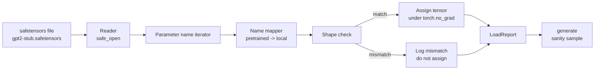

# 加载预训练权重

> 从零训练一个 1.24 亿参数模型，是预算问题；加载一份已经公开的 checkpoint，只该是周二下午的工作。这节课会把 GPT-2 风格的预训练权重从 safetensors 文件装进第 35 课那套完全一致的架构里，一步一步走通参数名映射，再用一次 sanity generation 证明加载真的生效。没有网络、没有第三方 loader、也没有黑盒魔法。

**类型：** Build
**语言：** Python
**前置要求：** 第 19 阶段第 30-36 课
**预计时间：** ~90 分钟

## 学习目标

- 用 `safetensors` Python 库读 safetensors 文件，并检查里面每个 tensor 的名字与形状。
- 把每一个预训练参数名映射到第 35 课 GPT 模型里的本地参数。
- 正确处理两套命名约定之间的差异：发布版 GPT-2 的 `wte/wpe/h.N.attn.c_attn/c_proj`、`mlp.c_fc/c_proj`，以及本课程本地模型的 `tok_embed/pos_embed/blocks.N.attn.qkv/out_proj`、`mlp.fc1/fc2`。
- 在任何权重赋值发生前，先检测并拒绝 shape mismatch，并给出清晰错误。
- 用加载后的权重生成一小段 continuation，确认 token 分布真的来自加载好的参数，而不是随机初始化。

## 问题所在

公开 checkpoint 从来不是按你的架构命名打包的。它们带的是原始实现自己的参数名。比如预训练文件里有：

`transformer.h.0.attn.c_attn.weight`，形状 `(2304, 768)`

而你的模型可能期待的是：

`blocks.0.attn.qkv.weight`，形状同样是 `(2304, 768)`，或者你的 `nn.Linear` 内部权重还把矩阵按另一种方向存了。于是同一块参数会同时有三种身份：名字、形状、字节布局。loader 的职责，就是把三者重新对齐。

一个瞎 copy 的 loader，会把对的 tensor 装进错的槽里，最后模型吐垃圾。一个遇到 shape mismatch 就偷偷跳过、但什么也不记的 loader，会让你完全不知道哪块权重没落下。本课的 loader 走的是硬路径：每次赋值都记日志，每个 shape 都先验证，最后给你一份 `LoadReport`，明白告诉你命中了哪些、漏了哪些、炸了哪些。

## 核心概念



name mapper 本质上就是一个 `str -> str` 的函数。shape check 只是一个 if。真正赋值时放在 `torch.no_grad()` 下，避免 autograd 跟踪加载动作。最后 report 把每个名字的命运都记下来。

### GPT-2 的命名约定

公开 GPT-2 权重常见名字如下：

| 预训练名 | 形状 | 含义 |
|---|---|---|
| `wte.weight` | `(50257, 768)` | Token embedding |
| `wpe.weight` | `(1024, 768)` | Position embedding |
| `h.N.ln_1.weight` | `(768,)` | 第 N 个 block 的 LayerNorm 1 scale |
| `h.N.ln_1.bias` | `(768,)` | 第 N 个 block 的 LayerNorm 1 shift |
| `h.N.attn.c_attn.weight` | `(768, 2304)` | 融合 QKV 线性层权重 |
| `h.N.attn.c_attn.bias` | `(2304,)` | 融合 QKV 线性层 bias |
| `h.N.attn.c_proj.weight` | `(768, 768)` | Attention 输出投影 |
| `h.N.attn.c_proj.bias` | `(768,)` | Attention 输出投影 bias |
| `h.N.ln_2.weight` | `(768,)` | LayerNorm 2 scale |
| `h.N.ln_2.bias` | `(768,)` | LayerNorm 2 shift |
| `h.N.mlp.c_fc.weight` | `(768, 3072)` | MLP fc1 权重 |
| `h.N.mlp.c_fc.bias` | `(3072,)` | MLP fc1 bias |
| `h.N.mlp.c_proj.weight` | `(3072, 768)` | MLP fc2 权重 |
| `h.N.mlp.c_proj.bias` | `(768,)` | MLP fc2 bias |
| `ln_f.weight` | `(768,)` | 最终 LayerNorm scale |
| `ln_f.bias` | `(768,)` | 最终 LayerNorm shift |

这里有两个坑最需要小心：

- `c_attn`、`c_proj`、`c_fc` 这些线性层的矩阵布局，与 `nn.Linear.weight` 默认期待的方向是转置关系，加载时要转置。
- LM head 根本不在文件里，因为它通过 `wte` 做 weight tying。只要 `wte` 装好了，head 本身应该通过 alias 指过去。

### 本地模型的命名约定

这套课程里的模型名字更偏描述式：

| 本地名 | 含义 |
|---|---|
| `tok_embed.weight` | Token embedding |
| `pos_embed.weight` | Position embedding |
| `blocks.N.ln1.scale` | 第 N 个 block 的 LayerNorm 1 scale |
| `blocks.N.ln1.shift` | LayerNorm 1 shift |
| `blocks.N.attn.qkv.weight` | Fused QKV |
| `blocks.N.attn.qkv.bias` | Fused QKV bias |
| `blocks.N.attn.out_proj.weight` | Attention 输出投影 |
| `blocks.N.attn.out_proj.bias` | 输出投影 bias |
| `blocks.N.ln2.scale` | LayerNorm 2 scale |
| `blocks.N.ln2.shift` | LayerNorm 2 shift |
| `blocks.N.mlp.fc1.weight` | MLP fc1 |
| `blocks.N.mlp.fc1.bias` | MLP fc1 bias |
| `blocks.N.mlp.fc2.weight` | MLP fc2 |
| `blocks.N.mlp.fc2.bias` | MLP fc2 bias |
| `final_ln.scale` | 最终 LayerNorm scale |
| `final_ln.shift` | 最终 LayerNorm shift |

映射关系是固定函数，本课会直接把它做成 dict，并按层展开。

### Stub Fixture

真实 GPT-2 权重大约 0.5 GB。本课不会下载它，而是在首次运行时生成一个小型 safetensors fixture：命名完全遵守 GPT-2 习惯，但层数和宽度会缩成便于本地验证的版本（比如 12 层、`d_model=192`）。这样 fixture 的结构足以打通 loader 的所有路径。换成真实文件时，loader 本身不用改。

## 动手构建

`code/main.py` 会实现：

- 一份本地版的第 35 课 `GPTModel`，保证本课自洽
- `make_pretrained_to_local(num_layers)`：按层展开 name map
- `load_safetensors(model, path)`：遍历名字、映射、检查 shape、对 conv1d 风格权重做转置，在 `torch.no_grad()` 下赋值，并返回 `LoadReport`
- `make_stub_safetensors(path, cfg)`：按预训练命名习惯生成 fixture 文件
- 一个 demo：首次运行时生成 `outputs/gpt2-stub.safetensors`，构造一个 fresh model，先从随机初始化下生成一段，再加载 stub，再生成一段，并验证两者不同，说明加载真的改变了模型

运行方式：

```bash
python3 code/main.py
```

输出包括：fixture 路径、逐参数加载日志、`LoadReport` 摘要、加载前的 continuation、加载后的 continuation，以及一条故意注入的坏 tensor 所触发的 shape mismatch，用来覆盖失败路径。

## Stack

- `safetensors`：负责磁盘格式与流式读取
- `torch`：负责模型和赋值数学
- 不用 `transformers`，不用 `huggingface_hub`，不做任何网络调用

## 生产里常见的三个模式

**先验证整个文件，再开始任何赋值。** 正确流程是：打开文件、列出所有 tensor 名、dtype、shape，跑完整 name mapping 和 shape check，只有全部通过后才真正写进模型。半加载模型就是静默失败制造机。

**每次赋值都记 source name 和 destination name。** 出问题时，这份 log 会直接告诉你哪块 tensor 被写到了哪里，不然你只能去读 hexdump。`LoadReport` 至少应该跟踪：`loaded`、`missing`、`unexpected`、`shape_mismatch`。

**LM head 是 weight tying alias，不是独立 copy。** 标准写法是：`model.lm_head.weight = model.tok_embed.weight`。若你把 embedding 再 copy 一份给 head，绑定就断了，参数数目悄悄翻倍。

## 上手使用

- 只要 safetensors 文件遵守 GPT-2 命名规范，这个 loader 就能直接用。真实 GPT-2 small / medium / large / xl 只是在 config 上不同，代码不需要变。
- 同样的套路也能扩展到 LLaMA、Mistral、Qwen，只要更新 name map 即可。shape check 和 report 逻辑完全不变。
- 加载后做一次 sanity generation，是最快的门槛测试：若加载后样本和随机初始化时几乎没区别，那就是 loader 根本没真正改到模型。

## 练习

1. 给 loader 加一个 `dtype` 参数，加载时可选强转成 `bfloat16`、`float16` 或 `float32`。验证 `float32` 模型降成 `bfloat16` 后仍能生成。
2. 加一个 `expected_layers` 参数，若 checkpoint 里的 `h.N` 索引与模型 `num_layers` 不符，就直接拒绝加载。
3. 把 loader 接回第 35 课的 generation 函数，打印“随机初始化样本 vs 加载权重样本”的并排对比。
4. 再补一条导出路径：把当前模型 state 按预训练命名规范写回新 safetensors 文件。再 round-trip 一次，验证 report 中 shape mismatch 为 0。
5. 扩展 `NAME_MAP` 去适配 LLaMA 风格命名（无 bias、RMSNorm、fused qkv），并用你自己生成的 stub LLaMA fixture 复跑 loader。

## 关键术语

| 英文 | 大家嘴上怎么说 | 它实际指什么 |
|---|---|---|
| Name map | “Key remapping” | 从预训练 tensor 名到本地参数名的映射函数，通常是一张按层展开的字典 |
| Shape mismatch | “Bad shape” | tensor 名能映射上，但预训练张量形状与本地参数不一致；loader 会拒绝赋值并记录 |
| Transpose-on-load | “Conv1d layout” | GPT-2 发布权重里 attention / MLP projection 的矩阵布局与 `nn.Linear` 期待方向相反，因此加载时要转置 |
| Weight tying alias | “Shared LM head” | 让 `model.lm_head.weight = model.tok_embed.weight`，head 与 embedding 共用同一块存储 |
| Load report | “Coverage summary” | 一个 dataclass，汇总 loaded、missing、unexpected、shape_mismatch；它就是你判断加载是否成功的证据 |

## 延伸阅读

- 第 19 阶段第 35 课：接收这些权重的模型架构
- 第 19 阶段第 36 课：产出同形 checkpoint 的训练 loop
- 第 10 阶段第 11 课：内存紧张时对已加载权重做量化
- 第 10 阶段第 13 课：围绕加载与推理的一整条 LLM pipeline
