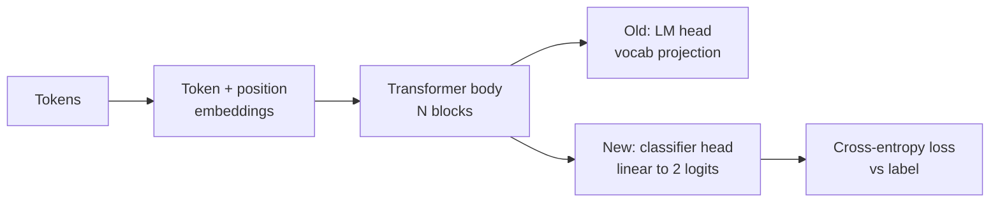
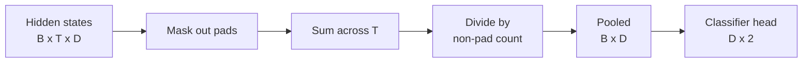
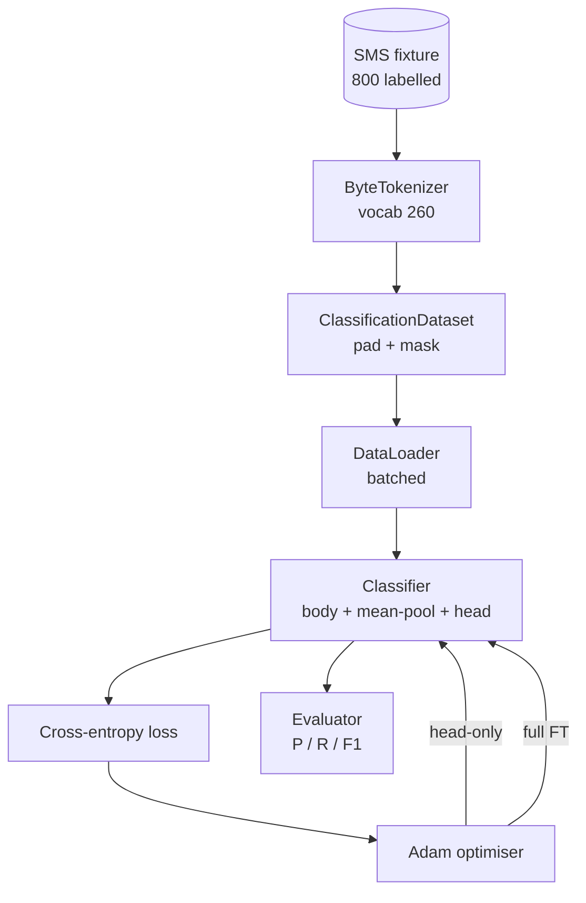

# 顶点课 38：通过换 Head 做分类微调

> 这是 Track B 的第一个顶点课。预训练语言模型本质上是一串 self-attention block，最后接一颗 token prediction head。当你的任务从“下一个 token 是谁”变成“spam 还是 ham”时，错的是 head，而不是 body。这节课会把原 head 拔掉，在 pooled representation 上接一个两类线性层，再以两种方式训练：只训最后这颗 head，以及全量 fine-tuning。评估指标用 held-out split 上的 precision、recall 和 F1。你会真正看到，每种策略买来了什么，又付出了什么。

**类型：** Build
**语言：** Python（torch、numpy）
**前置要求：** 第 19 阶段第 30-37 课（NLP LLM track：tokenizer、embedding table、attention block、transformer body、pre-training loop、checkpointing、generation、perplexity）
**预计时间：** ~90 分钟

## 学习目标

- 在不重新初始化 body 的前提下，把 language-model head 换成 classification head。
- 实现两套训练 regime：frozen body（只训 head）与 full fine-tuning，并共用同一条训练 loop。
- 构建一条理解 tokenizer 的数据管线：padding、mask padding、池化 attention 输出。
- 从原始 logits 计算 precision、recall、F1 和 confusion matrix。
- 理解参数量、训练时间与上限空间（head-room）之间的权衡。

## 问题所在

你预训练了一个小 transformer。原始输出 head 会把最后隐状态投到一个 1000-token 词表上。现在你手头有 800 条短信，标了 spam 或 ham，你要的是二分类。摆在你面前的选项有三种。

最差的做法，是在 800 条样本上从零训一个新分类器。预训练模型的 body 已经学到了不少有用结构：词身份、位置信息、简单共现模式。直接扔掉它，相当于把之前花的算力一起扔了。

真正可行的两种做法是：

- 换 head，但 body 冻住
- 换 head，让 body 也可训练

head-only 训练更快、显存更省，而且在这种小数据规模下不太容易过拟合。全量 fine-tuning 更慢，也更容易在小数据上过拟合，但若下游域与预训练语料差得很远，往往能冲出更高上限。

这节课会把两者都做出来，让你在同一份 fixture 上正面对比。

## 核心概念

模型本体可以写成 `f_theta(tokens) -> hidden_states`，head 则是 `g_phi(hidden) -> logits`。所谓换 head，就是保留 `theta`，换掉 `g_phi`。body 的参数才是大头，head 只是一层线性层。

真正可训练的参数集合分两类：

- `theta`（body）：每个 attention block 都有成千上万参数
- `phi`（head）：大约是 `hidden_dim * num_classes` 再加一个 bias

head-only 训练时，只对 `phi` 算梯度，对 `theta` 置零。PyTorch 里最直接的做法就是把 body 参数的 `requires_grad=False`。于是 optimizer 只看 head，body 完全冻结。

full fine-tuning 则允许梯度穿透整个栈，把 body 也一起改。风险是：小数据上容易 catastrophic forgetting，预训练时学到的结构会被噪声覆盖掉。

## Pooling 问题

分类器最终需要的是“每条序列一个向量”，而不是“每个 token 一个向量”。常见做法有三种：

- **Mean pool**：沿序列维做平均，并按 attention mask 给 pad 位置降权
- **CLS pool**：前置一个特殊 token，只取它的输出（BERT 的做法）
- **Last-token pool**：取最后一个非 padding token（GPT 类分类器常见）

本课用的是带 attention-mask 权重的 mean pooling。它最简单，跨长度更稳，也不要求你在预训练阶段就引入 CLS token。

## 数据

数据是 800 条短信，400 spam、400 ham，由 `code/main.py` 确定性生成。生成器用固定 seed，挑模板、填 slot，最终样本长度在 5 到 25 token 之间。真实数据集当然比这脏得多，本课做 fixture 的唯一理由是可复现。

划分方式是 80/20：640 训练、160 测试，并且 stratified，确保测试集依旧是 50/50。这样 precision 和 recall 才是真数字，不会被类别失衡误导。

## 指标

二分类里，我们把类 1 当作正类（spam）。记法如下：

- `TP`：预测 spam，且实际是 spam
- `FP`：预测 spam，但实际是 ham
- `FN`：预测 ham，但实际是 spam
- `TN`：预测 ham，且实际是 ham

三大指标是：

- `precision = TP / (TP + FP)`：被判成 spam 的消息里，真正 spam 的比例
- `recall = TP / (TP + FN)`：所有真实 spam 中，被模型抓出来的比例
- `F1 = 2 * P * R / (P + R)`：前两者的调和平均

此外还会打印一个 2x2 confusion matrix。demo 会为两种训练 regime 都打这张表。

## 架构

body 会刻意做得很小：词表 260、hidden 64、4 个 head、2 个 block、最大序列 32。这样无论 head-only 还是 full FT，都能在 CPU 上 90 秒内训到收敛。本课并不依赖外部预训练权重；取而代之的是一个 `pretrain_quick` helper，在相同 fixture 文本上先做 5 个 epoch 的 LM 训练，为 body 提供一个不完全随机的起点，保证课程自洽。

## 你要构建什么

实现形式是一个 `main.py` 加一个测试模块（`code/tests/test_main.py`）：

1. `ByteTokenizer`：把 bytes 映成 ids，并预留一个 pad id
2. `Block`：一个 pre-norm transformer block，含 multi-head attention 与 feed-forward
3. `LMBody`：token + position embedding 再加 block 栈，返回 hidden states
4. `MeanPool`：按 mask 做序列维加权平均
5. `Classifier`：body + pool + 线性 head，两种 regime 共用同一个 body 实例
6. `freeze_body` 与 `unfreeze_body`：切换 body 参数的 `requires_grad`
7. `train_classifier`：共用训练 loop，只是根据 regime 换 optimizer 看哪些参数
8. `evaluate`：在测试集上返回 `Metrics(precision, recall, f1, confusion)`
9. `run_demo`：先快速预训练 body，再跑 head-only 和 full fine-tuning，打印两份报告并以 0 退出

## 为什么这种对比重要

head-only 往往更快，也更不容易过拟合。在这份 fixture 上，你通常能看到它 20 个 epoch 后 precision 接近 0.9、recall 在 0.85 左右。全量 fine-tuning 大约要花三倍时间，最终结果视随机种子可能上下浮动几个点。

本课不替你宣布赢家。它的意义是逼你同时看“效果”和“代价”：在 800 样本、一个小 body 上，head-only 更像正确选择；在 8 万样本和更大 body 上，全量 fine-tuning 才会逐渐显出上限。真正要带走的契约是 API：两种 regime 都走同一个 `train_classifier`，切换只是一行代码。

## Stretch Goals

- 再加第三种 regime：只解冻最后一个 block，也就是 partial fine-tuning。它成本低于 full FT，但通常比 head-only 学得更多。
- 加一个 learning-rate scheduler。生产里常见做法是：head 用 cosine schedule，body 用更小的常数学习率。
- 把 mean pooling 换成 learned attention pool（一个带可学习 query 的小注意力层）。在更长序列上，它常常优于 mean pool。

代码里已经把钩子都留好了，测试也把契约钉死了。剩下的提升空间，就看你自己去推。
