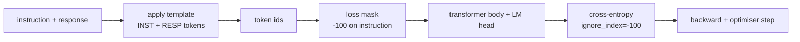
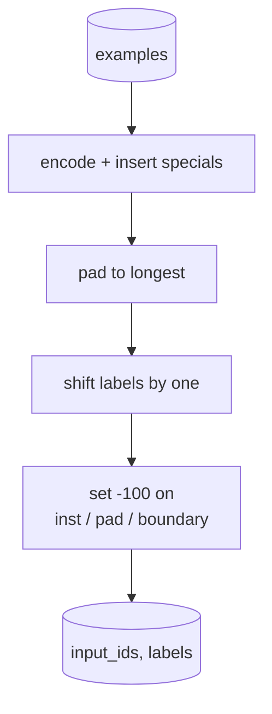
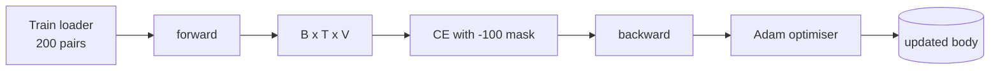

# 顶点课 39：通过监督微调做 Instruction Tuning

> 一个预训练好的 base model 能把序列续写下去，但它不会听指令。Supervised fine-tuning 是修这个问题的最小改动：给模型喂一批“指令 + 理想回复”的成对样本，训练它去预测回复 token。难点在于，loss 只该算回复，不该算指令。本课会做一套 Alpaca 风格的 SFT loop：用自定义 collate 函数把 instruction token 用 `ignore_index=-100` mask 掉，在 200 对 instruction-response 上训练，再用 held-out split 上的 exact-match 做评估。

**类型：** Build
**语言：** Python（torch、numpy）
**前置要求：** 第 19 阶段第 30-37 课（NLP LLM track：tokenizer、embedding table、attention block、transformer body、pre-training loop、checkpointing、generation、perplexity）
**预计时间：** ~90 分钟

## 学习目标

- 把 instruction-response 对格式化成一条单一的因果序列，并用显式边界 token 标出区域。
- 构建 collate 函数，把 instruction token mask 掉，让 cross-entropy 只计算 response token。
- 在 SFT 目标下训练一个 tiny transformer body，并观察 eval 指标如何变化。
- 实现同时尊重 response-start 边界的 greedy generation 与 temperature sampling。
- 用 exact-match 计算 held-out completion 的正确率。

## 问题所在

一个只做 next-token prediction 预训练的 base model，根本不知道“instruction”是什么。给它一句 `"What is the capital of France?"`，它大概率只会继续续写这个问题，或者另起一句废话。模型会语言，但不会遵守格式契约。

SFT 契约本质上就是一个模板。每条训练样本会变成 3 个区域连起来的一条序列：

```text
<INST> What is the capital of France? <RESP> The capital of France is Paris.
```

边界 token 是训练时预留出来的特殊 token。模型要学会：`<RESP>` 之后是“回复区”，真正被评分的也只有这块。base model 的 next-token 目标并没有变，只是现在训练语料的每条样本都被捏成了这种形状。

真正的坑在于：若你直接把整条序列丢进 vanilla cross-entropy，模型就会被训练去同时预测 instruction token。可 instruction 本来就是已知输入。你想要的是这些位置 0 梯度。修法就是 mask。

## 核心概念



`ignore_index` 是 `torch.nn.functional.cross_entropy` 的原生特性。任何目标位置若等于 `ignore_index`，就不会贡献 loss，也不会贡献梯度。PyTorch 里默认约定俗成的值就是 `-100`。collate 函数会为每个样本构造两份张量：

- `input_ids`：整条完整序列
- `labels`：`input_ids` 的拷贝，但把 instruction 区覆盖成 `-100`

模型前向时仍会看到整个序列；attention 可以照样看 instruction。只是 loss 只算 response token。这才是我们真正要的：条件是 instruction，预测的是 response。

## 数据

`main.py` 会确定性生成 200 对 instruction-response，覆盖 6 类任务：

- factual single-shot（某国首都是哪）
- arithmetic
- list extraction
- one-sentence summary
- code（如 print、sort）
- definition

每类任务都用模板化 instruction 和确定性 response。这里刻意做得很简单，因为 exact-match 很脆，本课只想用一个“答案就该是这句字符串”的 fixture 把原理钉清。真实 SFT 数据集当然需要更松弛的评估，但思想完全一样。

划分是 160 训练、40 测试。测试集覆盖全部 6 类任务，因此你还可以顺手打印 per-category exact-match。

## Tokenization 与 Padding

tokenizer 是 byte-level，并额外保留 3 个特殊 id：

- `INST_ID = 256`：instruction 区开头
- `RESP_ID = 257`：instruction 和 response 的边界
- `PAD_ID = 258`：batch 内变长样本的 padding

单条序列的形状是：

`[INST] inst_bytes [RESP] resp_bytes [PAD]*`

collate 函数要做 3 件事：

1. 先 tokenize 每个样本
2. 按 batch 内最长序列做 padding
3. 构造 `labels = input_ids` 左移一位后的版本（因果 LM 目标），并做如下 mask：
   - instruction 区改成 `-100`
   - padding 区改成 `-100`
   - `RESP_ID` 自己所在边界位置也改成 `-100`（你不训练模型去预测边界 token，而是训练它预测边界之后的回复）



这个 shift 就是标准 causal trick：`input_ids[i]` 预测 `labels[i] = input_ids[i+1]`。输入最后一个位置会被裁掉，目标第一个位置也会被裁掉。mask 必须在 shift 之后应用，位置才会对。

## 训练



loop 本身就是标准 PyTorch SFT loop。optimizer 用 Adam，学习率大约 `3e-4` 到 `1e-3`，在这份 fixture 上跑 10-20 个 epoch，不需要 scheduler。模型也做得很小（hidden 96、2 个 block、最大长度 64），CPU 上两分钟内就能收敛。

每隔 5 个 epoch，loop 会在 held-out set 上跑一个迷你 eval，并打印 exact-match。看着 exact-match 从 epoch 1 的 0.0 慢慢涨到 epoch 15 附近的 0.85 左右，这就是这节课的 payoff：你能直接看到模型既学会了“格式”，也学会了“答案”。

## 生成

评估时，模型拿到的是 instruction prefix：

`[INST] inst_bytes [RESP]`

然后开始生成，直到满足其一：

- 序列达到 `max_len`
- 触发一个简陋的 stop heuristic：连续生成两个句末标点 byte（`.`、`!`、`?`）

本课会同时提供 greedy decoding 和可选的 temperature sampling。exact-match 评估默认用 greedy，因为如果开采样，指标就会变随机。真实系统经常是“先 sample，再模糊判分”，那是第 41 课的内容。

## Exact-Match 评估

exact-match 是最严的文本指标。预测回复会先做标准化：小写、去首尾空白、压缩多空格。参考答案也做同样标准化。每个样本的得分要么是 1，要么是 0；整体指标就是均值。

真实 SFT pipeline 通常会补 token-level F1（第 41 课）和 judge model。但 exact-match 依旧有价值，因为它没有解释空间：如果它说 0.7，那就真的是 70% 的测试指令被一字不差地答对了。

## 你要构建什么

实现形式是一份 `main.py` 加测试：

1. `InstructionTokenizer`：带 special token 的 byte-level encoder，可编码 instruction prefix 或整对样本
2. `make_dataset`：用固定 seed 生成 200 对六类任务样本
3. `SFTDataset`：按样本返回已经处理好 mask 的 `(input_ids, labels)`
4. `sft_collate`：动态 padding，构 batch，并把 instruction / pad 位置全设成 `-100`
5. `TinyGPT`：transformer body + tied 或 untied 的 LM head
6. `train_sft`：带 per-epoch eval hook 的 SFT 训练 loop
7. `generate`：从 prefix 做因果解码，可 greedy，可 sample，并带 stop heuristic
8. `exact_match`：标准化字符串比较，返回 `[0, 1]` 浮点数
9. `run_demo`：构数据、训 20 个 epoch、评估、打印分任务拆分，并成功退出

## 为什么这个 Mask 不能省

没有 mask，loss 就会把 instruction token 当目标来训。模型学到的目标变成了“复述 instruction”，而不是“根据 instruction 产回复”。这会从两个维度把模型拉坏：

- 第一，模型容量被浪费在重建用户本来就提供的输入上
- 第二，大多数 batch 里 instruction token 数量比 response token 还多，导致真正关心的 response loss 在梯度和中占比被稀释，优化器等效学习率变低

所以 mask 不是抛光步骤，而是目标函数本身的一部分。

## Stretch Goals

- 加一个 learning-rate warmup + cosine decay。SFT 往往比 pretraining 更吃学习率细节。
- 记录 per-token loss 并画曲线。你会看到：前几轮主要由模板 token（如 `<RESP>`、常见前缀）主导，后几轮才主要由真正答案 token 主导。
- 把 eval 扩展到 BLEU-1 或 chrF。exact-match 会低估那些答对了但换了种说法的模型。
- 加一个多轮 chat template，并在带 follow-up 的 fixture 上训练。

这节课给你的，是格式契约、mask，以及 loop。从 base model 变成 instruction follower，本质改动真的就藏在一条 collate 函数里。
