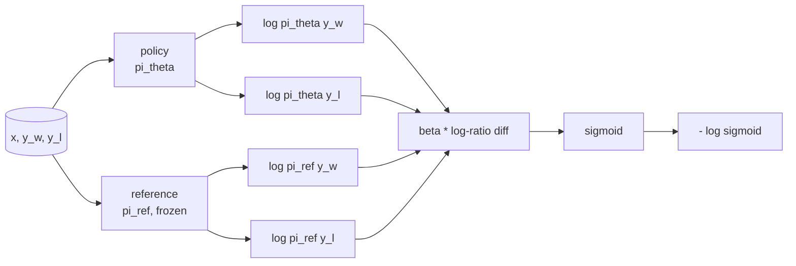
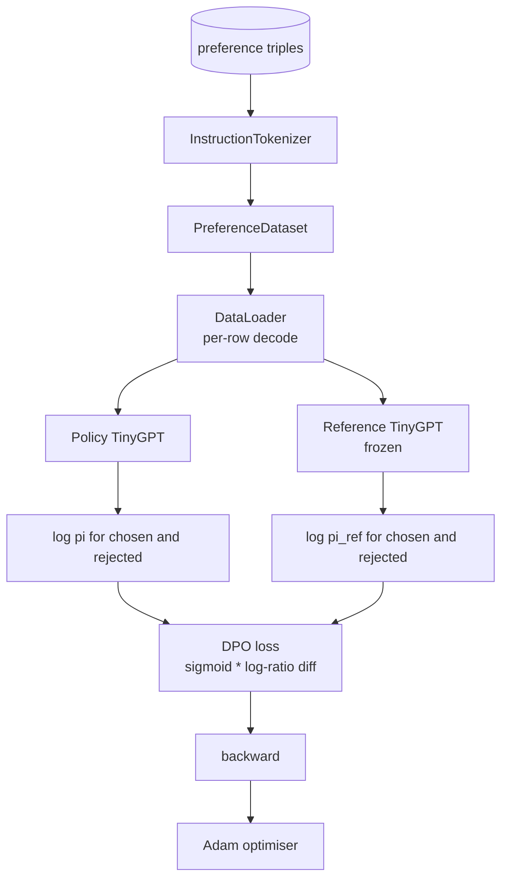

# 顶点课 40：从零实现 DPO（Direct Preference Optimization）

> Reward model + PPO 是经典 RLHF 全家桶。DPO 把这套东西压成一个监督 loss，直接拿偏好对训 policy，不需要单独训 reward model。这节课从 reward-difference 恒等式推导 DPO loss，实现 reference model + policy model 的配对结构，计算每个 token 的 log-probability，然后在一个由 chosen 和 rejected 补全组成的小型偏好数据集上训练一个 tiny transformer。测试会钉死 loss 的数学和梯度方向，确保实现跟论文一致。

**类型：** Build
**语言：** Python（torch, numpy）
**前置要求：** 第 19 阶段第 30-37 课（NLP LLM 路线：tokenizer、embedding table、attention block、transformer body、预训练循环、checkpoint、生成、perplexity）
**预计时间：** ~90 分钟

## 学习目标

- 把 DPO loss 推导为"缩放 log-ratio 差值的 sigmoid"，并将其与隐式 reward 联系起来。
- 构建 reference model + policy model 配对：reference 冻结，policy 可训练。
- 在两个模型下分别计算序列级 log-probability，对 prompt token 做 mask。
- 在 `(prompt, chosen, rejected)` 三元组上训练 policy，观察 chosen 的 log-prob 相对 rejected 上升。
- 用测试钉死 loss 数学、梯度符号和 reference 不变性。

## 问题

你有一个 SFT 模型。它能跟指令走，但输出参差不齐——有些补全清晰准确，有些冗长或干脆答错了。你还有一个小型偏好对数据集：同一个 prompt，人类标注了一个 chosen 补全和一个 rejected 补全。

经典 RLHF 的做法是两阶段流水线：先在偏好数据上训一个 reward model，再用 PPO 让 policy 对着 reward 做优化。能跑，但贵：PPO 阶段内存里要放两个模型，KL 控制让 policy 不要偏离 reference 太远，reward model 一脆弱就容易被 reward hacking。

DPO 用一个监督 loss 替掉了这两个阶段。Reward model 根本不需要显式存在。Policy 直接在偏好对上训练，同时对 SFT reference 施加一个显式的 KL 惩罚。在 Bradley-Terry 偏好模型下，最优解和 RLHF 一模一样，但代码量少得多。

## 概念

从 Bradley-Terry 模型出发。给定 prompt `x`、两个补全 `y_w`（chosen）和 `y_l`（rejected），人类偏好 `y_w` 的概率是：

```text
P(y_w > y_l | x) = sigmoid( r(x, y_w) - r(x, y_l) )
```

其中 `r` 是某个隐式 reward 函数。RLHF 先用偏好数据拟合 `r`，再训一个 policy `pi` 去最大化 `r`，同时用 KL 锚定：

```text
max_pi   E_{x, y~pi} [ r(x, y) ] - beta * KL(pi || pi_ref)
```

DPO 的推导观察到：在这个目标下，最优 policy `pi*` 可以用 `r` 显式写出来：

```text
pi*(y | x) = (1/Z(x)) * pi_ref(y | x) * exp( r(x, y) / beta )
```

把 `r` 反解出来：

```text
r(x, y) = beta * ( log pi*(y | x) - log pi_ref(y | x) ) + beta * log Z(x)
```

`log Z(x)` 这项只跟 `x` 有关、跟 `y` 无关，所以算偏好差值时直接消掉：

```text
r(x, y_w) - r(x, y_l) = beta * ( log pi_theta(y_w|x) - log pi_ref(y_w|x)
                                - log pi_theta(y_l|x) + log pi_ref(y_l|x) )
```

代入 Bradley-Terry sigmoid，取偏好对上的负对数似然：

```text
L_DPO(theta) = - E_{(x, y_w, y_l)} [
  log sigmoid( beta * ( log pi_theta(y_w|x) - log pi_ref(y_w|x)
                       - log pi_theta(y_l|x) + log pi_ref(y_l|x) ) )
]
```

这就是 loss。每个样本就是一个标量上的 sigmoid，由四个 log-probability 算出来。没有单独的 reward model，没有 PPO，loss 里也没有 KL 项——KL 约束在推导的闭式解里就已经内化了。



## 梯度的符号

在跑训练之前做个 sanity check 很有用。对 `log pi_theta(y_w | x)` 求梯度：

```text
d L_DPO / d log pi_theta(y_w | x) = - beta * (1 - sigmoid(z))
```

其中 `z` 是 sigmoid 的参数。对所有 `z` 这个值都是负的，意味着：提高 policy 对 chosen 补全的 log-probability 会降低 loss。对称地，对 `log pi_theta(y_l | x)` 的梯度是正的：提高 rejected 的 log-probability 会增大 loss。训练会把 chosen 推上去、把 rejected 压下去。Reference 是冻结的，不动。

## 数据

本课自带 12 个偏好三元组，每个都是 `(prompt, chosen, rejected)`。Chosen 补全简短精确，rejected 则冗长、跑题或答错。这些偏好对覆盖的任务类型和第 39 课一样（首都、算术、列表），这样从 SFT base 出发的 policy 有个合理的起点。

数据故意做得很小。生产环境下 DPO 要上万甚至几万对；这里的重点是 loss 数学和训练循环能在一个 tiny 数据集上端到端跑通，而且 chosen vs. rejected 的 log-prob 差距肉眼可见地拉开。

## Reference 不变性

DPO 的实现必须小心处理 reference model。Reference 就是冻结住的 SFT 模型。需要保证三条性质：

- Reference 的参数永远不接收梯度。
- Reference 的 log-probability 在不同 epoch 之间不变。
- Policy 的初始权重跟 reference 一模一样。（最优的 `theta` 是 reference 加上一个学习到的更新；把 policy 初始化为 reference 的拷贝是数学上 well-defined 的起点。）

实现上通过以下方式保证：

- Reference 的 forward pass 用 `torch.no_grad()` 包裹。
- Reference 的每个参数都设 `requires_grad=False`。
- 在 reference 构建完成后，通过 `policy.load_state_dict(reference.state_dict())` 构造 policy。

## 架构



模型跟第 39 课用的 TinyGPT 一样（decoder-only、causal、byte tokeniser）。Reference 和 policy 共享同一个架构；policy 的权重在训练中逐渐偏离 reference，而 reference 始终固定不动。

## 你将构建什么

实现是一个 `main.py` 加测试。

1. `InstructionTokenizer`：带 `INST` 和 `RESP` 特殊 token 的 byte tokenizer，形态与第 39 课一致。
2. `TinyGPT`：decoder-only transformer，形态与第 39 课一致，这样即使你跳过了 39 也能独立完成本课。
3. `make_preferences`：返回 12 个 `(prompt, chosen, rejected)` 三元组。
4. `sequence_log_prob`：给定模型、prompt 前缀和补全，返回补全部分 next-token log-probability 的总和（不计 prompt 位置的贡献）。
5. `dpo_loss`：接收四个 log-probability 和 `beta`，返回 per-example loss 张量以及用于日志的隐式 reward delta。
6. `train_dpo`：per-epoch 循环，分别在 policy 和 reference 下算 chosen/rejected 的 log-prob，apply loss，步进 Adam。
7. `evaluate_margins`：返回 policy 当前状态下 chosen-rejected log-probability margin 的均值。
8. `run_demo`：用一小段 warm-up 预训练构建 reference 和 policy，拷贝权重，训练 30 步，打印每步的 loss 和 margin，成功则 exit 0。

## 为什么 DPO 能跑通

DPO 在 Bradley-Terry 偏好模型下和 RLHF 在数学上等价，只是 reward 的参数化方式不同。隐式 reward `r(x, y) = beta * (log pi(y|x) - log pi_ref(y|x))` 可以从偏好数据中辨识出来，差一个只依赖 `x` 的函数——但这个函数在差值中消掉了。闭式 policy 让你跳过了显式的 reward model。KL 约束是结构性的：`pi` 和 `pi_ref` 偏差越大，log-ratio 越大，sigmoid 越饱和，梯度就越弱——这样 policy 跑太远时会自动刹车。Reference 就是你的安全网。

## 拓展目标

- 给 log-probability 求和加上长度归一化：除以补全长度。长度偏差是 DPO 的已知失败模式——模型倾向于选择更短的补全，因为它们的 log-probability 绝对值更大。
- 加入 IPO 变体 loss：把 sigmoid + log 替换成 `(z - 1)^2`。在同一数据集上对比收敛情况。
- 加入 label-smoothing 参数，在硬 chosen-rejected 标签和均匀的 0.5 之间做插值。
- 用一个更小更便宜的模型替换 reference（知识蒸馏风味）。

这个实现给你 loss、reference 不变性和训练循环。数学是本课的核心。代码让数学变得可触摸。
