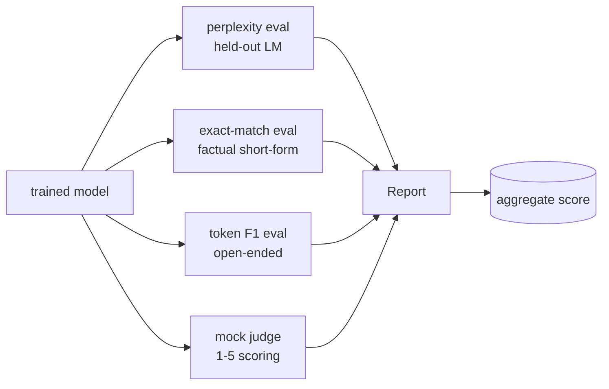
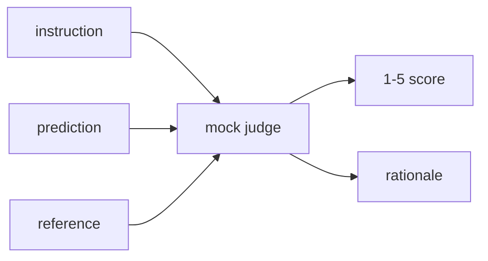
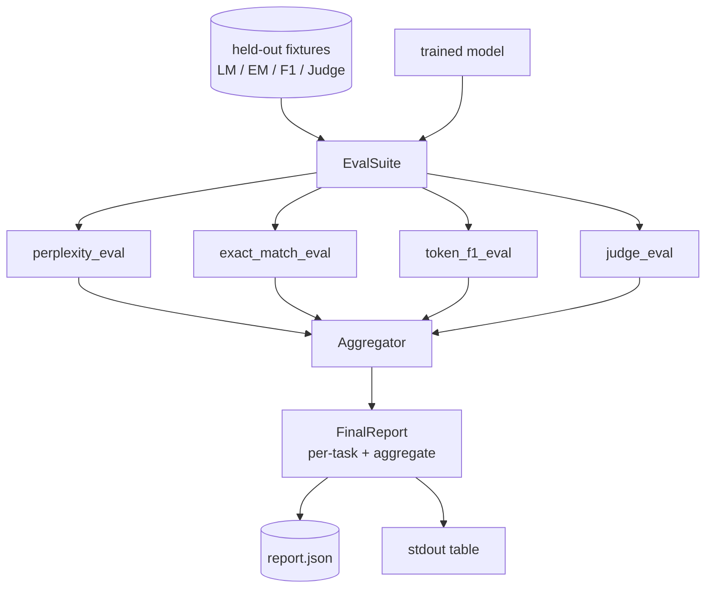

# 顶点课 41：完整评估流水线

> 训练那部分你可以盯着 loss 曲线看。评估那部分得自己设计。这节课构建一个统一的 eval 流水线：接收任意训练好的语言模型，跑四种不同类型的 eval，把结果汇总成一份 per-task 报告，并且自带一个本地 mock LLM-as-judge，让整个循环不需要联网就能跑。四个 eval 覆盖每个上线模型都需要的维度：语言建模（perplexity）、短答精确匹配（exact-match）、开放式相似度（token F1）、定性打分（judge）。

**类型：** Build
**语言：** Python（torch, numpy）
**前置要求：** 第 19 阶段第 30-37 课（NLP LLM 路线：tokenizer、embedding table、attention block、transformer body、预训练循环、checkpoint、生成、perplexity）
**预计时间：** ~90 分钟

## 学习目标

- 在 tiny transformer 上计算带 mask token 计数的 held-out perplexity。
- 在短答事实类 prompt 上跑 exact-match eval。
- 对预测和参考字符串做归一化后计算 token 级 F1。
- 构建一个本地 mock LLM-as-judge，按 1-5 分给模型输出打分。
- 把四个 eval 汇总成一份带权重的综合报告，含 per-task 明细。

## 问题

单一指标永远描述不了一个语言模型。Perplexity 衡量模型对语言分布的拟合程度，但说不了它能不能回答问题。Exact-match 说模型有没有产出 gold string，但会惩罚正确的改述。Token F1 容忍改述，但容易被词汇重叠的错误内容骗过。LLM-as-judge 能捕获定性维度，但贵且有随机性。

你真正想要的流水线四个都有。每个 eval 覆盖其他三个覆盖不到的维度。每个跑在针对该指标设计的不同 held-out 子集上。最终报告把 per-task 数字并排展示加上一个聚合分，让 reviewer 一眼看出模型在做什么 trade-off。

这节课端到端构建这个流水线，一个文件搞定。

## 概念

每个 eval 都是一个 `(model, dataset) -> EvalResult` 的函数。Result 里带指标值、per-example 明细用于检查、以及一个名字用于聚合。流水线通过配置来决定跑哪些 eval、权重怎么设。

## Perplexity：正确计数

Perplexity 就是 `exp(mean negative log-likelihood per token)`。实现上有两个坑：

- 均值的分母必须是实际 token 位置数，不是 batch * sequence。Padding token 必须从分母中排除，否则 perplexity 会看起来比实际好。
- 模型预测的是下一个 token，所以位置 `i` 的 logits 预测的是位置 `i+1` 的 token。这里的 off-by-one 错误是静默的：loss 照样训，但指标就没意义了。

Eval 计算每个 batch 中非 pad 位置的 `-log p(token)` 之和以及 token 计数，最后统一除。这在数值上比逐 batch 平均 perplexity 更安全（后者会低估短序列的权重），也与教科书定义一致。

## Exact-match：带归一化

匹配前对预测和参考都做归一化：

- 转小写。
- 去除首尾空白。
- 内部连续空白压缩成单个空格。
- 如果两边只差尾部标点（`.`、`!`、`?`），则去掉尾部标点。

归一化让 exact-match 在实际中可用。模型回答 `"Paris"` 是对的；回答 `"Paris."` 也是对的；回答 `"  paris  "` 也是对的。归一化之后还是要求字符串完全一样。

## Token F1：正确做法

Token F1 是在 bag-of-tokens 上计算 precision 和 recall 的调和平均。步骤：

1. 对预测和参考做归一化（规则同 exact-match）。
2. 按空白分词，得到 token 列表。
3. 计算多重集交集。
4. Precision = `intersection_count / len(pred_tokens)`。Recall = `intersection_count / len(ref_tokens)`。F1 = 调和平均。

如果预测和参考都是空的，F1 为 1（空集匹配）。如果只有一方为空，F1 为 0。这个模式和 SQuAD 评估参考实现一致，对改述也能产出稳定的数字。

## 本地 Mock LLM-as-Judge

真正的 judge 是一个通过 API 调用的 frontier model。本课的 judge 必须离线运行。Mock judge 是一个确定性打分器，接收指令、模型预测和参考，返回 `{1, 2, 3, 4, 5}` 中的一个分数加一句理由。打分规则很明确：

- 5 分：归一化后预测等于参考。
- 4 分：预测和参考之间的 token F1 >= 0.8。
- 3 分：token F1 在 `[0.5, 0.8)` 之间。
- 2 分：token F1 在 `[0.2, 0.5)` 之间。
- 1 分：其余情况。

这不是真 judge，但接口是对的。以后换成真模型只需改一个函数。流水线不关心。

## 聚合

聚合是归一化 eval 分数的加权平均。每个 eval 报告一个 `[0, 1]` 区间的值：

- Perplexity：归一化为 `1 / (1 + log(perplexity))`。Perplexity 为 1 映射到 1，无穷映射到 0。
- Exact-match：本身就在 `[0, 1]`。
- Token F1：本身就在 `[0, 1]`。
- Judge：除以 5。

权重可配。默认权重是 perplexity 0.2、exact-match 0.3、token F1 0.3、judge 0.2。权重怎么选是产品决策；本课把旋钮暴露出来，方便你试。

## 架构

`EvalSuite` 是一个薄薄的编排器。每个独立 eval 是一个自由函数，接收 `(model, tokenizer, dataset, config)` 返回 `EvalResult`。`Aggregator` 收集结果、产出最终报告。Demo 会把表格打到标准输出并写一份 JSON 副本，下游 CI 可以直接消费。

## 你将构建什么

实现是一个 `main.py` 加测试。

1. `TinyGPT`：与第 38-40 课相同的 decoder-only 架构，包含在内让本课可独立运行。
2. `InstructionTokenizer`：带 INST / RESP / PAD 特殊 token 的 byte tokenizer。
3. 四个 fixture：LM 语料、EM 集、F1 集、judge 集。每个 20 条，确定性的。
4. `perplexity_eval`：返回带 perplexity 值和 per-token loss 直方图的 `EvalResult`。
5. `exact_match_eval`：返回 mean EM 和 per-example 记录。
6. `token_f1_eval`：返回 mean token F1 和 per-example 记录。
7. `mock_judge` 和 `judge_eval`：per-example 分数和理由，整个集合的 mean score。
8. `Aggregator.normalise`：每个 eval 的归一化规则。
9. `Aggregator.aggregate`：加权平均，组装报告。
10. `run_demo`：短暂训练一个 tiny model，跑全部四个 eval，打印报告表格并写 JSON，成功则 exit 0。

## 如何读报告

报告分三层。最上面是聚合分。下面是四个 per-eval 数字。再下面是 per-example 明细，用于诊断。CI 挂了一般看聚合分就够了；但如果 reviewer 要追一个退化，就需要看 per-example 明细，找到模型具体答错了哪些输入。

JSON dump 用稳定的 key，CI dashboard 可以跨版本画趋势线。终端上的 pretty-print 表格是给训练跑完后盯终端看的人准备的。

## 拓展目标

- 加一个 calibration eval：模型的 softmax 概率和准确率一致吗？按置信度分桶，报告每个桶的经验准确率。
- 加一个 robustness eval：给每个样本打上扰动标签（typo、改述、干扰项），报告每种扰动的指标下降。
- 把 mock judge 换成通过 HTTP 调用的真模型。函数签名不变。
- 加 per-task 权重学习：不用固定权重，用目标偏好序来拟合权重。

这个实现给你四个 eval、聚合器和报告。真正的评估流水线会在此基础上叠加更多维度；模式不变：一个函数一个 eval，一个聚合器，一份报告。
