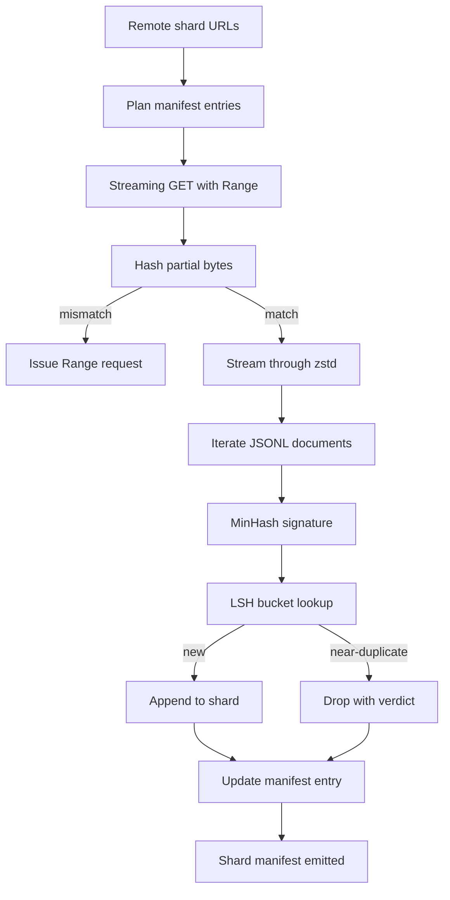

# 大规模语料下载器

> 训练语言模型，在第一次 forward pass 之前还有很长的路要走。语料得先落盘，解压、去重、可寻址，而且在网络才下了 4% 就断掉之前，resume 机制就得先想好。这节课构建一个流式下载器：拉取压缩分片、用 Zstandard 流式解压、通过 MinHash + 局部敏感哈希（LSH）做近似去重指纹，最后写出一份分片 manifest 供下游流水线使用。

**类型：** Build
**语言：** Python
**前置要求：** 第 19 阶段第 30-37 课
**预计时间：** ~90 分钟

## 学习目标

- 用 `urllib` 流式拉取远程分片，用 `zstandard` 流式解压，全程不把整个文件缓存到内存。
- 通过 HTTP `Range` 请求在验证过的字节偏移处恢复中断的下载。
- 为每个文档构建 MinHash 签名，用 LSH 做分桶让近似重复文档发生碰撞。
- 输出分片 manifest，包含内容哈希、字节数、文档数和去重判定。

## 问题

你第一次在 200 GB 语料上训练时，网络在 41% 处断了，脚本抛了个 `urllib` 异常退出。第二次在 78% 断了。到 99% 的时候你已经重写了三遍循环。你从第一分钟就必须设计好应对两种故障：断点续传和重复文档去除。两者都有成熟的解决方案；两者也经常被跳过，因为流水线最初就是一行 `requests.get` 然后越长越复杂。

断点续传是个 HTTP 问题。服务器得支持 `Range`，客户端得跟踪已验证的偏移并记录到磁盘，而且这个已验证偏移必须能扛住进程挂掉。如果偏移和文件哪怕差了一个字节，续传就会写入垃圾数据，语料就以一种只有 tokenization 阶段才会暴露出来的方式被悄悄污染了。

去重是个签名问题。精确哈希去重会漏掉近似重复：同一篇 Wikipedia 文章带了三种不同的样板页脚，同一个代码文件换了个 license 头，同一篇博文里每个链接加了不同的 tracking 参数。MinHash + LSH 能以亚线性代价捕获这些。开销就是每个文档一个签名、每个签名一次桶查找。

## 概念



### 用 `urllib` 流式传输

标准库的 `urllib.request.urlopen` 返回一个类文件对象。把它包在 `zstandard.ZstdDecompressor().stream_reader` 里，字节就从网络经过解压器流进文档迭代器，全程不需要把压缩分片或解压分片整体放到内存里。唯一的内存开销是行缓冲区、当前文档的 MinHash 签名和 LSH 索引。

### 用 `Range` 续传

下载器为每个分片写两个文件：分片本身和一个 `.partial.json` 检查点。检查点记录 `verified_bytes`、`expected_size`、`sha256_prefix`（对前 `verified_bytes` 字节计算的哈希）和源 URL。启动时下载器读取检查点，重新计算磁盘上字节的 `sha256_prefix`，只有哈希匹配才续传。如果哈希不对，就丢弃 partial 文件从零开始。静默损坏不可能发生，因为已验证的字节是经过校验的，不是假设的。

### MinHash + LSH

MinHash 用固定空间估算两个集合的 Jaccard 相似度。对一个文档来说，集合就是它文本的 shingle（重叠 n-gram）。签名是 `k` 个最小哈希值，每个对应一个独立的哈希函数。两个 Jaccard 相似度为 `s` 的文档，在签名的任意单个分量上一致的概率就是 `s`。

LSH 把 `k` 个分量分成 `b` 个 band，每个 band 有 `r` 个 row，其中 `k = b * r`。两个文档至少在一个 band 上碰撞的概率是 `1 - (1 - s^r)^b`，这在 `s` 的某个值附近形成一个陡峭的阈值，通过调 `(b, r)` 来控制。典型语料去重的阈值是 `s = 0.8`，LSH 研究文献里用 `k = 128, b = 32, r = 4` 就能达到。

### 分片 manifest 作为契约

下载器唯一的持久化输出就是 manifest。Manifest 里每个分片记录：URL、解压后字节数、文档数、去重后的唯一文档数，以及最终分片文件的 sha256。下游 tokenization 读 manifest，不是读目录列表。如果某个分片缺失或 sha256 不对，manifest 会告诉下一个阶段拒绝启动。Manifest 就是"数据下载完了"和"数据下载完了且可验证"之间的分界线。

## 构建

`code/main.py` 实现：

- `ShardPlanner` - 读取分片 URL 列表，生成计划好的 manifest 条目。
- `StreamingDownloader` - 打开带可选 `Range` 的 `urllib` 流，写入临时文件，每个 chunk 更新 `.partial.json` 检查点，续传时验证 sha256 前缀。
- `ZstdDocIterator` - 把类文件流包在 `zstandard.ZstdDecompressor` 里，逐行 yield 文档。
- `MinHasher` - 用固定的哈希种子族为字符串生成 `k` 分量签名。
- `LSHIndex` - 按 band 分桶签名，报告碰撞。
- `Dedup` - 组合 hasher 和 index，给每个文档标记 `keep` 或 `near_duplicate` 以及匹配的分片 id。
- `ManifestWriter` - 收集 per-shard 统计信息，写出 `manifest.json`。

文件底部的 demo 会在磁盘上构建一个小型合成语料，用 `zstandard` 压缩，通过 `file://` URL 下载，去重，然后打印 manifest。

运行：

```bash
python3 code/main.py
```

脚本 exit 0 并打印 manifest 摘要。

## 生产模式

四个模式把这节课扩展到真实语料。

**先写检查点，再写数据。** `.partial.json` 必须在字节追加到分片之前先 `fsync`。否则掉电时顺序反了：磁盘上有分片字节但检查点没有，下次续传以为已验证字节比实际少，重复的尾部字节就会污染文件。先写检查点再写数据——这和 write-ahead log 是同一个纪律。

**分片 LSH 索引。** 单个 LSH 索引覆盖整个语料在 200 GB 规模下放不进内存。按第一个 band hash 做分区，分区存磁盘，新签名进来只查它会落到的那个分区。代价是每个文档多一次磁盘读；好处是 LSH 索引不再是硬性的内存上限。

**标记墓碑，别删除。** 被丢弃的重复文档在 manifest 中标记为 `near_duplicate` 并记录它碰撞的分片 id。直接删掉会丢失重复和保留之间的关联。打墓碑标记保留了审计轨迹，也让下游流程可以改变阈值后重新决定。

**manifest 里记 per-shard sha256，再给 manifest 自身一个 sha256。** Manifest 本身也要有内容哈希。下游阶段先验证 manifest 哈希，再信任其中的 per-shard 条目。没有这层保护，manifest 就是静默的攻击面：能编辑一个文件就能污染整条流水线。

## 使用方式

生产模式：

- **每次 CI 运行都走续传。** CI runner 是临时的。下载器必须假设每次运行都是全新磁盘，从缓存或远程恢复。`--cache-dir` 是一等公民 flag。
- **先去重再 tokenize。** Tokenization 很贵。同一个文档跑两遍就是两倍代价换同一条 loss 曲线。去重在 tokenization 上游，不是下游。
- **Manifest 作为合入门禁。** 训练运行从 pinned commit 读 manifest sha256。新版本数据集就需要一个新的 manifest commit。代码和数据的关联靠 git，不靠口口相传。

## 交付

`outputs/skill-corpus-downloader.md` 在真实项目中会描述哪些 URL 喂给下载器、检查点目录怎么布局、去重用什么 shingle 宽度和 `(k, b, r)` 三元组、manifest 在版本控制中放在哪里。本课交付的是引擎。

## 练习

1. 加一个 `--shingle-width` flag，测量 shingle 宽度为 3、5、9 时去重判定的变化。为选择的默认值做论证。
2. 通过嗅探 magic bytes 在 zstd 旁边加上 gzip 支持。下载器不应该要求调用方指定编码格式。
3. 加一个 `--resume-only` 模式：如果没有找到检查点则拒绝启动新下载。在 CI 中防止某次运行意外重拉 200 GB。
4. 把 LSH 索引挪到 shelf 或 sqlite 文件上，与内存版本做吞吐量对比。
5. 在启动时加 manifest sha256 校验。如果磁盘上的 manifest 和 `manifest.lock` 中的 manifest hash 不一致，下载器应该拒绝运行。

## 关键术语

| 术语 | 大家嘴上说的 | 实际含义 |
|------|------------|---------|
| Shard（分片） | "一个文件" | 语料的一个自包含切片，有自己的 sha256，用作续传和去重的最小单位 |
| MinHash 签名 | "指纹" | 一个集合的 `k` 分量草图，每个分量是一个独立哈希对该集合的最小值 |
| LSH band | "桶" | 签名中的 `r` 个分量组成一组，作为碰撞检测的单一桶键 |
| 已验证字节 | "续传偏移" | 磁盘上 sha256 前缀与检查点匹配的字节；唯一安全的续传起始点 |
| Manifest | "索引" | 下载器产出的唯一持久记录，包含内容哈希 |

## 延伸阅读

- [RFC 7233](https://datatracker.ietf.org/doc/html/rfc7233) - HTTP Range 请求，续传协议
- [Zstandard 格式规范](https://datatracker.ietf.org/doc/html/rfc8478) - 使流式解压安全的帧格式
- [MinHash](https://en.wikipedia.org/wiki/MinHash) - 本课使用的签名族
- [Locality-sensitive hashing](https://en.wikipedia.org/wiki/Locality-sensitive_hashing) - 去重阈值背后的 banding 方案
- 第 19 阶段 · 43 - 下载器输出的 HDF5 tokenized corpus
- 第 19 阶段 · 44 - 在此语料上训练的 cosine schedule
- 第 19 阶段 · 45 - 消费 schedule 的 AMP 训练循环
