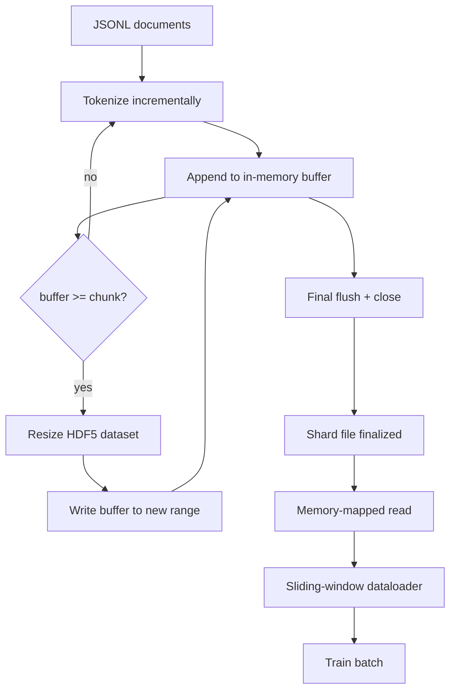

# HDF5 Tokenized Corpus

> 下载好的语料必须落到一种 trainer 能以线速流式读取的布局里。JSONL 在磁盘上扛不住 16 个 dataloader worker。HDF5 配上可扩容的分块整数 dataset 就能扛住。这节课构建：流式 tokenization 写入可扩容 HDF5 dataset、跨多文件的分片写入、训练时的内存映射读取、以及一个产出定长序列并正确 packing 的滑动窗口 dataloader。

**类型：** Build
**语言：** Python
**前置要求：** 第 19 阶段第 30-37 课
**预计时间：** ~90 分钟

## 学习目标

- 用确定性分块策略把文档流式写入可扩容 HDF5 整数 dataset。
- 在多个 HDF5 文件之间分片写入，让故障可控、并行成为可能。
- 通过 HDF5 page-cache 支撑的分块布局回读 token，让 dataloader 只在组 batch 时才拷贝到 batch buffer。
- 实现一个滑动窗口 dataloader，产出定长训练序列并有明确的 packing 规则。

## 问题

现代语言模型训练每秒要在几十个 worker 上读取数十万个样本。JSONL 在第一次冷缓存 page fault 时就死了：JSON 解析器慢、文档边界不可寻址、seek 到"第 4,217,884 个样本"需要从头扫文件。即使 Parquet 压缩率不错，也不适合，因为 trainer 不要列、要的是一条带 O(1) 随机访问的扁平 token 流。

HDF5 合适是因为它提供分块、可扩容、纯整数的 dataset，读取时 chunk 对 page cache 友好。Trainer 请求 `tokens[3,200,000 : 3,200,8192]` 这样一个切片，HDF5 就从 page cache 把请求的 hyperslab 拷贝到新分配的 NumPy 数组里。代价是每个 worker 一个打开的文件句柄加一个 chunk 大小的 page-cache 占用——相比解析 JSONL 的代价可以忽略不计。

构建上的难点在于让写入端诚实。可扩容 dataset 很容易用错：每次写一个文档，HDF5 文件就碎片化到不可用；一次 resize 写入全部文档，进程一挂就丢掉整个分片。正确的做法是 buffer-then-extend：buffer 大小对齐 chunk 大小，分片写入分散到多个文件，这样 crash 最多丢一个分片。

## 概念



### 正确使用可扩容 HDF5

Token dataset 创建时用 `maxshape=(None,)` 和固定的 `chunks=(chunk_size,)`。写入过程中先在一个长度为 `chunk_size` 的 NumPy 数组里缓冲 token。Buffer 满了就把 dataset resize 正好 `chunk_size`，然后把 buffer 写入新范围。分片结束时残余 buffer 写入最后一个 partial range。除了最后一次，每次写入都是连续且 chunk 对齐的。最后一个 partial range 里，reader 根据 HDF5 attributes 中记录的 `token_count` 来截断。

### 分片写入

单个 HDF5 文件是单点故障。流水线并行写分片：第 19 阶段第 42 课的每个输入分片对应一个 HDF5 输出分片。一个 `shards.json` 索引记录每个分片的文件路径、token 数、文档数以及 token 的 sha256。Trainer 读 `shards.json` 来计算全局偏移并校验语料。

### 内存映射读取

训练时每个 worker 以 `swmr=True` 模式打开自己负责的 HDF5 文件，请求 `tokens[start:stop]`。HDF5 的分块布局让这变成一次 page-cache 支撑的读取（chunk 热了之后）。Worker 永远不会把整个文件物化到内存：切片被拷贝到 dataloader 的 batch buffer，然后 dataloader 再把它拷贝到 pinned-memory 训练张量里。热路径上每次 chunk 切换一个 syscall，其余都是 RAM 访问。

### 滑动窗口 dataloader

Dataloader 是唯一知道训练序列长度的阶段。它在全局 token 流中随机选一个起始索引，读取 `window_size + 1` 个 token，返回 `(input, target) = (tokens[:-1], tokens[1:])`。不强制文档边界：一个窗口可能跨越两个文档，中间用显式的 `boundary_token_id` 分隔，让模型学会使用分隔符。这是标准 packing 规则；也是初学者最容易忘的规则——结果语料有 8% 是训练边界 token，92% 才是自然文本。

## 构建

`code/main.py` 实现：

- `Tokenizer` - 一个字节级确定性 tokenizer，够 demo 用。接口是 `encode(text) -> list[int]` 和 `vocab_size`。
- `HDF5ShardWriter` - 打开一个可扩容整数 dataset，把 token 缓冲到 chunk 大小，按定长步幅 resize 并写入，关闭时在 HDF5 attributes 中记录 `token_count` 和 `sha256`。
- `ShardedTokenizationPipeline` - 遍历输入文档，路由到 writer，输出 `shards.json` 索引。
- `MmapTokenStore` - 打开分片文件做内存映射读取，计算全局偏移，暴露单一的 `get_slice(start, stop)` API。
- `SlidingWindowDataloader` - 从全局流中随机选窗口，yield `(input_ids, target_ids)` NumPy 数组。

文件底部的 demo 构建一个 tiny 内存语料，tokenize 成两个分片，通过内存映射打开，跑 10 个 batch 的 dataloader，打印每个 batch 的 shape 和 checksum。

运行：

```bash
python3 code/main.py
```

脚本 exit 0 并打印 batch checksum。

## 生产模式

四个模式把这节课扩展到真实训练运行。

**chunk 大小等于典型读取大小。** Trainer 每个样本读 `window_size + 1` 个 token。把 HDF5 chunk 设为 `window_size` 的倍数，读取就是 page-cache 对齐的。Chunk 不匹配会让吞吐量减半，因为每个样本要触碰两个 chunk。

**token 数记在 attributes 里，不是在 dataset 里。** Dataset 尾部切片可能只写了一部分，因为 chunk 大小不整除文档边界。把真实的 `token_count` 作为 HDF5 attribute 存在 dataset 上，reader 按这个值截断。不这样做 reader 就会越界读到 zero-padded token，模型就学会去预测零了。

**分片 sha256 + 并行验证。** 每个分片对 token 字节有自己的 sha256。Trainer 训练开始前可以并行验证所有分片。sha256 不对就提前挂掉，不要等到第三个 epoch、跑了十六个小时之后。

**写入端用 `swmr=True` + `libver="latest"`。** Single-Writer-Multiple-Reader 模式要求写入端用 `libver="latest"` 打开文件，先创建好所有 dataset，再 set `file.swmr_mode = True`。之后写入端每次 resize 后都必须调 `dataset.flush()`，这样用 `swmr=True` 打开的 reader worker 才能看到一致的数据。忘了 `libver="latest"` 或者在结构性变更后才开 SWMR，是常见的 "file is locked" 报错来源。

## 使用方式

生产模式：

- **一个 HDF5 对应一个源分片。** 下载器（第 42 课）每个 URL 输出一个分片；tokenization（本课）每个源分片输出一个 HDF5。1:1 映射让续传和部分故障恢复变得简单。
- **boundary token id。** Boundary token 是 tokenizer 词表的一部分，是 dataloader 唯一注入的 token。训练 loss 如果要让模型忽略它就 mask 掉；否则模型就学着把它当序列分隔符用。
- **`shards.json` 作为唯一真相源。** 加一个新分片就是写 HDF5、算 sha256、追加一条记录。Trainer 启动时读一次这个文件，之后再也不碰目录列表。

## 交付

`outputs/skill-hdf5-tokenized-corpus.md` 在真实项目中会描述哪个 tokenizer 喂流水线、什么 chunk 大小匹配 trainer 的窗口、`shards.json` 在版本控制中放哪里、dataloader worker 怎么在文件间分配。本课交付的是引擎。

## 练习

1. 给 HDF5 writer 加一个 `--compression gzip` flag，在 demo 语料上测量吞吐量代价。为选择的默认值做论证。
2. 给滑动窗口 dataloader 加确定性种子，验证两次相同种子的运行产出完全一样的 batch。
3. 加一个 `--validate` 模式：读取每个分片，重算 token 的 sha256，与 `shards.json` 对比。CI 训练前应该跑这个。
4. 对比 chunk 大小等于、一半和两倍 window size 时的 dataloader 吞吐量，报告 page-cache 效应。
5. 加一个 `--max-document-tokens` flag，在写入时截断过长文档。论证这与在读取时截断之间的 trade-off。

## 关键术语

| 术语 | 大家嘴上说的 | 实际含义 |
|------|------------|---------|
| 可扩容 dataset | "Append-only" | 一个 `maxshape=(None,)` 的 HDF5 dataset，通过按 chunk 大小步幅 `resize` 来增长 |
| 分块布局 | "HDF5 怎么存的" | 固定大小的磁盘页，内核可以 memory-map、dataloader 可以连续读取 |
| `swmr` 模式 | "读写并行" | Single-Writer-Multiple-Reader 模式，让 dataloader worker 安全共享文件 |
| 分片索引 | "shards.json" | 所有 token 分片的持久索引，包含偏移和内容哈希 |
| 滑动窗口 | "训练样本" | 全局 token 流中的一个定长切片，trainer 将其与 shift-by-one 的 target 配对 |

## 延伸阅读

- [HDF5 分块文档](https://docs.hdfgroup.org/hdf5/v1_14/) - 本课使用的分块可扩容 dataset 布局
- [h5py 用户指南](https://docs.h5py.org/en/stable/) - HDF5 的 Python 绑定
- [NumPy memory mapping](https://numpy.org/doc/stable/reference/generated/numpy.memmap.html) - h5py 通过 HDF5 暴露的读端原语
- 第 19 阶段 · 42 - 本课 tokenize 的下载器输出
- 第 19 阶段 · 44 - 消费此 dataloader 的 cosine schedule
- 第 19 阶段 · 45 - 包裹训练步骤的 AMP 循环
