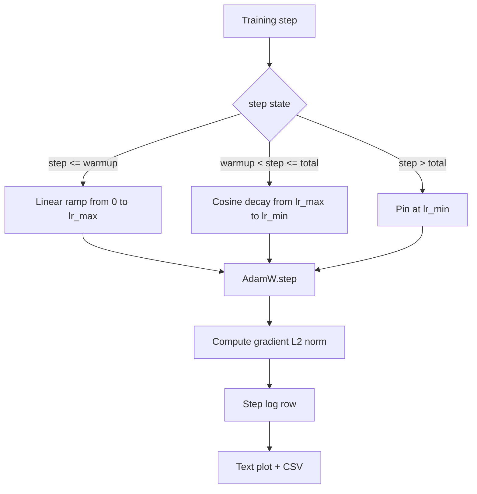

# Cosine 学习率 + 线性 Warmup

> 学习率 schedule 是仅次于 loss 函数的第二重要决策。AdamW 配 cosine decay + linear warmup 是语言模型训练的现代默认配置——前面那一千步脆弱期给模型一个小的有效步长，然后升到配置好的峰值，最后平滑衰减回接近零。这节课实现这个 schedule、画出训练步上的曲线、在 schedule 旁边记录 gradient norm、并证明 schedule 在 warmup、peak 和 decay 边界上的行为正确。

**类型：** Build
**语言：** Python
**前置要求：** 第 19 阶段第 30-37 课
**预计时间：** ~90 分钟

## 学习目标

- 实现一个连接了 cosine 学习率 schedule + linear warmup 的 AdamW optimizer。
- 在任意 step 精确计算 schedule 的值，跨 run 无浮点漂移。
- 把 gradient L2 norm 和学习率并排记录，让训练健康状态可观测。
- 把 schedule 渲染成肉眼可读的文本图和任意工具可消费的 CSV。

## 问题

训练的前一千步是最吵的。模型权重还贴近初始化。Optimizer 的二阶矩估计还没稳定。梯度 norm 又大又噪声。如果学习率在这些 step 就已经到峰值，模型要么直接发散，要么掉进一个再也爬不出来的 loss 平台。两个已知的修复方法是 gradient clipping（第 19 阶段第 45 课的主题）和一个从小到大慢慢升的学习率 schedule。

Cosine-with-warmup schedule 有三个区间。从 step 0 到 step `warmup_steps`，学习率从零线性升到配置的峰值 `lr_max`。从 step `warmup_steps` 到 step `total_steps`，学习率沿 cosine 曲线的上半段从 `lr_max` 衰减到 `lr_min`。`total_steps` 之后学习率钉在 `lr_min`，这样配置错了的 trainer 超了步也不会悄悄跑出 schedule。

构建上的难点在于 schedule 很容易 off-by-one。这个 off-by-one 会在训练跑了六个小时后才暴露为一个高了或低了 1% 的学习率——正好赶上模型开始过拟合的节骨眼——除非你在边界上做了穷举测试，否则根本看不见。

## 概念



### Warmup 公式

对于 `step` 在 `[0, warmup_steps]` 且 `warmup_steps > 0` 的情况，学习率是 `lr_max * step / warmup_steps`。退化情况 `warmup_steps = 0` 视为"无 warmup"：step 0 直接从 `lr_max` 开始，立即进入 cosine decay。有些测试 harness 会传 `warmup_steps = 0` 来检查 schedule 是否仍能产出可用曲线。

### Cosine 公式

对于 `step` 在 `(warmup_steps, total_steps]` 的情况，学习率是 `lr_min + 0.5 * (lr_max - lr_min) * (1 + cos(pi * progress))`，其中 `progress = (step - warmup_steps) / max(1, total_steps - warmup_steps)`。在 `step = warmup_steps` 时 cosine 算出 `cos(0) = 1`，得到 `lr_max`，精确匹配 warmup 终点。在 `step = total_steps` 时 cosine 算出 `cos(pi) = -1`，得到 `lr_min`，精确匹配 decay 终点。

两个端点的连续性不是巧合。这就是为什么 schedule 要实现为关于 `step` 的单一函数，而不是三个不同函数粘在一起。粘起来的 schedule 在第一次改 `lr_max` 时就会丢掉一个边界。

### total_steps 之后的地板

`step > total_steps` 时学习率保持 `lr_min`。契约是明确的：schedule 不会报错也不会外推；它钉在地板上，让 trainer 记一条 warning。需要延长训练就改 schedule 的 `total_steps`，别改循环。

### Gradient norm 和学习率并排记录

Schedule 是训练健康的一半。Gradient norm 是另一半。训练循环每步都记录两者。发散的训练在 gradient norm spike 时就会暴露，比 loss 更早；调得好的 warmup 会让 norm 随学习率线性上升；peak 太激进会表现为 warmup 结束后 norm 居高不下。磁盘上的数据集是 `step, lr, grad_l2_norm, loss`。CSV 是唯一的持久记录。

## 构建

`code/main.py` 实现：

- `CosineWithWarmup` - 一个无状态函数 `lr(step) -> float`，覆盖配置好的 schedule。
- `TrainState` - 把模型、`AdamW` optimizer 和 schedule 包装成一个 step 函数。
- `TrainState.step` - 跑一次 forward pass、一次 backward pass、记录 gradient L2 norm、然后把 `lr(step)` 应用到 optimizer。
- `plot_schedule_ascii` - 把 schedule 渲染为肉眼可读的文本图。
- `write_schedule_csv` - 每步一行，输出学习率。

文件底部的 demo 构建一个 tiny `nn.Linear` 模型，在固定输入 batch 上训练 20 步，打印每步的学习率、gradient norm 和 loss。Schedule 也渲染成文本图做视觉 sanity check。

运行：

```bash
python3 code/main.py
```

脚本 exit 0 并打印 per-step 训练日志加 schedule 图。

## 生产模式

四个模式把 schedule 升级为生产制品。

**Schedule 放在配置里，不在代码里。** Trainer 从 git 里提交的 YAML 或 JSON 配置中读取 `warmup_steps`、`total_steps`、`lr_max`、`lr_min`。Schedule 可复现因为配置是内容寻址的；schedule 可审计因为配置是 PR diff 的一部分。

**Step counter 单调递增且与 epoch 解耦。** 有些框架在数据分片或 dataloader 重启时会搞混 step 和 epoch。Schedule 从 trainer 的 checkpoint 读 `global_step`，不是从本地计数器读。恢复训练时 schedule 位置正确，因为 step counter 是持久化的轴。

**Schedule 图放在 run 目录里。** 每次训练运行都在 run 目录下写一个 `outputs/lr_schedule.png`（本课是文本图）。Reviewer 扫一眼目录就能 sanity-check schedule，不需要重跑。这在 PR 时就能抓住配错 schedule 这类 bug。

**Log row schema 固定。** `step, lr, grad_l2_norm, loss`，按这个顺序。下游 notebook 或 dashboard 按这个 schema 读；不 bump version 就改列名会废掉所有现有 dashboard。

## 使用方式

生产模式：

- **先 sweep peak，再 sweep 其他任何东西。** `lr_max` 是最敏感的旋钮。先在小模型上 sweep；最优 `lr_max` 随模型大小弱缩放，所以小模型 sweep 是个很强的先验。
- **Warmup 是 total steps 的比例，不是绝对步数。** 一个 2 亿步的运行配 2,000 步 warmup 几乎一开始就到峰值；一个 20,000 步的运行配同样的数字却是 10% 的 warmup。把 warmup 配成比例（典型：1-3%），schedule 就能随训练时长自动缩放。
- **`lr_min` 故意非零。** 一个 10% `lr_max` 的地板让 optimizer 在长尾阶段还能学。`lr_min = 0` 的 schedule 画出来的曲线很漂亮，但模型其实还没训完。

## 交付

`outputs/skill-cosine-warmup.md` 在真实项目中会描述哪个配置文件承载 schedule、trainer step 的全局计数器从哪里读、部署值的 `lr_max` sweep 产出了什么。本课交付的是引擎。

## 练习

1. 加一个 inverse-square-root 变体 schedule，在 200 步 toy 训练运行上对比。哪条曲线的最终 loss 更低？
2. 加一个 `--restart` flag，在 `total_steps / 2` 处做第二次 warmup。论证 warm restart 在 toy 运行上是改善还是损害。
3. 加一个单元测试检查 schedule 连续性：对 `[0, total_steps]` 中的每个 step，差值 `|lr(step+1) - lr(step)|` 必须被 `lr_max / warmup_steps` 上界。
4. 把 schedule 接入 `torch.optim.lr_scheduler.LambdaLR`，让它能和框架代码组合。本课用的是纯 step 函数；wrapper 改变了什么？
5. 加一个 `--plot-png` flag 用 `matplotlib` 画真图。论证本课的文本图和 PNG 哪个更适合作为 CI 运行的默认值。

## 关键术语

| 术语 | 大家嘴上说的 | 实际含义 |
|------|------------|---------|
| Warmup | "慢启动" | 在前 `warmup_steps` 步内从零线性升到 `lr_max` |
| Cosine decay | "平滑下降" | 在剩余步数上从 `lr_max` 到 `lr_min` 的上半 cosine 曲线 |
| 地板 | "训练之后" | `total_steps` 之后 schedule 钉死的 `lr_min` 值 |
| Gradient norm | "梯度的 L2" | 拼接后梯度向量的欧几里得范数，每步记录 |
| Global step | "Schedule 轴" | 一个能扛住重启的单调 step 计数器，驱动 schedule |

## 延伸阅读

- [Loshchilov and Hutter, SGDR: Stochastic Gradient Descent with Warm Restarts (arXiv 1608.03983)](https://arxiv.org/abs/1608.03983) - cosine schedule 的参考论文
- [Loshchilov and Hutter, Decoupled Weight Decay Regularization (arXiv 1711.05101)](https://arxiv.org/abs/1711.05101) - AdamW 的参考论文
- [PyTorch torch.optim.lr_scheduler](https://docs.pytorch.org/docs/stable/optim.html#how-to-adjust-learning-rate) - step 函数如何与框架 scheduler 组合
- 第 19 阶段 · 42 - schedule 消费的语料的下载器
- 第 19 阶段 · 43 - schedule 共同演进的 dataloader
- 第 19 阶段 · 45 - gradient clipping 和 AMP，循环的下一层
