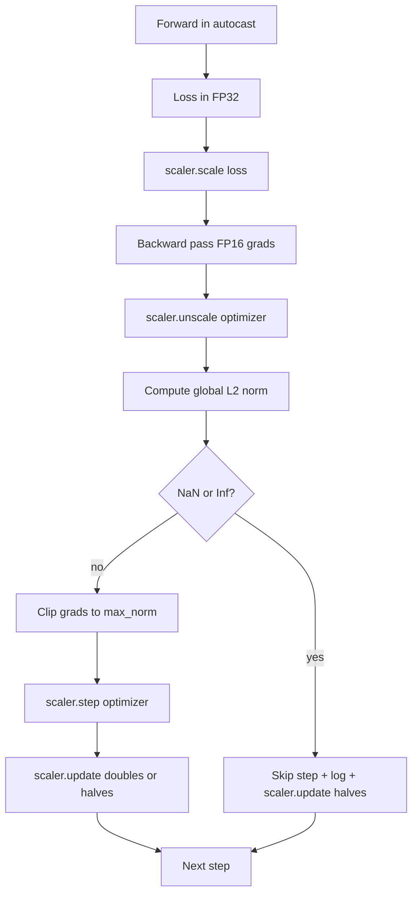

# Gradient Clipping 与混合精度训练

> 上一课的 optimizer 和 schedule 假设梯度是正常的。通常它们不正常。一个 bad batch 就能让 gradient norm 飙升三个数量级。混合精度训练还会雪上加霜——FP16 在 loss 端引入溢出。这节课构建生产训练不可或缺的两根安全带：按全局 L2 norm 配置阈值的 gradient clipping，以及一个带 autocast 和 GradScaler 的混合精度循环，能检测 NaN 和 Inf、干净地跳过该步、并把 scaling factor 记日志方便事后取证。

**类型：** Build
**语言：** Python
**前置要求：** 第 19 阶段第 30-37 课
**预计时间：** ~90 分钟

## 学习目标

- 计算所有参数梯度的全局 L2 norm，超过配置阈值时就地 clip。
- 用 autocast + GradScaler 包裹训练步骤，让 FP16 的 forward 和 backward pass 能扛住溢出。
- 检测 loss 或梯度中的 NaN 和 Inf，跳过 optimizer step，并记录跳过原因。
- 每步报告 GradScaler 的 scaling factor，让连续跳步一目了然。

## 问题

昨天还跑得好好的训练，在 step 8,217 loss 曲线突然拉直。罪魁祸首是一个 gradient norm 4,200 的 batch，是之前峰值的 20 倍。没有 clipping 的话 optimizer 一步就把模型过去一小时学到的东西全抹掉了。有了全局 L2 clip（norm = 1.0），同一个 batch 贡献的是一个单位 norm 的更新；loss 继续沿趋势线走；训练活了下来。

混合精度训练用 FP16 计算 forward pass 和大部分 backward pass，吞吐量提升 2-3 倍。代价是 FP16 的指数范围很窄。一个在 FP16 下溢出的典型梯度会变成 Inf，Inf 传播到后续层变成 NaN，下一次 optimizer step 就把所有权重都设成 NaN。PyTorch 的 GradScaler 通过在 backward 前把 loss 乘以一个大的 scaling factor、在 optimizer step 前把梯度除以同一个 factor 来解决这个问题。如果在 unscale 时发现任何梯度是 Inf 或 NaN，scaler 就跳过该步并把 factor 减半；如果前 N 步都是干净的，scaler 就把 factor 翻倍。训练过程中 factor 会找到 FP16 范围允许的最大值。

构建上的难点在于把两者正确接线。在 unscale 之前 clip，阈值作用在 scaled 梯度上；在 unscale 之后 clip，GradScaler 的操作顺序才对。正确的顺序是：`scaler.scale(loss).backward()`，然后 `scaler.unscale_(optimizer)`，然后 `clip_grad_norm_`，然后 `scaler.step(optimizer)`，然后 `scaler.update()`。任何其他顺序都会产出一个悄悄坏掉的循环。

## 概念



### 全局 L2 norm

全局 L2 norm 是拼接后梯度向量的欧几里得范数，不是 per-parameter norm。PyTorch 实现为 `torch.nn.utils.clip_grad_norm_(parameters, max_norm)`。这个函数返回 clip 前的 norm，本课可以同时记录自然值和 clip 后的值——这对诊断"每步都在 clip"是必要的。

### autocast 和 GradScaler

`torch.amp.autocast(device_type)` 是选择性地将符合条件的运算（主要是 matmul 类运算）跑在 FP16 下的上下文管理器。`torch.amp.GradScaler(device_type)` 是在 backward 前 scale loss、在 optimizer step 前反向 scale 梯度的辅助类。两者是配套设计的；只用其中一个不用另一个是配置错误，测试应该能抓到。

本课用 CPU autocast 因为这样在 CI 里能跑；同一套模式换成 CUDA 只需把 `device_type="cpu"` 改成 `device_type="cuda"`。CPU 上的 GradScaler 是个 stub（CPU autocast 默认跑 BF16，不需要 loss scaling），但本课保留了调用点，让接线与 GPU 循环完全一致。

### NaN 和 Inf 检测

检测发生在两个地方。第一，backward 之前用 `torch.isfinite` 检查 loss 本身；一个 Inf 或 NaN 的 loss 不会产出有用的梯度，直接跳过不进 optimizer。第二，`scaler.unscale_(optimizer)` 之后用 `has_non_finite_grad(...)` 扫描 unscaled 梯度，任何 Inf 或 NaN 都视为跳步。两个检查一起覆盖了 forward-pass 和 backward-pass 的失败模式。

### Scaling factor 诊断

Scaling factor 是 GradScaler 的内部状态。每步本课都读 `scaler.get_scale()` 并和学习率、gradient norm 一起记录。健康的训练会看到 factor 按 2 的幂往上爬直到 `2^17` 或 `2^18` 附近饱和。不健康的训练会看到 factor 在高低之间振荡——这就是模型梯度有时在范围内有时不在的信号。不记日志的话这个诊断信息是隐形的。

## 构建

`code/main.py` 实现：

- `clip_global_l2_norm` - 对 `torch.nn.utils.clip_grad_norm_` 的包装，返回 clip 前和 clip 后的 norm。
- `has_non_finite_grad` - 扫描梯度中的 NaN 和 Inf 的辅助函数。
- `AmpTrainState` - 包装模型、`AdamW` optimizer、GradScaler 和 autocast device。暴露 `step(inputs, targets)` 方法，跑完整的 clipping、scaling 和 NaN 跳步流水线。
- `StepLog` 和 `SkipLog` - 结构化的 per-step 记录。
- 一个 demo：训练一个小 `nn.Linear` 模型 20 步，在 step 5 注入一个 Inf 到梯度里来触发跳步路径，打印结果日志。

运行：

```bash
python3 code/main.py
```

脚本 exit 0 并打印 per-step 日志，每行标记 `STEP` 或 `SKIP`；至少有一行是 `SKIP`。

## 生产模式

四个模式把循环升级为生产训练步骤。

**跳步计数器是告警，不是日志行。** 每轮训练跳几步是正常的。每个 epoch 跳几百步就是硬告警：模型处于 FP16 兜不住的区间，循环在静默失败。本课追踪 1,000 步滚动跳步率，在生产中超过 5% 就应该报警。

**Clip 阈值放在配置里。** `max_norm = 1.0` 是语言模型训练的现代默认值。先在小模型上 sweep；更大的阈值让模型从真正困难的 batch 中恢复；更小的阈值限制了最坏情况但代价是更嘈杂的 loss 曲线。阈值和第 44 课的 schedule 放同一个 YAML 或 JSON 配置里。

**Norm 日志和 schedule 写同一个 CSV。** CSV 列是 `step, lr, grad_l2_pre_clip, grad_l2_post_clip, loss, skipped, skip_reason, scaler_scale`。Reviewer 打开文件就能一行看到 schedule、梯度故事、scaling factor 和跳步结果（含原因）。把列分散到多个文件里就是给分析对齐挖坑。

**`scaler.update()` 每步都跑，包括跳步。** 正常步里 scaler 读自己的 no-inf 计数器、加一、可能翻倍 factor。跳步里 scaler 减半 factor、重置计数器。忘了在跳步路径上调 `update()` 就是那个"scaling factor 一直没变"的 bug。

## 使用方式

生产模式：

- **autocast device 要和 optimizer device 一致。** GPU 训练用 `torch.amp.autocast(device_type="cuda")`；CPU 用 `torch.amp.autocast(device_type="cpu")`。device 混了会产出一个静默的类型错误——loss 曲线看着没问题但模型没在学。
- **backward 之前先检查 loss。** `torch.isfinite(loss).all()` 就是一次张量 reduction；代价可以忽略，但在 NaN loss 上省下的是一整个训练步。务必执行。
- **`zero_grad` 里用 `set_to_none=True`。** 把梯度设为 `None` 而不是零，让 optimizer 跳过不受影响的参数组。这是个免费的吞吐量提升，还能略微减少 bug 面。

## 交付

`outputs/skill-clip-amp.md` 在真实项目中会描述训练步使用什么 clip 阈值和 autocast device、per-step CSV 在版本控制中放哪里、生产跳步率告警阈值是多少。本课交付的是引擎。

## 练习

1. 把合成的 Inf 注入换成真实的 loss spike（把某个 batch 的 target 乘以 1e8），验证跳步路径会触发。
2. 加一个 `--bf16` 模式，把 autocast 切到 BF16。BF16 指数范围比 FP16 宽，很少需要 loss scaling；验证在同一个 demo 上跳步率降到零。
3. 加一个单元测试验证 gradient-clip 包装在无需 clip 时正确返回 clip 前和 clip 后的 norm。
4. 加一个滚动窗口跳步率计算和一个 CLI flag：如果连续 100 步跳步率超过配置阈值就让运行失败。
5. 接好循环让它写标准 CSV（`step, lr, grad_l2_pre_clip, grad_l2_post_clip, loss, skipped, skip_reason, scaler_scale`），确认文件能扛住 Ctrl-C——每行写完就 flush。

## 关键术语

| 术语 | 大家嘴上说的 | 实际含义 |
|------|------------|---------|
| 全局 L2 norm | "Clip 目标" | 所有可训练参数梯度拼接后的欧几里得范数 |
| autocast | "混合精度" | 在 `with` 块内选择性地将符合条件的运算跑在 FP16（或 BF16）下 |
| GradScaler | "Loss scaler" | backward 前乘以 loss、optimizer step 前反向除梯度的辅助类 |
| 跳步 | "Bad step" | 因梯度或 loss 非有限而拒绝的 optimizer step；scaler 减半 factor |
| Scaling factor | "Scaler 状态" | GradScaler 当前的乘数；连续干净步后翻倍，每次跳步减半 |

## 延伸阅读

- [Micikevicius et al., Mixed Precision Training (arXiv 1710.03740)](https://arxiv.org/abs/1710.03740) - 最初的 loss-scaling 提案
- [Pascanu, Mikolov, Bengio, On the difficulty of training recurrent neural networks (arXiv 1211.5063)](https://arxiv.org/abs/1211.5063) - gradient clipping 的参考论文
- [PyTorch torch.amp.GradScaler](https://docs.pytorch.org/docs/stable/amp.html) - 本课包裹的 scaler API
- [PyTorch torch.nn.utils.clip_grad_norm_](https://docs.pytorch.org/docs/stable/generated/torch.nn.utils.clip_grad_norm_.html) - 本课使用的 clipping 原语
- 第 19 阶段 · 42 - 喂给循环的语料的下载器
- 第 19 阶段 · 43 - 循环消费的 dataloader
- 第 19 阶段 · 44 - 本循环组合的 schedule
