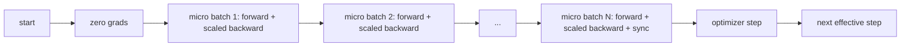
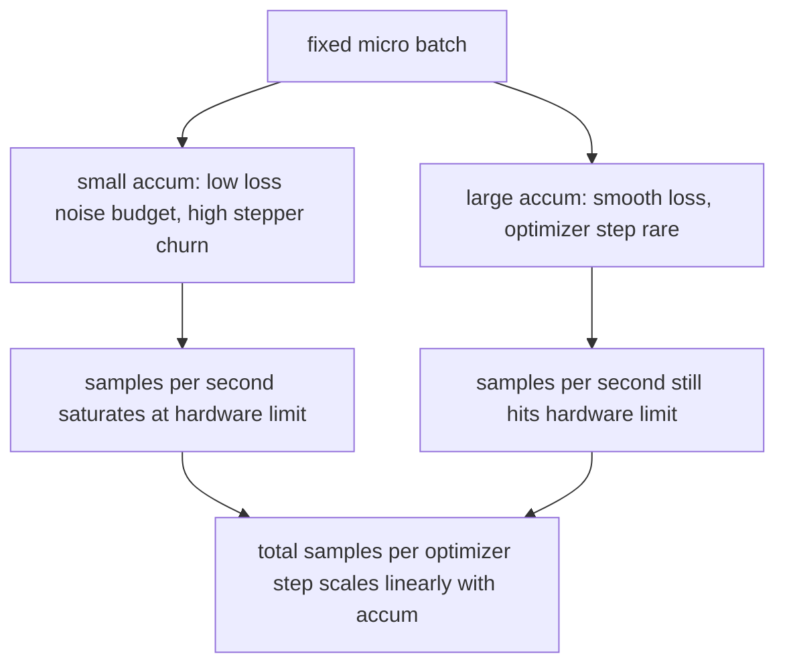

# 梯度累积

> 用你买不起的大 batch 来训练——一个 micro-batch 一个 micro-batch 地攒。缩放 loss，按住优化器别动，让梯度自己堆起来。

**类型：** Build
**语言：** Python
**前置要求：** 第19阶段第42-45课
**预计时间：** ~90 分钟

## 学习目标

- 推导 effective batch 恒等式：`effective_batch = micro_batch * accum_steps`。
- 实现逐 micro-batch 的 loss 缩放，使累积梯度与单次全 batch backward 等价。
- 在非末尾 micro-batch 上跳过优化器同步（sync-on-last-step）。
- 阅读吞吐量-effective batch 曲线，解释收益递减现象。

## 问题背景

你想用 effective batch 512 来训练——loss 曲线更平滑，优化器在这个尺度上每一步更有意义。但桌上的加速卡塞 32 个样本就爆显存了。batch 翻倍做不到，模型减半也不行。2017 年起整个领域用到现在的老招是：跑 16 次 backward，让梯度在参数 buffer 里累积，直到数量凑够再执行一次 optimizer step。

风险在于 loss 的数值变了。把 16 个 mini-batch 的 cross entropy 直接加起来，是单个完整 batch loss 的 16 倍。不做缩放的话，梯度方向没错，但大小不对——optimizer step 直接大了 16 倍。修复方法就是一个除法。但这个除法也很容易忘。

## 核心概念



核心约定很简短：

- 每个 micro-batch 的 loss 在 `backward()` 之前要除以 `accum_steps`。PyTorch 默认把梯度累加到 `param.grad` 里；这个除法把累加值拉回正确的量级。
- optimizer step 在最后一个 micro-batch 的 backward 之后才执行，每个 effective batch 执行一次。在累积中途就 step，会把后续所有参数都带偏。
- 优化器的内部状态（momentum buffer、Adam 的一阶/二阶矩）每个 effective step 推进一次，而非每个 micro-batch 推进一次。否则指数移动平均会看到错误的频率，把学习率调度搞砸。
- 在单卡上这只是一些记账工作。在多卡集群上，同样的模式会把非末尾 micro-batch 包裹在 `no_sync` 上下文中，跳过梯度 all-reduce；最后一个 micro-batch 一次性做完全部累积梯度的 reduce，而不是付 N 次网络开销。

### 代码层面的等价性证明

```python
loss = criterion(model(x_full), y_full)
loss.backward()
opt.step()
```

等价于

```python
for x, y in chunks(x_full, y_full, n):
    scaled = criterion(model(x), y) / n
    scaled.backward()
opt.step()
```

差异仅来自浮点累加顺序。循环结束后的梯度 buffer 与单次全 batch backward 产生的 tensor 一致。课程代码在 `equivalence_check` 中用 max-abs difference < 1e-4 来断言这一点。

### 开销分布

每个 micro-batch 花费一次 forward 和一次 backward。梯度累积是拿时间换显存。`outputs/accum-curve.json` 里的吞吐量曲线展示了在固定 micro-batch 下增大 effective batch 时会发生什么：



没有免费午餐。`accum_steps` 翻倍，每次 optimizer step 的挂钟时间也翻倍。变化的是梯度估计的方差：在同样的时间预算下，optimizer step 更少，但每一步平均了更多样本。文献把大 batch 和小 batch 当作不同的优化问题来讨论；本课只关心机械层面，不涉及统计层面。

## 动手构建

`code/main.py` 是可运行的产物。它做三件事。

### 第一步：等价性检查

`equivalence_check()` 用相同 seed 构建两份相同网络。一份在一次 forward 中看到 16 个样本的 batch；另一份看到四个 4 样本的 chunk，并且 loss 除以 4。函数在 optimizer step 之前比较梯度 buffer，step 之后比较参数。断言是 `max_abs_diff < 1e-4`。

### 第二步：sync-on-last-step 模式

`train_one_optimizer_step` 遍历 micro-batch。对于除最后一个之外的每个 micro-batch，进入 `no_sync_context(model)`。在单进程上这个 context 是 no-op；在 DDP 下就是跳过梯度 all-reduce 的地方。记账逻辑不变。`sync_counter` 记录离开 no_sync 作用域的次数；对于 N 个 micro-batch，每个 effective step 计数为 1 而不是 N。

### 第三步：吞吐量曲线

`sweep_effective_batches` 用固定 micro-batch 和一组 accumulation steps 运行同一个模型。对每种设置记录：

- `samples_per_sec`：总样本数除以挂钟时间
- `median_step_ms`：每个 effective step 的第 50 百分位耗时
- `sync_calls`：collective 调用次数
- `avg_loss`：sweep 中各 optimizer step 的平均 loss

输出写入 `outputs/accum-curve.json`，可在 notebook 中复用。

运行：

```bash
python3 code/main.py
```

脚本先打印等价性 diff，再打印 sweep 表格，最后输出 JSON 路径。退出码为零。

## 实际应用

在生产训练中，梯度累积就藏在一个旋钮后面。PyTorch 里的套路是 `accumulation_steps = effective_batch // (micro_batch * world_size)`。你不能在本课使用的那些框架包了同样的循环，但步骤一样：缩放 loss，跳过非末尾 micro 的 sync，累积，step 一次。

实战中三种常见模式：

- Micro-batch 大小选到刚好塞满设备显存。更小浪费加速器算力，更大直接 OOM。
- Effective batch 根据学习率调度来定。大 effective batch 需要缩放后的学习率和 warmup——这就是 2017 年以来一直在说的 linear scaling rule。
- Accumulation 步数是两者之间的桥梁，也是唯一一个你能在运行时随意调整而不用改 data loader 的旋钮。

## 交付产物

`outputs/skill-gradient-accumulation.md` 把 recipe 记下来，方便同事直接拿到新 repo 里用：loss 除以 `accum_steps`，非末尾 micro 跳过 optimizer sync，每个 effective batch 执行一次 optimizer step，把吞吐量-effective batch 数据导出为 JSON 以便可视化。

## 练习

1. 用 `--num-steps 100` 重跑 sweep，画出 samples per second 与 effective batch 的关系。曲线在哪里变平了？
2. 加一个错误缩放变体（不做除法），展示第 1 步的参数与参考值的 diff。
3. 把 SGD 换成 AdamW，确认 optimizer state 每个 effective step 推进一次，而非每个 micro-batch。
4. 引入真正的 `DistributedDataParallel` wrapper，把 `no_sync_context` 路由到它的方法。确认 sync_calls 每个 effective batch 减少了 N-1 次。
5. 修改等价性检查，比较两种不同的 micro 分割方式（2×8 vs 4×4），解释你需要放宽的容差。

## 关键术语

| 术语 | 日常说法 | 实际含义 |
|------|---------|---------|
| Micro batch | 你 forward 的那个 batch | 单次 forward 中能塞进显存的那一片数据 |
| Accum steps | 每个 step 的 backward 次数 | 在一次 optimizer step 之前累积的 backward 次数 |
| Effective batch | 真正的 batch | micro batch × accum steps × 数据并行的 world size |
| Loss scaling | 除以 N | 逐 micro-batch 做除法，使累加后的梯度与全 batch 一致 |
| Sync on last | 跳过其余的 | 只在窗口中最后一次 backward 时执行梯度 collective |

## 延伸阅读

- PyTorch `DistributedDataParallel.no_sync` 文档，sync-on-last-step 技巧的生产版本。
- Goyal et al., 2017，关于大 batch 训练的 linear scaling，这是关心 effective batch 的经典原因。
- PyTorch issue tracker 上关于梯度累积与混合精度 unscaling 交互的讨论。
- 第19阶段第42-45课覆盖了本课所依赖的模型、data loader、optimizer 和 trainer 脚手架。
- 第19阶段第47课覆盖了 checkpoint 与 resume，让一次漫长的累积训练能扛过挂钟时限。
