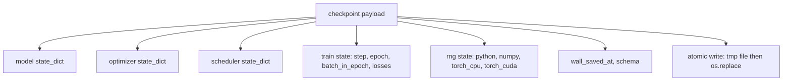
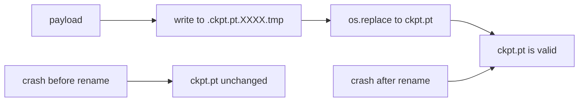
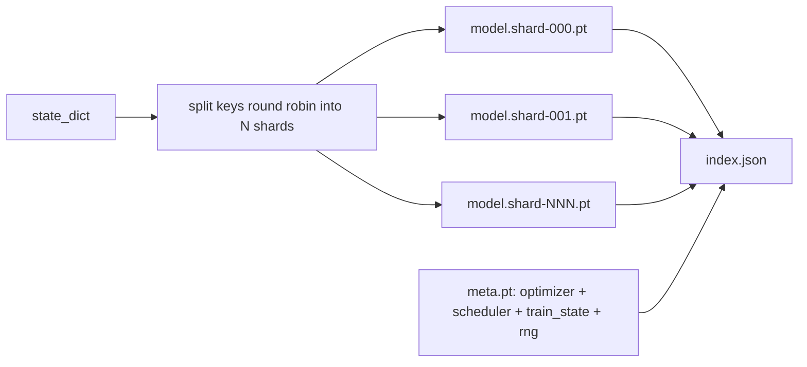

# Checkpoint 保存与恢复

> 训练中断会杀死整个 run；checkpoint 让它接着跑。把模型、优化器、调度器、loss 历史、step 计数器和 RNG 状态原子地存下来，这样任意时刻被 kill 都能在磁盘上留下一个合法文件。

**类型：** Build
**语言：** Python
**前置要求：** 第19阶段第42-45课
**预计时间：** ~90 分钟

## 学习目标

- 把完整的训练状态打包到一个 payload 中，能在全新进程里加载恢复。
- 用"先写临时文件再 rename"的方式实现原子保存，crash 不会留下写到一半的文件。
- 恢复 Python、NumPy 和 PyTorch 的 RNG 状态，使 resume 后的 loss 与未中断的 baseline 一致。
- 为单文件装不下的大模型构建分片 checkpoint 布局，带 hash 校验的 shard 加上 JSON 索引。

## 问题背景

你设了一个 18 小时的训练任务。挂钟上限是 4 小时。集群在第 11 小时重启了——因为你上面的人批准了一次内核升级。没有 checkpoint 就从头来过。没有 resume，就连优化器花了前 11 小时才学到的状态也丢了：即使模型权重幸存，AdamW 的矩估计也没了，下一步会朝着训练轨迹早已走过的方向猛冲。

正确的产物是一个包含续跑所需一切的文件：模型参数、优化器状态、调度器状态、画图用的 loss 历史、当前 step/epoch/batch-in-epoch 计数器，以及每种随机源的 RNG 状态。没有 RNG 状态，resume 后的 loss 曲线就是另一条曲线——同一个模型、同一份数据，不同的 shuffle、不同的 dropout mask、仪表盘上不同的数字。

原子保存是合约的另一半。直接写目标文件名意味着写到一半 crash 会留下一个损坏文件；resume 读到的是垃圾。先写同目录下的临时文件再 rename，crash 时之前的好文件依然完好。rename 在 POSIX 文件系统上是原子操作。

## 核心概念



### 五类状态

| 类别 | 为什么重要 |
|------|-----------|
| Model | 权重和 buffer；模型"是什么" |
| Optimizer | Momentum 和 adaptive moments；没有这些下一步就是另一个优化问题 |
| Scheduler | 学习率在曲线上的位置；cosine schedule 尤其在意 |
| Train counters | Step、epoch、batch-in-epoch，加上画仪表盘的 loss 历史 |
| RNG state | dropout、数据 shuffle 和模型内部采样的确定性保证 |

### 原子保存



两条规则。第一，临时文件和目标放在同一个目录下，保证 rename 在同一个文件系统内；跨设备 rename 不是原子的。第二，每次临时文件名唯一，避免两个 writer 互踩。

### 分片 checkpoint

模型变大后，单文件 payload 加载太慢、检查太难，网络共享传输中断更痛苦。解决办法是把参数状态拆成 shard，再写一个小索引把它们串起来。



索引记录 shard 数量、每个 shard 的 sha256 以及 meta 文件的 sha256。加载器在任何 hash 不匹配时直接报错。shard 可以落在不同物理磁盘上；meta 很小，先读。

### Resume 从 epoch 中间继续

如果 resume 只能跳到下一个 epoch 开头，浪费几分钟到一整天不等。解决办法是 `(epoch, batch_in_epoch)` 加上 RNG 状态。加载后，训练循环把随机数生成器快进到当前 epoch 中已消费的 batch 之后，从 `batch_in_epoch` 继续。课程代码就是这么做的；断言是 resume 后的 loss 轨迹与未中断 baseline 的差异在 1e-4 以内。

## 动手构建

`code/main.py` 提供四个原语和一个 demo 驱动。

### 第一步：捕获和恢复 RNG 状态

`capture_rng_state` 返回一个 dict，包含 Python 的 `random.getstate`、NumPy 的 `np.random.get_state`，以及 PyTorch CPU 和 CUDA 的 RNG 字节。`restore_rng_state` 做反向操作。CPU tensor 是一个 uint8 字节 buffer，PyTorch 的 RNG 知道怎么消费它。

### 第二步：原子保存

`atomic_save` 把 payload 写到目标目录的临时文件，再用 `os.replace` 换到最终文件名。`atomic_write_json` 对分片索引做同样的事。

### 第三步：完整 checkpoint 往返

`save_checkpoint` 把 model、optimizer、scheduler、train state 和 RNG 打包成一个 dict。`load_checkpoint` 做反向操作并返回 `TrainState`。schema 字段是升级钩子：未来格式变更只需 bump 版本字符串，loader 按版本分发。

### 第四步：分片变体

`save_sharded_checkpoint` 用 round-robin 把参数 key 分配到 N 个 shard，对每个 shard 做原子保存，写一个包含 optimizer、scheduler 和 train state 的 meta 文件，再写一个带 shard sha256 的 JSON 索引。`load_sharded_checkpoint` 在合并前校验每个 shard。

### 第五步：resume demo

`run_resume_demo` 训练一个小模型跑 `total_steps` 步，在 `interrupt_at` 处保存 checkpoint，然后继续。第二个进程恢复 checkpoint 并跑完剩余步骤。函数返回中断点之后两条 loss 轨迹的 max absolute difference。RNG 恢复后，差值为零或浮点噪音。

运行：

```bash
python3 code/main.py
```

单文件和分片 demo 都断言 max-diff < 1e-4。摘要写入 `outputs/resume-demo.json`。

## 实际应用

生产训练栈把 checkpointing 作为 trainer 的一部分。形状一样：model + optimizer + scheduler + counters + RNG，原子写入，以 step 命名方便找最新的。分片布局让大模型可以并行读取；index.json 是让这一切运转的关键。

三个需要坚持的模式：

- **Schema 是 payload 里的一个字符串。** 迁移逻辑按它分发。没有它你就没法演进格式而不破坏旧 run。
- **每个 shard 都做 sha256。** 静默截断的下载是最坏的 bug 类型；loader 要么早报错，要么就是太晚才发现。
- **保持 checkpoint 频率诚实。** 每 N 步和每隔一定挂钟分钟数保存一次，取较短者。否则那个 crash 的超长 step 会浪费一整个窗口的工作量。

## 交付产物

`outputs/skill-checkpoint-save-resume.md` 是任何新训练脚本的 recipe：payload 结构、原子写入、RNG 捕获、分片索引。把 skill 丢进 repo，在周期性保存点接上 `save_checkpoint`，在启动时接上 `load_checkpoint`，run 就能扛住 kill。

## 练习

1. 把 round-robin 分片替换为按参数组分片（`.weight` 结尾的 vs `.bias` 结尾的）。什么时候哪种布局更好？
2. 扩展保存逻辑，保留最近 K 个 checkpoint 并清理更旧的。磁盘小的时候 K 取多少合适？
3. 加一个 `--ckpt-every-seconds` 标志，按挂钟间隔触发保存，而非仅按 step 数。
4. 加一条 checksum 校验路径，在启动时扫描目录下的所有 checkpoint，报告哪些已损坏。
5. 实现一个 `migrate_v1_to_v2` 函数，给 payload 加一个新字段并 bump schema 字符串。让 load 兼容两个版本。

## 关键术语

| 术语 | 日常说法 | 实际含义 |
|------|---------|---------|
| Atomic save | "写完祈祷" | 先写到同目录的临时文件，再用 os.replace 替换到目标文件名 |
| State dict | "权重" | 模型参数和 buffer，以参数名为 key |
| Sharded checkpoint | "大模型文件" | 多个文件，每个 shard 一个，外加一个 meta 文件和一个带 sha256 的 JSON 索引 |
| RNG state | "随机种子" | 捕获的 Python random、NumPy、torch CPU、torch CUDA 的状态；不只是 seed |
| Mid-epoch resume | "重启" | 快进 RNG，从同一个 epoch 的下一个 batch 继续 |

## 延伸阅读

- POSIX `rename` 语义，`os.replace` 原子性声明的基础。
- PyTorch `torch.save` 和 `torch.load` 文档，包括跨设备恢复的 `map_location`。
- 第19阶段第46课覆盖了本课的 checkpoint payload 需要跨越的梯度累积。
- 第19阶段第48课覆盖了分布式 wrapper，本方案需要兼容其 state dict 格式。
- Linux 内核 `fsync` 文档，原子 rename 背后的持久性保证。
