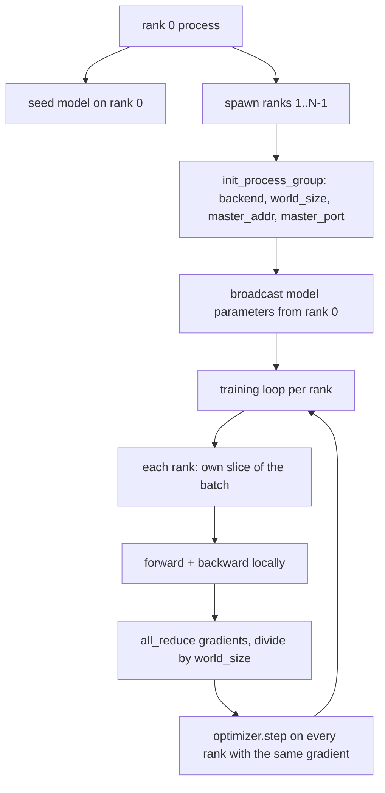
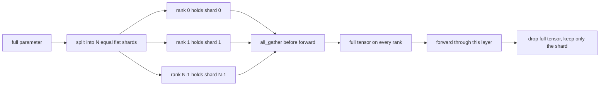

# 从零实现分布式数据并行与 FSDP

> 多 rank 训练就是两个 collective 加一条铁律。启动时广播参数，backward 后平均梯度，永远不让各 rank 对当前是第几步产生分歧。

**类型：** Build
**语言：** Python
**前置要求：** 第19阶段第42-45课
**预计时间：** ~90 分钟

## 学习目标

- 用 `gloo` 后端在 N 个 rank 之间拉起一个 process group，不需要特殊硬件。
- 实现一个最小 DDP wrapper：构造时广播参数，backward 后 all-reduce 梯度。
- 证明各 rank 梯度的 all-reduce 等价于单进程在拼接输入上的梯度。
- 概述 FSDP 参数分片：每个 rank 持有一个切片，forward 时 gather 出完整 tensor，用完即丢。

## 问题背景

模型放得进一张卡。数据放不进。优化预算要求每秒看到 N 倍的样本。第一个杠杆是数据并行：每个 rank 跑同一个模型、看不同的 batch 切片，然后在 optimizer step 之前平均梯度。第二个杠杆是 FSDP：模型也放不进一张卡了，于是每个 rank 只持有每个参数的一部分，forward 时逐层重建完整 tensor。

痛点是记账。如果参数在各 rank 之间发生漂移，run 就被静默损坏了。如果平均了梯度但没平均 loss，仪表盘就在骗人。如果 collective 后端对拓扑达不成一致，run 就永远挂住。解决办法是亲手写一遍 collective，别再信任你无法复现的 wrapper。

本课在 CPU 上运行。不假设有 CUDA。`gloo` 后端随每个 PyTorch 构建一起发布，接受 `torch.multiprocessing` worker；同样的代码在多 GPU 节点上切到 `nccl` 也不需要改结构。

## 核心概念



### 两个最重要的 collective

| Collective | 做什么 | 什么时候用 |
|------------|--------|-----------|
| `broadcast` | 把一个 tensor 从一个 rank 复制到所有其他 rank | 参数初始化、scheduler 状态、任何一对多同步 |
| `all_reduce` | 对一个 tensor 在所有 rank 间做 sum（或 mean、max），每个 rank 都拿到结果 | backward 后的梯度平均 |
| `all_gather` | 每个 rank 贡献一个 tensor，每个 rank 拿到拼接结果 | logits 收集、FSDP 参数 unshard |

DDP 的合约是：构造时 `broadcast`，backward 后 `all_reduce`。FSDP 的概述额外加了每层 forward 前的 `all_gather`。

### 梯度平均等价于单进程梯度

一个模型在 N 个 rank 上用 B 个样本的 batch 训练，产生的梯度必须与单进程在 N*B 的 batch 上训练一致。关键是：把各 rank 梯度求和再除以 N 就得到平均 loss 梯度，也就是 cross entropy 用 mean reduction 在完整 batch 上会产生的东西。课程代码用 `max-abs-diff < 1e-3`（手动 all-reduce 梯度 vs 参考单进程梯度）来断言这一点。

### FSDP 概述



内存节省是精确的：每个 rank 的参数内存降到 1/N。代价是 gather——每次 forward 都要付。生产级 FSDP 把 gather 和上一层的计算重叠，所以实际挂钟开销比朴素计算预测的小得多。本课对每个参数做往返并断言重建结果与原始值 bit-equal。

### CPU 与 gloo 后端

CUDA 是生产目标，但同样的代码路径在 CPU 上也存在。`gloo` 是 CPU collective 后端。它比 GPU 上的 `nccl` 慢几个数量级，但 API 面完全一样。本课的 process group 用 `backend="gloo"` 初始化，rank 用 `torch.multiprocessing` 而非 `torchrun` 启动；两者最终调的都是相同的 `torch.distributed` 接口。在多 GPU 节点上，唯一的变化是 `backend="nccl"`、tensor 放到设备上，以及用 `torchrun` 来启动。

## 动手构建

`code/main.py` 是可运行的产物。

### 第一步：拉起 process group

```python
os.environ["MASTER_ADDR"] = "127.0.0.1"
os.environ["MASTER_PORT"] = str(port)
dist.init_process_group(backend="gloo", rank=rank, world_size=world_size)
```

`MASTER_ADDR` 和 `MASTER_PORT` 是 rendezvous 点：每个 rank 拨同一个主机的同一个端口。课程用 bind-and-close 技巧找空闲端口，避免多个 run 共享同一台机器时的冲突。

### 第二步：构造时广播

`MinimalDDP.__init__` 遍历每个参数和 buffer，调用 `dist.broadcast(tensor, src=0)`。rank 0 的值成为规范初始化。没有这一步，每个 rank 用自己的 seed 初始化，从第一步就开始分叉。

### 第三步：backward 后 all-reduce 梯度

```python
def all_reduce_grads_(module, world_size):
    for p in module.parameters():
        if p.grad is None:
            p.grad = torch.zeros_like(p.data)
        dist.all_reduce(p.grad.data, op=dist.ReduceOp.SUM)
        p.grad.data.div_(world_size)
```

每个 rank 最终拿到相同的平均梯度。optimizer step 现在是对每个 rank 上相同输入的函数，这就是参数在整个 run 中保持同步的原因。

### 第四步：证明等价性

`manual_all_reduce_matches_single_process` 在 rank 0 上构建同一个模型，把 all-reduce 后的梯度与单进程在拼接输入上计算的梯度做比较。max-abs-diff 大约在 1e-8。

### 第五步：FSDP 往返

`fsdp_round_trip_sketch` 展平每个参数，pad 到 `world_size` 的倍数，切片，all-gather，再去 pad。每个 rank 的重建结果等于原始值。这是 unshard 步骤；反向操作（forward 后 re-shard）就是从 gather 出的 tensor 上切一片。

运行：

```bash
python3 code/main.py
```

默认 world size 为 2。两个 CPU 进程启动，通过 `gloo` 互相通信，退出码为零。输出 `outputs/ddp-demo.json` 记录每个 rank 的参数和、all-reduce 后的梯度范数、FSDP 往返结果，以及手动梯度 vs 参考梯度的 diff。

## 实际应用

生产训练栈调用的是同样的原语。PyTorch 的 `DistributedDataParallel` 额外加了：backward 后的梯度 hook 把 all-reduce 和 backward 重叠、bucket 化的 all-reduce 把多个小梯度合成一个 collective，以及第46课用过的 `no_sync` context。

PyTorch 的 FSDP 额外加了：每层一个 flat 参数视图让每个 rank 持有一块连续 buffer、下一层的 unshard 与当前层的计算重叠，以及可选的 CPU offload。

形状不变：启动时广播，backward 后 reduce，参数放不下就分片。

## 交付产物

`outputs/skill-distributed-fsdp-ddp.md` 是新训练脚本的 recipe：用 `gloo` 起 CPU 的 process group、用 `nccl` 起 GPU 的，把模型套进一个 DDP shell（构造时广播、backward 后 reduce），可选地用 FSDP 概述中的 all_gather 模式做参数分片。

## 练习

1. 用 `--world-size 4` 运行，确认整个 run 中参数 spread 保持在 1e-3 以下。
2. 把手动平均替换为 `dist.all_reduce(op=dist.ReduceOp.AVG)`，计时对比差异。
3. 给 DDP wrapper 加一个 post-backward hook，让 all-reduce 和剩余 backward 重叠；测量挂钟改善。
4. 实现 FSDP re-shard 步骤：forward 之后把完整 tensor 换回本地 shard。确认每个 rank 的内存降低了。
5. 在 CUDA 机器上切换到 `nccl` 后端。记录哪些环境变量变了、哪些没变。

## 关键术语

| 术语 | 日常说法 | 实际含义 |
|------|---------|---------|
| Backend | "gloo 或 nccl" | 实现 collective ops 的库；gloo 用于 CPU，nccl 用于 GPU |
| World size | "总 rank 数" | 组里的进程数量；组是 collective 操作的单位 |
| Rank | "Worker id" | 组内的进程标识符，从零开始 |
| All-reduce | "把梯度加起来" | 对一个 tensor 在所有 rank 间求和，每个 rank 最终拿到相同结果 |
| Unshard | "把参数拼回来" | 通过 all_gather 从各 rank 的切片重建完整 tensor |

## 延伸阅读

- PyTorch `torch.distributed` 文档，本课所依赖的 collective 语义。
- `gloo` 库的 collective 列表，形状与 CUDA 版 `nccl` 原语一致。
- 第19阶段第46课的梯度累积模式，把 DDP all-reduce 包在 `no_sync` 中。
- 第19阶段第47课的 checkpoint 布局，能在 DDP 和 FSDP 的 run 中存活。
- PyTorch FSDP 文档，本课概述的参数分片的生产级实现。
