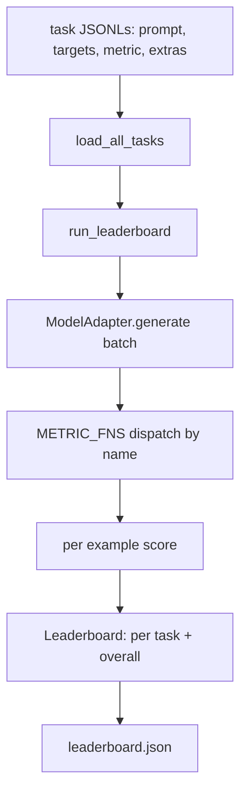
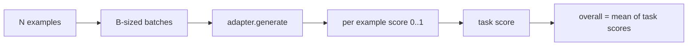

# 语言模型评测框架

> 一个模型在你没法定义的任务上表现好，那它就是瞎猫碰死耗子。评测框架就是任务定义、指标、运行器和排行榜，装在一个简短、可替换的壳子里。

**类型：** Build
**语言：** Python
**前置要求：** 第19阶段第42-45课
**预计时间：** ~90 分钟

## 学习目标

- 把一个 task 定义为 JSONL 文件，每条含 `prompt`、`targets`、`metric` 和可选的 `extras`。
- 实现五种指标：exact match、rouge-l F1、可执行检查、多选、子串包含。
- 构建一个 runner，按 task 分批发送 example 并派发到可替换的 model adapter。
- 输出排行榜 JSON，包含每个 task 的分数、延迟和可复现的总平均分。

## 问题背景

每周都有新的语言模型出来。营销话术说它表现好。诚实的问题是：好在哪？诚实的答案是你自己写的排行榜——因为厂商的排行榜就是他们调出来的。

repo 里没有评测框架，你就只能靠感觉比较两个模型。有了框架，你就能在固定任务集、固定指标上用分数来比，用 JSON 输出来做 diff。框架是昨天的 run 和今天的 run 之间的合约。没有它，退化就会被发上线。

陷阱是把框架调得只适合某一个模型。解决办法是同样的陷阱反过来用：框架小到十五分钟就能读完，task 小到可以放进 repo，指标从零手写以便同事可以 audit，adapter 是唯一放模型特定代码的地方。换 adapter，排行榜会动；换 task，排行榜也会动。别的什么都不应该动。

## 核心概念



### Task 规范

每条 example 是一行 JSONL：

```json
{"id": "arith-00", "prompt": "compute: 2 + 2", "targets": ["4"], "metric": "exact_match"}
```

对于需要评分辅助的指标，`extras` 携带附加数据：

```json
{
  "id": "code-00",
  "prompt": "python: write a function f that doubles its input",
  "targets": ["ok"],
  "metric": "code_exec",
  "extras": {"io_pairs": [[1, 2], [3, 6]]}
}
```

一个 task 就是 `outputs/tasks/` 下的一个 `.jsonl` 文件。文件名即 task 名。同一文件中的所有 example 共享一种指标。

### 五个 fixture task

| Task | 指标 | 测什么 |
|------|------|--------|
| arithmetic | exact_match | 确定性答案的 token 级正确性 |
| summary | rouge_l | 与单行参考摘要的最长公共子序列 F1 |
| code-exec | code_exec | 可执行测试：预测的函数必须满足一组输入输出对 |
| multiple-choice | multiple_choice | 预测的首字母必须匹配允许的字母 |
| generation | substring_contains | 自由文本必须包含至少一个目标子串 |

### 指标合约

每个指标是一个函数：`(prediction, targets, extras) -> float in [0.0, 1.0]`。框架对每个 example 的分数取平均得到 task 分数，再对 task 分数取平均得到总分。指标函数都很小：

- `exact_match`：转小写，压缩空白，判等。
- `substring_contains`：同样的归一化，子串测试。
- `multiple_choice`：首字符转大写。
- `rouge_l`：LCS 长度除以 prediction 和 reference 的长度，precision 和 recall 的 F1。
- `code_exec`：在受限命名空间中执行 prediction，对每个输入输出对调用 `f(x)`，统计匹配数。

code_exec 指标在一个剥离了 builtins 的命名空间中运行 prediction。课程测试断言 `import os` 会报错，因为 `os` 不在命名空间中——你没法从代码 prediction 访问文件系统。

### Model adapter

```python
class ModelAdapter(Protocol):
    def generate(self, prompts: Sequence[str]) -> List[str]: ...
    @property
    def name(self) -> str: ...
```

Adapter 就是接缝。本课提供 `ToyAdapter`，一个确定性的模式匹配器，对五个 fixture task 的每个 prompt 都返回正确答案。真正的 adapter 调用模型并返回输出。框架不关心用的是哪个。

### Runner

`run_task` 按 `batch_size` 分批发送 prompt 并派发到指标函数。`run_leaderboard` 遍历每个 task 并取平均。`write_leaderboard` 输出带 schema 字符串的 JSON，以防未来格式变更时静默破坏仪表盘。



## 动手构建

`code/main.py` 是可运行的产物。

### 第一步：生成 fixture task

`seed_fixture_tasks(target_dir)` 写出五个 `.jsonl` 文件。`main.py` 首次运行时如果目录为空就自动生成。

### 第二步：加载 task

`load_all_tasks(task_dir)` 读取每个 `.jsonl`，返回一个从 task 名到 `Example` 记录列表的 dict。以 `#` 开头的注释行和空行会被跳过，方便贡献者给文件加注释。

### 第三步：实现指标

每个指标是一个小函数，带单元测试。课程测试套件包含 13 个 case，覆盖归一化、部分重叠、代码执行和不安全代码拒绝。

### 第四步：写 runner

`run_task` 遍历 batch 并产出 `TaskResult`，包含分数、正确数、总数和延迟。`run_leaderboard` 遍历所有 task 并产出 `Leaderboard`，带总平均分。

### 第五步：输出 JSON

`write_leaderboard` 序列化排行榜。`--include-per-example` 标志导出每条 example 的记录，方便在分数变化时 diff 预测结果与上一次 run 的对比。

运行：

```bash
python3 code/main.py
```

脚本首次运行时生成 fixture，用 toy adapter（对每个 fixture 都答对）打分，写出 `outputs/leaderboard.json`。用 toy adapter 总分为 1.0；`test_main.py` 中的 stub adapter 测试表明同一个框架在 adapter 答不上来时产出 0.0。

## 实际应用

要接入真正的模型，写一个 adapter。形状如下：

```python
class HttpAdapter:
    name = "vendor.v1"

    def __init__(self, endpoint, api_key):
        self.endpoint = endpoint
        self.api_key = api_key

    def generate(self, prompts):
        out = []
        for prompt in prompts:
            response = http_post(self.endpoint, prompt, self.api_key)
            out.append(response["text"])
        return out
```

在 `main()` 顶部把 `ToyAdapter` 换成 `HttpAdapter`。框架、task、指标和排行榜保持不变。

在真实项目中使用评测框架需要坚持的三个模式：

- **锁定 task 文件。** leaderboard.json 要么带上 hash 锁定的 task 内容，要么把 JSONL 随身携带；否则 task 文件变了分数也跟着动，你分不清是哪个动了。
- **Diff 预测结果，不只是分数。** `--include-per-example` 标志让你看到分数下降那天模型到底说了什么。
- **限制 batch size。** 真正的 adapter 有速率限制。小 batch size 让框架在不同厂商之间通用。

## 交付产物

`outputs/skill-lm-eval-harness.md` 是 recipe：JSONL task 规范、五种指标、可替换 adapter、分批 runner、带 schema 字符串的排行榜 JSON。`outputs/tasks/` 里的 task 文件就是 fixture；复制到真实项目中作为起点。

## 练习

1. 加一个第六个 task，用你从零写的自定义指标（类 BLEU 的重叠、类 BLEURT 的参考评分，任何合约清晰的都行）。
2. 扩展 `code_exec` 以捕获 stdout，接受一组预期 stdout 作为 target。
3. 加一个排行榜 diff 命令：给定两个 `leaderboard.json` 文件，打印哪些 task 变了以及变了多少。
4. 限制每条 example 的延迟。把 adapter 调用包在 timeout 里；在排行榜中多加一列 `timeouts`。
5. 用 sha256 在排行榜中锁定 task 内容，让未来的读者能验证评测的是同一套 task。

## 关键术语

| 术语 | 日常说法 | 实际含义 |
|------|---------|---------|
| Task spec | "评测格式" | JSONL 文件，每条含 prompt、targets、metric、可选 extras |
| Metric | "怎么打分" | 函数 (prediction, targets, extras) -> [0, 1] 的浮点数 |
| Adapter | "模型客户端" | 有 generate(prompts) -> list[str] 方法的对象；唯一存放模型特定代码的地方 |
| Leaderboard | "排行榜" | JSON，包含每个 task 的分数、总数、延迟和总平均分 |
| Code exec metric | "跑一下看看对不对" | 在受限命名空间中执行 prediction，与输入输出对比较 |

## 延伸阅读

- 原版 lm-evaluation-harness，生产级参考实现，大得多但形状一样。
- HuggingFace 的 lighteval，同一合约的另一种实现。
- 第19阶段第46课覆盖了框架所评测的训练栈中使用的梯度累积模式。
- 第19阶段第47课覆盖了你要评测的 checkpoint 格式；在排行榜中锁定 checkpoint hash。
- 第19阶段第48课覆盖了产出被测模型的分布式训练栈。
