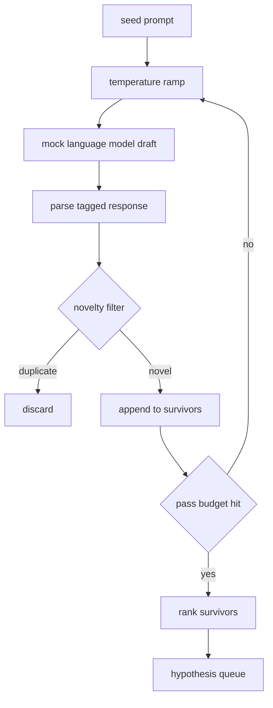

# 假设生成器

> 一个研究 agent 对同一个问题问两遍就是在浪费 token。诀窍是强迫每一稿都落在新的地方。

**类型：** Build
**语言：** Python
**前置要求：** 第19阶段 Track A 第20-29课
**预计时间：** ~90 分钟

## 学习目标

- 从种子 prompt 驱动采样器，把输出转成带类型的假设记录。
- 每轮提高采样温度，让下一稿从上一稿越走越远。
- 用小型 embedding 模型和余弦距离阈值过滤近似重复。
- 用融合新颖性、具体性和可测试性的打分函数对幸存者排名。
- 保持每一步确定性，相同 seed 始终产出相同队列。

## 为什么先生成、再过滤

让一个模型问一次只拿到一个假设。做示例够了，做研究循环就不对了。循环需要一个有深度的排序队列——第一个假设失败了，runner 直接拿下一个，不用再花一轮完整采样。

两个思路组合产出这个队列。第一是温度递增（temperature ramping）：每轮采样把温度调高一档，鼓励后面的草稿去探索。第二是新颖性过滤（novelty filtering）：每一稿出来后，生成器算它和此前所有幸存假设的 embedding 距离，距离太近就拒掉。

本课附带一个 mock 语言模型，对固定 prompt 返回脚本化的 token 序列。mock 足以跑通完整链路：种子 prompt 输入、温度递增生效、候选被解析、新颖性过滤执行、排序队列输出。

## Hypothesis 的结构

```text
Hypothesis
  id             : int           (一个 run 内单调递增)
  text           : str           (假设声明)
  variables      : list[str]     (条件之间变化的变量)
  metric         : str           (runner 将要测量的指标)
  baseline_ref   : str | None    (对比引用了哪篇论文或 run)
  draft_pass     : int           (第几轮采样产出的)
  temperature    : float         (产出时的采样温度)
  novelty_score  : float         (与此前幸存者的距离, 0..1)
  rank_score     : float         (用于排序的加权总分)
```

`variables` 和 `metric` 不是自由文本。解析器从带标签的响应中提取它们。第52课的 runner 在构建实验配置时直接读这些字段。

`baseline_ref` 可选但推荐。第53课的 evaluator 需要一个 baseline 来做对比。如果假设省略了，evaluator 会退回到相同指标上的上一次 run。

## 架构



循环本身很直白。有意思的是每个框都有一个硬合约。

## 温度递增

从 `t_min` 开始，到 `t_max` 结束，步长 `(t_max - t_min) / (n_passes - 1)`。每轮以当前温度调用采样器，产出 `n_passes` 个从 `GeneratorConfig.schedule()` 均匀分布的值。Mock 模型通过在 `(prompt, temp_bucket)` 键值上切换一小组脚本响应来模拟温度效果。bucket 是开区间，所以温度的微小变化会选中不同的 bucket 并产出不同的草稿。在生产中，采样器会是真正的模型，传入 `temperature=t`。

默认调度是六轮，从 `0.2` 到 `1.2`。六轮足以填满队列又不至于付出会被新颖性过滤拒掉的采样开销。低于 `0.2` 模型会鹦鹉学舌地复述种子。高于 `1.2` 响应容易跑题并无法通过解析器。

## 新颖性过滤

每一稿被解析后，生成器对文本做 embedding 并与每个已接受假设比较。embedding 是一个 hash 化的词袋向量，归一化到单位长度。两个单位向量的余弦距离是 `1 - dot(a, b)`。如果一稿与任一此前幸存者的最小距离超过 `novelty_threshold`，就通过。默认阈值是 `0.25`。

hash 化 embedding 不花哨。但它确定性、零依赖，足以抓住最明显的情况：两稿共享大部分名词。生产部署会换成小型句子模型。接口不变。

## 排序分数

```text
rank_score = w_novelty * novelty_score
           + w_specificity * specificity_score
           + w_testability * testability_score
```

三个子分。`novelty_score` 是与此前幸存者的最小 embedding 距离。`specificity_score` 是假设中具体变量的数量除以目标数量。`testability_score`：假设同时指定了 metric 和 baseline 得 1 分，只有 metric 得 0.5 分，都没有得 0 分。

默认权重是 `0.4`、`0.3`、`0.3`。权重放在 generator config 里，下游课程可以直接调而不用 fork 代码。

## Mock 语言模型

```python
class MockLLM:
    def sample(self, prompt: str, temperature: float, seed: int) -> str:
        ...
```

给定 `(prompt, temperature, seed)` 三元组，采样器是确定性的。Mock 维护一个以 `(prompt_signature, temperature_bucket)` 为键的脚本响应表。如果表里找不到对应的键，采样器返回一个会让解析器失败的 fallback。这条 fallback 路径被其中一个测试覆盖到了。

seed 被混入响应，所以相同的 `(prompt, temperature)` 对加上不同 seed 会产出不同草稿。测试中我们固定 seed 以保证可复现。真实部署中 seed 来自系统时钟或计数器。

## 输出队列

输出是一个按 `rank_score` 降序排列的 `Hypothesis` 记录列表。第52课的 runner 弹出队首，跑实验；第53课的 evaluator 写出裁决。如果裁决说假设错了，runner 弹出下一个。

队列是有限的。清空后，编排器可以放宽种子 prompt 再跑一次生成器，或者停下来报告预算用完。

## 如何阅读代码

`code/main.py` 定义了 `Hypothesis`、`MockLLM`、`HypothesisGenerator` 和一个确定性 demo。生成器暴露一个 `run(seed_prompt)` 方法，返回排序后的队列；轮次数从 `GeneratorConfig.n_passes` 读取而非作为参数传入。embedding 是 hash 化的词袋。新颖性过滤是一个函数。排序分数是一个函数。不依赖 `numpy`；embedding 数学用纯 stdlib 实现，保持课程可移植性。

`code/tests/test_generator.py` 覆盖了正常路径、重复拒绝路径、解析失败路径、温度递增边界和排名顺序。

## 在整体中的位置

第50课产出队列。第51课拿队首做文献检索以确认或否定假设。第52课拿同一个队首跑真实实验。第53课读取两者的输出写出裁决。四课组合成一个无人参与的研究循环；人可以在任何边界介入。
