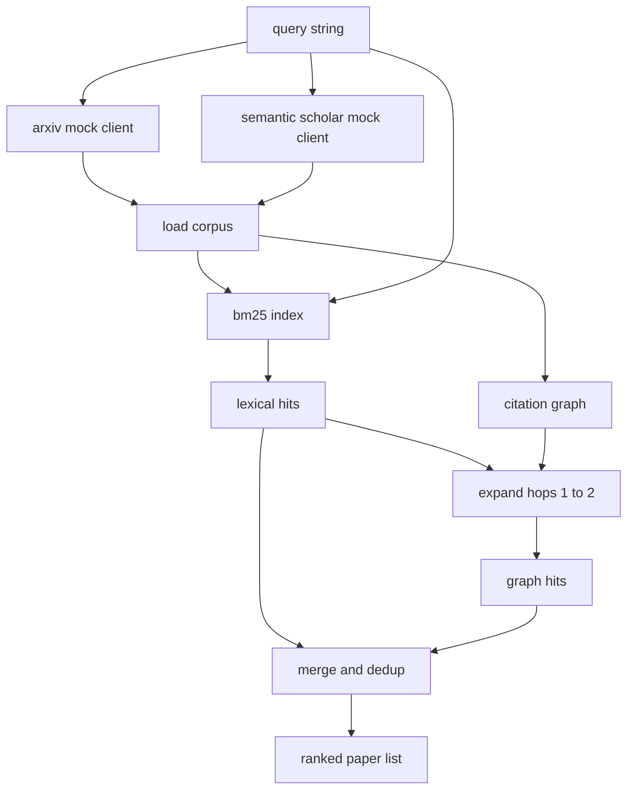

# 文献检索

> 假设很廉价。知道有没有人已经证明了它才是贵的部分。在 runner 启动沙箱之前，先构建回答这个问题的检索层。

**类型：** Build
**语言：** Python
**前置要求：** 第19阶段 Track A 第20-29课
**预计时间：** ~90 分钟

## 学习目标

- 建模一条小型论文记录，包含下游循环需要读取的字段。
- 仅用 stdlib 数据结构在摘要上构建 BM25 索引。
- 遍历引用图以找到词法搜索遗漏的论文。
- 基于稳定的论文 id 对词法和图两轮检索的命中结果去重。
- 把两个 mock 外部 API 封装在一个统一客户端后面，让上游调用方在真实端点接入时无感。

## 为什么需要两轮检索

在摘要上做关键词搜索能找到与查询共享词汇的论文，覆盖了大部分情况。但有两种漏网之鱼。第一种是开创性论文用了不同的术语——比如查 "sparse attention" 会漏掉标题是 "block selection in transformer routing" 的论文。第二种是相关论文作为后续工作引用了一个已知锚点——找到锚点再沿引用往前走，比暴力搜摘要池更高效。

本课构建两轮检索。BM25 搜摘要抓词法命中。引用图遍历从 BM25 top 结果出发，沿前向和后向各走一到两跳做扩展。合集按论文 id 去重并用一个小型综合分数排序。

## Paper 的结构

```text
Paper
  id          : str           (稳定标识符, mock 语料中用 "p001")
  title       : str
  abstract    : str
  year        : int
  authors     : list[str]
  references  : list[str]     (本文引用的论文 id)
  citations   : list[str]     (引用本文的论文 id)
  source      : str           (哪个 mock api 提供的, "arxiv" 或 "s2")
```

references 和 citations 字段构成有向引用图。两个 mock API 返回的字段有重叠但不完全一样，所以语料加载器按 `id` 做合并。

## 架构



检索客户端负责两轮检索和合并。调用方传入查询，拿回一个排序列表，每条记录带有逐论文的分数字段（`bm25_score`、`graph_distance`、`recency_score`、`final_score`）来解释排名。

## 从零实现 BM25

实现是标准的 Okapi BM25，默认参数 `k1=1.5`、`b=0.75`。索引是两个字典：`term -> doc_frequency` 和 `term -> list of (doc_id, term_count)`。文档长度是摘要的 token 数。平均文档长度在索引构建时一次性算好。对查询打分就是对每个查询词求 `idf * tf_norm` 的和，其中 `tf_norm` 是标准 BM25 长度归一化的词频。

分词器就是 `lower` 然后按非字母数字字符切分。不做词干化。生产系统会换成一个小型 stemmer，接口不变。

```text
idf(t)      = log((N - df + 0.5) / (df + 0.5) + 1.0)
tf_norm(t)  = (f * (k1 + 1)) / (f + k1 * (1 - b + b * dl / avgdl))
score(d, q) = sum over t in q of idf(t) * tf_norm(t)
```

## 引用图遍历

图从语料一次性构建。前向边从论文指向它引用的论文。后向边从论文指向引用它的论文。遍历是广度优先搜索，以 BM25 top 命中为种子，上限为两跳。

两跳是刻意设的天花板。一跳太浅——agent 经常需要直接的祖先或后代。三跳在连通图上会让结果集爆炸，并且容易偏离主题。课程把跳数上限做成配置项，下游循环可以收紧它。

## 去重与排名

两轮检索返回的集合有重叠。合并按论文 id 做 key。每篇论文的最终分数是加权混合：

```text
final_score = w_bm25 * bm25_score_norm
            + w_graph * graph_score
            + w_recency * recency_score
```

`bm25_score_norm` 是 BM25 分数除以合集中的最大 BM25 分数（归一到 0 到 1）。`graph_score` 直接词法命中为 1，一跳为 `0.6`，两跳为 `0.3`，其余为 0。`recency_score` 是从语料最小年份（0）到最大年份（1）的线性映射。

默认权重是 `0.5`、`0.3`、`0.2`。权重是可配置的；冷门主题可能调低 recency，快速迭代的主题则调高。

## Mock 语料

语料包含一百篇论文，由 `build_corpus()` 生成。每篇有手写的标题和摘要，涵盖五个主题：attention sparsity、retrieval augmentation、low rank adapters、dataset distillation 和 evaluation harnesses。references 和 citations 的连接方式使每个主题形成一个连通子图，外加少量跨主题边。

两个 mock API 客户端（`ArxivMockClient`、`SemanticScholarMockClient`）从同一个语料读取但暴露不同字段。Arxiv 返回 title、abstract、year、authors。Semantic Scholar 额外加上 references 和 citations。检索客户端按 id 合并；跨客户端字段不一致的处理留给后续课程。

## 第52课和第53课读什么

第52课的 runner 读 `paper.id`、`paper.title` 以及摘要的前三句作为实验的上下文。第53课的 evaluator 读 `paper.year` 和 `paper.references` 以将 baseline 归属到一篇具体的论文。

检索客户端返回一个 `RetrievalResult`，包含排序列表和每次查询的指标：命中数、平均分、最高分、总挂钟时间。Runner 记录这些指标，供下游可观测性模块绘制质量随时间变化的趋势。

## 如何阅读代码

`code/main.py` 定义了 `Paper`、`ArxivMockClient`、`SemanticScholarMockClient`、`BM25Index`、`CitationGraph`、`RetrievalClient` 和一个确定性 demo。Mock 客户端和语料放在同一个文件里以保持课程可移植性。BM25 实现是一个类、六十行代码。图遍历是一个方法。

`code/tests/test_retrieval.py` 覆盖了词法路径、图路径、合并、去重和空查询。

## 在整体中的位置

第50课产出假设。第51课检索文献看这个假设是否已经被解决。第52课在未解决时跑实验。第53课读取检索结果和实验指标写出裁决。检索客户端是四个阶段中最便宜的，在编排器中最先运行。
