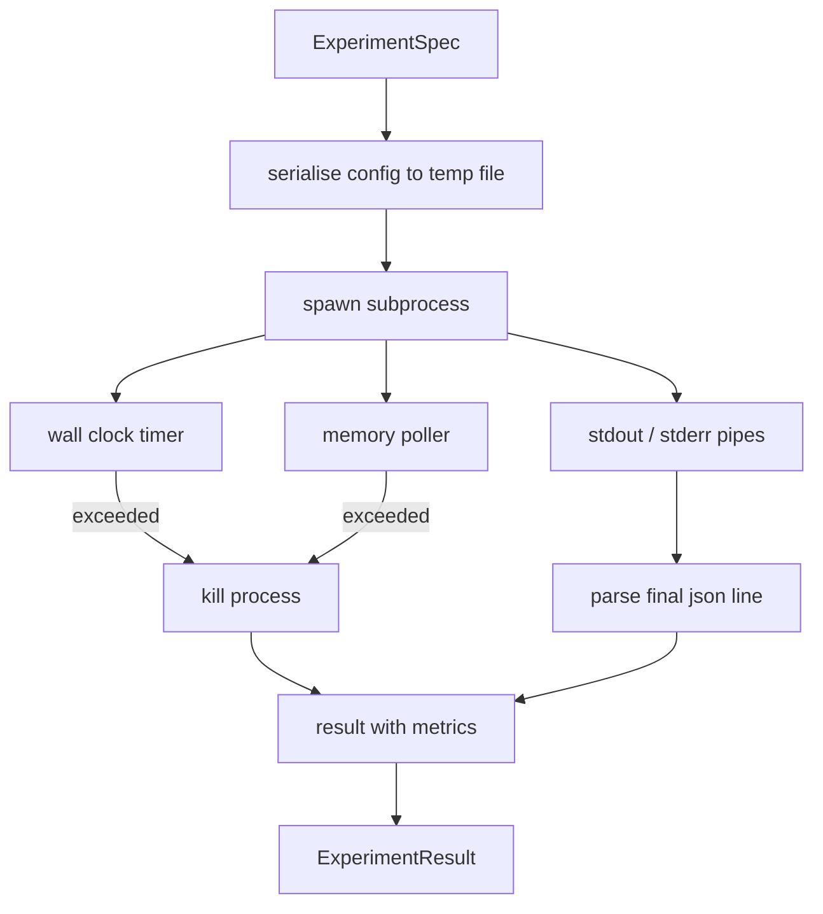

# 实验执行器

> 一个循环的诚实程度取决于它的测量方式。构建一个执行器：接收 spec、在沙箱子进程中运行、输出一个评估器可以信赖的 JSON metrics blob。

**类型：** Build
**语言：** Python
**前置要求：** 第19阶段 Track A 第20-29课
**预计时间：** ~90 分钟

## 学习目标
- 将实验编码为一个 typed spec，runner 可以将其序列化后交给子进程执行。
- 启动带硬性挂钟超时和软性内存上限的子进程，并将两者都作为终止条件暴露出来。
- 将 stdout、stderr 和结构化 metrics blob 捕获到同一个 result 记录中。
- 构建一张消融表（ablation table），每次只调整一个配置旋钮，基于固定的 base spec 进行扫描。
- 给定 seed 后保证每次结果确定性一致，这样评估器在跨 run 时看到的数字完全相同。

## 为什么用子进程

研究循环会执行不受信任的代码。假设来自采样器，实验脚本也来自同一条路径——把它们当成安全的进程内代码来跑，就是在给自己埋雷，一旦崩溃会把编排器一起拉垮。子进程是语言自带的最简隔离手段：独立进程、独立地址空间、父进程侧持有信号句柄。

这里的 runner 没有实现完整沙箱。没有 cgroup，没有 seccomp 过滤，没有 namespace 重映射。它有的是：挂钟超时、一个轮询内存增长的循环、以及在任一限制被突破时终止进程的 kill 路径。这就是所有更精细沙箱都会扩展的运行时契约。本课把这个契约控制在一次能读完的规模。

## ExperimentSpec 的结构

```text
ExperimentSpec
  spec_id        : str            (stable id, "exp_001")
  hypothesis_id  : int            (link back to the queue from lesson 50)
  script_path    : str            (path to the python script to run)
  config         : dict           (passed to the script as one json arg)
  seed           : int            (deterministic seed for the experiment)
  wall_timeout_s : float          (hard timeout, killed on exceed)
  memory_cap_mb  : int            (soft cap, polled; killed on exceed)
  metric_keys    : list[str]      (which fields the evaluator will read)
```

脚本存在磁盘上；runner 把 config 写到一个临时文件路径，脚本从那里读取。脚本应在 stdout 上打印一行 JSON，其 key 是 `metric_keys` 的超集。stdout 上的其他内容会被捕获，但 metrics 解析器会忽略它们。

## 架构



Runner 是一个类、一个主方法。轮询器是一个小线程，每隔一个 poll interval 唤醒一次，在有 proc 文件系统的平台上读取子进程的 `psutil` 等效数据，在不支持的平台上退化为 no-op。

## 为什么用软性内存上限

硬性内存上限需要 `resource.setrlimit`，而且只在 POSIX 上有效。本课采用跨平台方案：轮询驻留集大小（RSS），超限就 kill 子进程。之所以说"软性"，是因为轮询有间隔——进程可能在两次轮询之间飙到上限以上然后又降回来。Runner 会记录观察到的最大 RSS，评估器可以据此判断这次运行离上限有多近。

在不支持进程检查的系统上，轮询器会记录一次警告然后自行禁用。挂钟超时仍然生效。本课的测试覆盖了两条路径。

## 捕获 stdout 和 stderr

Runner 在进程完成时 drain 两个管道。Stdout 逐行扫描；最后一行能被解析为 JSON 且包含所有 `metric_keys` 的，就是 metrics blob。之前的 JSON 行作为 `intermediate_metrics` 保留在 result 中；评估器可以用它们画学习曲线。

Stderr 原样捕获到 result 中。Runner 不会因为非零退出码而抛异常——它把退出码记在 result 里。任何非零退出都标记为 `"crash"`，即使脚本打印了 metrics 也一样，这样评估器默认把部分运行视为失败。

## 消融表

```python
def ablate(base: ExperimentSpec, knob: str, values: list[Any]) -> list[ExperimentSpec]:
    ...
```

给定一个 base spec 和一个旋钮名称，这个辅助函数返回每个值对应的 spec，其中 `config[knob]` 被覆盖。每个 spec 会得到一个派生的 `spec_id`（`f"{base.spec_id}_{knob}_{value}"`）。Runner 附带一个 `AblationRunner`，按顺序执行它们，返回以旋钮值为 key 的 `AblationTable`。

为什么一次只调一个旋钮？全因子扫描呈指数爆炸，产出的结果评估器根本无法解读。一次一个旋钮生成干净的单轴数据，评估器可以直接画图。本课只支持通过多次单旋钮消融的组合来实现多旋钮扫描，组合逻辑由调用方完成。

## 确定性

每个 spec 都带有 seed。Runner 通过 config dict 将 seed 传给脚本（`config["__seed"] = spec.seed`）。`code/experiments/` 中的 mock 实验脚本遵循这个 seed，跨 run 产出相同的 metrics。第53课的评估器依赖于此——没有确定性的话，一个"回归"可能只是换了个随机初始化。

## Mock 实验脚本

本课附带一个实验脚本：`code/experiments/sparsity_experiment.py`。它是一个真实脚本，读取 config 文件，用 numpy 随机数模拟一个小型训练过程，然后输出 JSON metrics blob。脚本支持 `sleep_s` 旋钮用于测试超时，支持 `allocate_mb` 旋钮用于测试内存轮询器。

这个模拟并没有在真正训练什么。它是一个数值计算，模拟训练循环的形状：loss 曲线、最终 perplexity、挂钟时间。本课的重点是 runner，不是模拟。真正的实验脚本会 import 一个模型。

## Result 的结构

```text
ExperimentResult
  spec_id              : str
  hypothesis_id        : int
  exit_code            : int
  terminal             : "ok" | "timeout" | "oom" | "crash"
  wall_time_s          : float
  peak_rss_mb          : float | None
  metrics              : dict
  intermediate_metrics : list[dict]
  stdout_tail          : str
  stderr_tail          : str
```

评估器先看 `metrics` 和 `terminal`。如果 terminal 不是 `"ok"`，这次实验算失败，评估器的判定是自动的。否则 metrics 会被送入显著性检验。

## 怎么读代码

`code/main.py` 定义了 `ExperimentSpec`、`ExperimentResult`、`ExperimentRunner`、`AblationRunner` 和一个确定性 demo。子进程管理是一个类。内存轮询器是一个小线程。消融辅助函数是一个单独函数。

`code/experiments/sparsity_experiment.py` 是测试中使用的 mock 实验。它从 argv 读取 config 文件路径，完成后在 stdout 写入一行 JSON metrics。

`code/tests/test_runner.py` 覆盖了成功路径、超时路径、崩溃路径、消融表，以及两次运行的确定性检查。

## 在整体中的位置

第50课生成假设。第51课过滤掉文献已经解决的部分。第52课对剩下的运行实验。第53课读取结果、进行显著性检验，写出判定结果并存储到假设 ID 上，供编排器使用。
