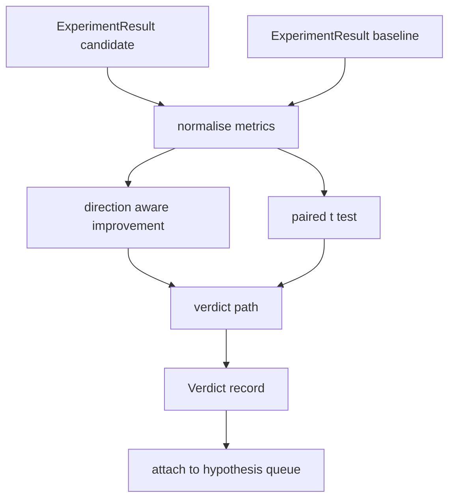

# 结果评估器

> Runner 产出了数字。评估器来决定这些数字是改进、退步、还是噪声。构建一个判定路径，把 metrics 变成一行结论。

**类型：** Build
**语言：** Python
**前置要求：** 第19阶段 Track A 第20-29课
**预计时间：** ~90 分钟

## 学习目标
- 使用方向感知的 improvement 计算和固定阈值，将候选 run 与基线进行比较。
- 从零实现配对 t 检验，基于 per-seed metrics 计算 p 值。
- 对 log 尺度的 metrics 做归一化，使下游报告能把它们和线性 metrics 混合使用。
- 输出 per-hypothesis 的 verdict，编排器可以把它挂到第50课的假设队列上。
- 保持每一步纯函数化，相同输入永远产出相同 verdict。

## 为什么用配对检验

Runner 给出的单个数字无法说明变化是否真实。同一配置换个 seed，perplexity 就不一样了。变化可能只是噪声。正确的比较方式是配对的：相同的 seed、相同的数据，分别跑一次候选配置和一次基线配置。每个 seed 贡献一个差值。这些差值的均值就是效应大小。这些差值的标准误差就是噪声下限。

本课从零实现检验过程，不依赖 `scipy.stats`。数学量小到一屏就能看完。

```text
diffs    = [a_i - b_i for i in seeds]
mean     = sum(diffs) / n
variance = sum((d - mean) ** 2 for d in diffs) / (n - 1)
t_stat   = mean / sqrt(variance / n)
df       = n - 1
p_value  = two_sided_p(t_stat, df)
```

双侧 p 值使用正则化不完全 Beta 函数。本课附带一个小型实现，使用 Lentz 连分数法。整个东西只有六十行标准库 math。

## 方向感知的 improvement

有些 metrics 越高越好（accuracy、throughput），有些越低越好（loss、perplexity、wall time）。评估器在每个 metric 上带一个 `direction` 字段。

```text
if direction == "higher_is_better":
    improvement = (candidate - baseline) / abs(baseline)
elif direction == "lower_is_better":
    improvement = (baseline - candidate) / abs(baseline)
```

Improvement 是带符号的。higher_is_better 的 metric 上 improvement 为负，意味着候选配置更差。判定路径同时读取符号和幅度。

一个固定阈值（`improvement_threshold=0.02`，即 2%）决定变化是否大到值得宣布。低于这个阈值，verdict 就是 "noise"，不管 p 值如何——循环对用户无法感知的变化不感兴趣。

## 架构



评估器运行三个独立计算，然后在判定路径中汇合。每个计算都是纯函数，无共享状态。

## Log 归一化

Perplexity 是 loss 的指数。Loss 降 0.1，perplexity 的降幅大得多。直接比较两个配置的 perplexity 没问题，但要在一份报告里把它和线性 metrics 混在一起用，就需要归一化。

本课对 `scale` 字段为 `"log"` 的 metric，在计算 improvement 之前取自然对数。阈值在 log 空间中应用。Perplexity 从 32 降到 28，即 `log(28) - log(32) = -0.133`，在 lower_is_better 指标上远超 2% 阈值。

```text
if scale == "log":
    a = log(candidate)
    b = log(baseline)
else:
    a = candidate
    b = baseline
```

`scale="linear"`（默认）的 metrics 跳过变换。同一条代码路径处理两种情况。

## Per-seed 配对检验

第52课的 runner 每次运行输出一个最终 metrics blob。要做配对检验，评估器需要候选配置和基线配置各自对每个 seed 的一个 blob。编排器在相同 seed 列表下用两种配置分别运行实验，把两组 `ExperimentResult` 记录交给评估器。

评估器按 seed 配对（seed 存在 `result.metrics["seed"]` 中），遍历请求的 metric。如果两组 list 的 seed 对不上，评估器抛出 `PairingError`。编排器应当重新运行。

## Verdict 的结构

```text
Verdict
  hypothesis_id          : int
  metric                 : str
  direction              : "higher_is_better" | "lower_is_better"
  scale                  : "linear" | "log"
  candidate_mean         : float
  baseline_mean          : float
  improvement            : float       (signed, fraction; see direction rules)
  p_value                : float | None  (None if n < 2)
  significance_threshold : float
  improvement_threshold  : float
  verdict                : "improved" | "regressed" | "noise" | "failed"
  rationale              : str
```

判定路径是一个小型决策表：

```text
1. If any candidate result has terminal != "ok": verdict = "failed"
2. else if |improvement| < improvement_threshold:  verdict = "noise"
3. else if p_value is None or p_value > significance: verdict = "noise"
4. else if improvement > 0:                          verdict = "improved"
5. else:                                             verdict = "regressed"
```

Rationale 是一行人类可读的句子，编排器可以把它挂在假设 ID 旁边做日志。

## 怎么读代码

`code/main.py` 定义了 `MetricSpec`、`Verdict`、`Evaluator`、t 统计量和不完全 Beta 辅助函数，以及一个确定性 demo。t 检验用纯标准库 math 实现；numpy 只用来读 metrics 列表以及计算均值和方差。

`code/tests/test_evaluator.py` 覆盖了改进路径、退步路径、噪声路径（小改进）、噪声路径（低 n）、失败终止路径、log 归一化路径、t 检验与已知参考值的对比，以及配对错误。

## 在整体中的位置

第50课生成假设队列。第51课过滤掉文献已经解决的部分。第52课在候选和基线配置下跨 seed 运行实验。第53课读取这些运行结果并写出 verdict。编排器把四课串起来：

```text
for hypothesis in queue:
    literature = retrieval.search(hypothesis.text)
    if literature_settles(hypothesis, literature):
        attach(hypothesis, verdict="settled")
        continue
    candidates = runner.run_all(specs_for(hypothesis))
    baselines  = runner.run_all(baseline_specs_for(hypothesis))
    metric_spec = MetricSpec("perplexity", direction=LOWER, scale=LOG)
    verdict = evaluator.evaluate(hypothesis.id, metric_spec, candidates, baselines)
    attach(hypothesis, verdict)
```

这个编排器不在本课中；四课通过各自定义的 dataclass 组合在一起，不需要任何额外胶水代码。
