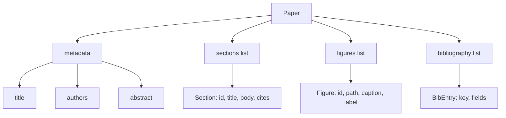
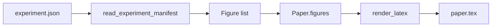
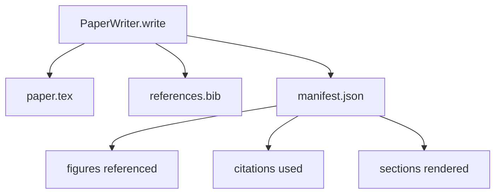

# 论文生成器

> LaTeX skeleton 是研究者和排版器之间的契约。契约一旦被打破，文档就编译不了，而且失败是响亮的。先构建 skeleton，再填充内容。

**类型：** Build
**语言：** Python
**前置要求：** 第19阶段第50-53课
**预计时间：** ~90 分钟

## 学习目标

- 将研究论文视为具有已知 section graph 的结构化产物，而不是自由格式文档。
- 生成一个 LaTeX skeleton，在任何正文写作之前就声明好 abstract、sections、figure slots 和 bibliography keys。
- 通过确定性 slot 机制，将实验输出的 figure（路径和标题）注入 skeleton。
- 接入一个 mock prose generator，从结构化大纲填充每个 section，使 harness 无需模型即可测试。
- 输出一个 `paper.tex` 加 `references.bib` 加 manifest，列出每个被引用的 figure 和每个被使用的 citation。

## 为什么先写 skeleton

从正文开始写的草稿会积累结构债。Introduction 多出三段本该放在 Related Work 里的内容。Figure 在定义之前就被引用了。Bibliography 里同一篇论文出现了三个 key。等作者发现时，重写成本已经高于写作成本了。

Skeleton 把这个流程反过来。结构作为数据预先声明。Section 是带名称和顺序的 slot。Figure 是带 id 和 caption 的 slot。Bibliography key 在顶部声明，附带它们指向的条目。正文一个 slot 一个 slot 地生成进去。Harness 可以在任何正文写作之前就验证：每个 figure 都有 slot，每个 citation 都有条目，每个 section 都出现在目录中。

这和前面课程对 plan、tool call 和 trace 施加的纪律是一样的。结构就是契约。

## Paper 的结构

每个字段都是纯 Python 数据。渲染器是从 `Paper` 到 LaTeX 字符串的纯函数。Harness 可以在渲染之前审查 paper：统计 section 数量、列出缺失的 figure 文件、检查每个 `\cite{key}` 是否有对应的 `BibEntry`。

## 渲染契约

渲染器保证三个性质。第一，skeleton 中的每个 figure slot 都会输出一个 `\begin{figure}` 块，label 格式为 `fig:<id>`。第二，每个 section 都会输出一个 `\section{}`，label 格式为 `sec:<id>`，这样交叉引用才能工作。第三，bibliography 输出的 `\bibliography` 块中的 `references.bib` 恰好包含 paper 上声明的条目，不多不少。

违反其中任何一条都是渲染错误，不是警告。Skeleton 就是契约；渲染时悄悄丢掉一个 figure 就是契约违约。

## 从实验中注入 Figure

本 track 前面的课程产出的实验输出是 JSON manifest。每个 manifest 带有一组 artifact，包含路径和简短说明。Paper writer 读取这个 manifest 并生成 `Figure` 记录。

注入是确定性的。Figure id 由实验名加单调递增计数器派生。Caption 来自 manifest。路径相对于 paper 的输出目录做归一化，这样即使实验输出在磁盘的其他位置，LaTeX 也能编译。

## Mock prose generator

本课不调用模型。一个 `MockProseGenerator` 读取大纲结构，确定性地输出正文。大纲结构是每个 section 的一个短字符串。Generator 将这个字符串展开为两段短文，并把 section 标题编织进去。生成的正文恰好在大纲声明 figure 和 citation 的位置提及它们。

这足以测试 writer 的所有行为。真正的实现只需要把 generator 换成模型调用。围绕它的 harness 不变。这就是把 prose generator 声明为 callable 的价值：测试替换为确定性的，生产替换为模型驱动的，pipeline 的其余部分完全一致。

## Manifest 输出

Writer 向输出目录输出三个文件。

Manifest 是下游评估器或 critic loop 读取的东西。它不解析 LaTeX；它读 manifest。下一课——critic loop——以这个 manifest 为输入，产出反馈列表。这就是为什么 manifest 是契约的一部分，而 LaTeX 不是。

## 验证 gate

Writer 在写入任何文件之前运行四个 gate。

1. Paper 内每个 figure id 必须唯一。
2. 每个 section 的 `cites` 字段引用的 bibliography key 必须已在 paper 上声明。
3. Abstract 不能为空。
4. Title 不能为空。

Gate 失败时抛出 `PaperValidationError`，附带精确原因。Harness 将这个原因作为失败模式暴露出来。没有部分写入：要么三个文件全部输出，要么一个都不输出。

## 怎么读代码

`code/main.py` 定义了 `Paper`、`Section`、`Figure`、`BibEntry`、`PaperValidationError`、`MockProseGenerator`、`PaperWriter` 和 `render_latex` 函数。`write` 方法接收一个输出目录，输出 `paper.tex`、`references.bib` 和 `manifest.json`。`read_experiment_manifest` 辅助函数将实验 manifest 列表转换为 `Figure` 记录。

`code/tests/test_paper_writer.py` 覆盖了：无 section 的 skeleton 渲染、两个 section 和两个 figure 的完整渲染、缺失 citation 的 gate、重复 figure id 的 gate、manifest 内容，以及 LaTeX 字符串契约（每个 section 输出 `\section{}`，每个 figure 输出 `\begin{figure}`）。

## 更进一步

真实实现会想要两个扩展。第一，多格式渲染：同一个 `Paper` 结构编译为 Markdown 用于博客、HTML 用于预览。渲染器变成 `Paper` 上的策略。第二，Citation 增强：给定 DOI 的本地缓存，writer 从 citation key 拉取 BibTeX 条目。两者都有价值，都可以在不触碰 skeleton 契约的情况下添加。

Skeleton 就是这个赌注。Section、figure 和 citation 作为数据声明，正文生成到 slot 中，manifest 和 LaTeX 一起输出。所有其他改进都在此之上组合。
