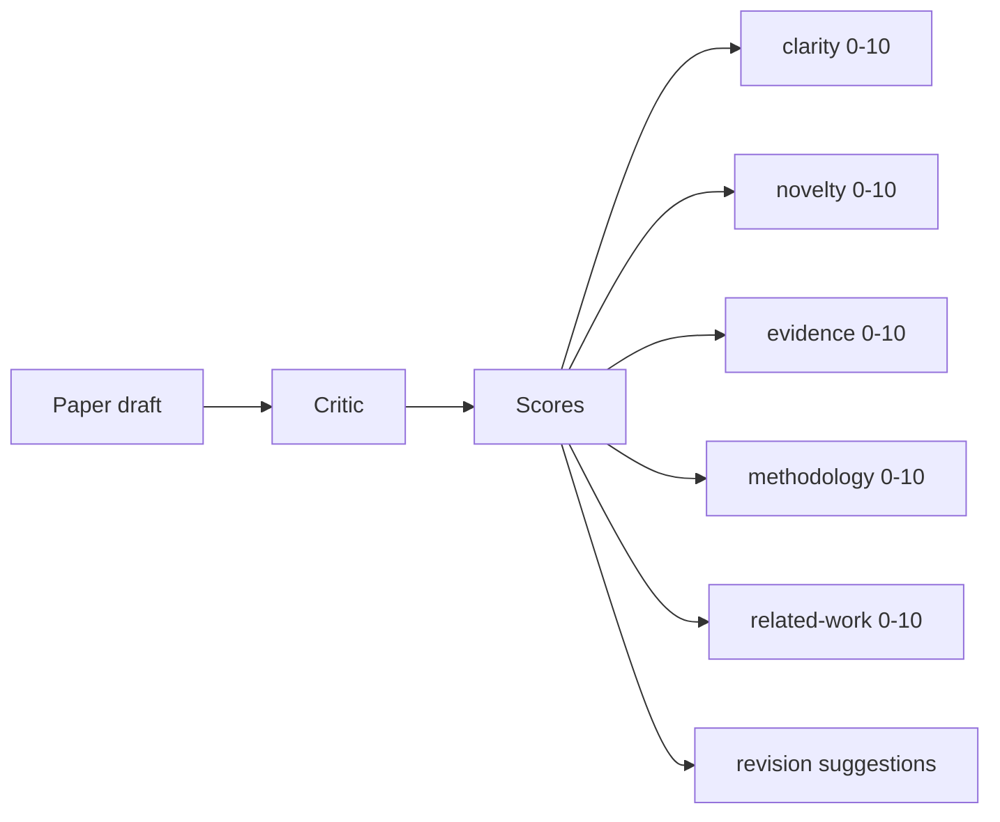
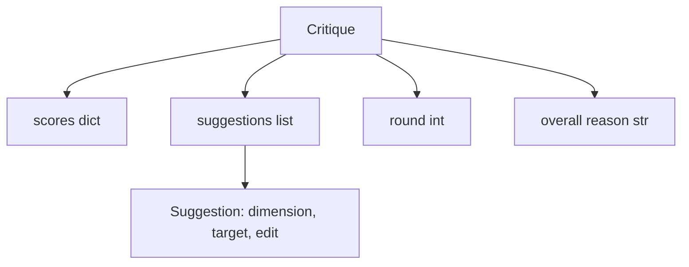
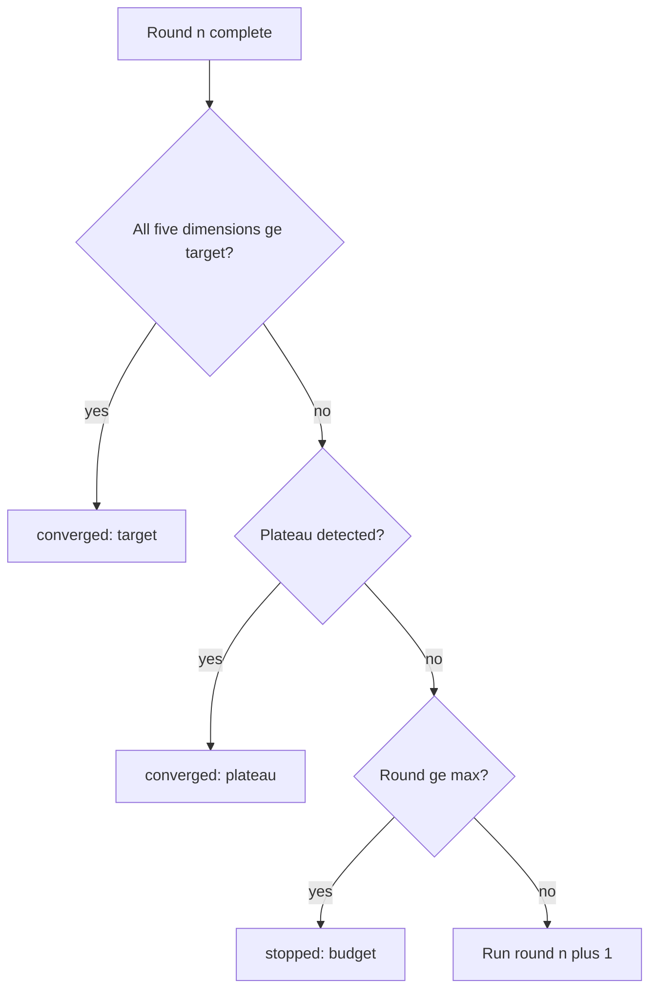
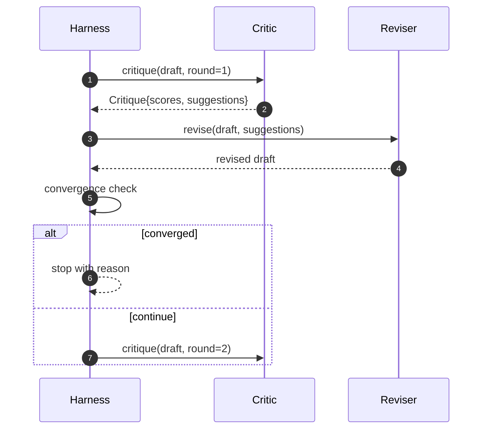

# 评审循环

> 第一次就返回"看起来不错"的评审是坏的。永远返回"还需修改"的评审也是坏的。有趣的评审是会收敛的那个，而你得工程化地实现收敛。

**类型：** Build
**语言：** Python
**前置要求：** 第19阶段第50-53课
**预计时间：** ~90 分钟

## 学习目标

- 在五个固定维度上给论文草稿打分：clarity（清晰度）、novelty（新颖性）、evidence（证据）、methodology（方法论）、related-work（相关工作）。
- 将每轮评审意见作为结构化 revision diff 来应用，而不是自由格式的重写。
- 通过跨轮次比较分数来检测收敛；在 plateau、达到目标或预算耗尽时停止。
- 用 max-iteration 预算封顶轮次，防止不收敛的评审永远跑下去。
- 输出 per-round trace，下游仪表盘或下一阶段可以用它来渲染分数轨迹。

## 为什么是五个固定维度

自由格式的评审就是模型返回一段建议文字。下一轮修改把这段文字当成环境上下文。修改是否回应了批评，无法验证——因为批评本身从来没有结构。

五个维度给 harness 提供了契约。



分数是一个向量。Harness 跨轮次观察每个维度。一次修改提高了 clarity 但拉低了 evidence，那就是 evidence 上的退步，收敛检查看得到。纯模型评审给不了这种保证。

## Critique 的结构



每条 suggestion 带有它改进的维度、它针对的 section，以及一条 `edit` 指令供 reviser 应用。Reviser 也是一个 callable。本课附带一个确定性 reviser，把 edit 指令解释为 append-to-section 操作。模型驱动的 reviser 会把同一字段解释为 prompt。契约不变。

## 收敛规则（按顺序）

当以下三个条件中的任何一个触发时，critic loop 终止。



Target 是最严格的情况：五个维度（clarity、novelty、evidence、methodology、related_work）每一个都必须达到 `>= target_score`（默认 `8.0`），循环才算成功返回。均值高但有一个维度弱是不够的。Plateau 检测比较当前轮次均值和上一轮次均值。如果连续两轮改善低于 `plateau_epsilon`（默认 `0.1`），循环以 `plateau` 退出。Budget 是轮次的硬上限（默认 `5`），以 `budget` 退出。

顺序很重要。Target 优先于 plateau，plateau 优先于 budget。如果第三轮同时命中 target 和 plateau，结果是 `target`，不是 `plateau`。

## 为什么 plateau 检测要跨两轮

单轮 plateau 是噪声。真实的评审每次迭代都会返回略有不同的分数——即使是确定性打分也取决于哪些 suggestion 被应用了、以什么顺序。要求连续两轮 plateau 才能过滤掉这种噪声。如果 harness 报告了 plateau，说明草稿确实停止了改善。

## 本课的确定性评审

本课不调用模型。附带的评审是一个 callable，基于三个信号给草稿打分：平均 section body 长度（clarity）、figure 数量和 citation 数量（evidence），以及 paper metadata 上的 `originality_tag` 字段（novelty）。Reviser 知道如何推高每个分数。

```text
clarity      grows when the average section body length increases
novelty      grows when originality_tag is set to "high"
evidence     grows when a section's figure_refs is non-empty
methodology  grows when a section titled "Method" exists with body
related-work grows when a section titled "Related Work" exists with body
```

Reviser 将每条 suggestion 解释为定向追加。第一轮之后，harness 可以观察到分数上升。测试利用这个性质断言循环缩小了差距。

## 完整 loop 契约



Harness 拥有轮次计数器、trace 和收敛检查。Critic 拥有分数。Reviser 拥有 diff。三者都不碰彼此的状态。

## Trace 输出

每轮输出一个 trace 事件，包含轮次号、分数向量、suggestion 数量和收敛判定。完整 trace 和最终草稿一起返回。下游仪表盘可以渲染 score-per-round 图表。下一课——iteration scheduler——读取这个 trace 来决定分支是否值得保留。

## 防范坏评审的预算

一个产出的 suggestion 从不改善分数的评审，会把循环锁在 max-iteration 上限。Trace 让这件事可见：五轮，分数持平，verdict 为 `budget`。用户读到的是评审有 bug，不是草稿有 bug。另一种做法——只展示最终草稿——隐藏了诊断信息。Trace-first 设计把它暴露出来。

## 怎么读代码

`code/main.py` 定义了 `Critique`、`Suggestion`、`Critic` protocol、`Reviser` protocol、`CriticLoop`，以及一个 `make_deterministic_critic_pair` 工厂函数，返回确定性评审和匹配的 reviser。内含一个最小化的 `Paper` 结构，使本课可以独立运行。

`code/tests/test_critic_loop.py` 覆盖了：第一轮后的单调改善、调优草稿上的 target 收敛、两轮持平后的 plateau 检测、无 suggestion 改善时的 budget 耗尽、reviser 的 suggestion 应用，以及 trace 结构。

## 更进一步

真实实现会想要两个扩展。第一，维度权重：workshop 论文对 novelty 的权重高于 methodology；journal 论文反过来。收敛检查变成加权均值。第二，配对评审：一个评审打分，另一个评审在 reviser 看到之前裁决 suggestion。两者都有价值，都在同一个 `Critique` 结构上组合。

赌注就是分数向量。一旦评审结构化了，所有其他改进——收敛规则、仪表盘、配对评审——都可以直接接入而不改变循环本身。
