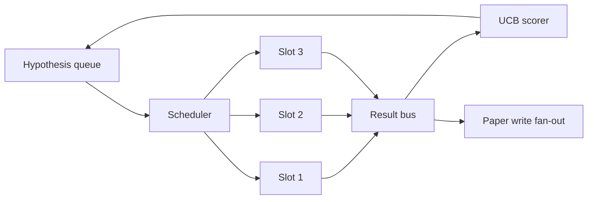
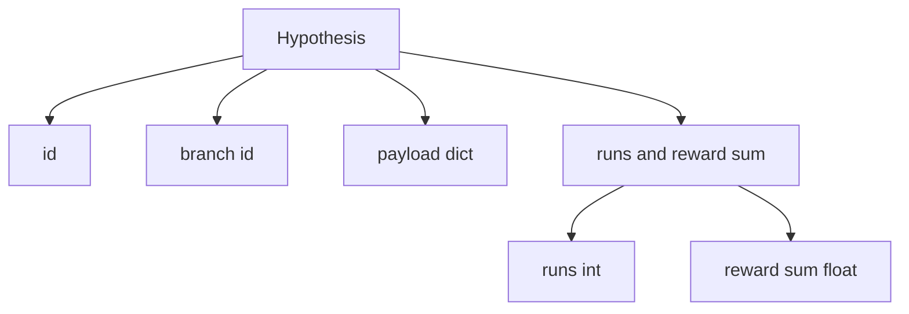
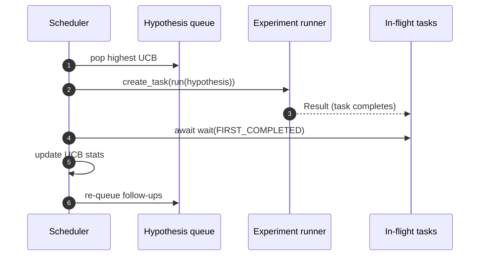

# 迭代调度器

> 没有调度器的研究循环就是一个自我感觉良好的队列。调度器是循环决定停止探索什么的地方，而这个决定就是全部。

**类型：** Build
**语言：** Python
**前置要求：** 第19阶段第50-53课
**预计时间：** ~90 分钟

## 学习目标

- 将研究工作流建模为假设队列，喂入并行实验 slot，结果再扇入回来。
- 用 asyncio 并发运行多个实验，让调度器保持所有 slot 繁忙。
- 用 UCB 给每个假设分支打分，让调度器可以剪枝低产出分支而不放弃探索。
- 将完成的结果扇出到论文写作阶段和重新入队阶段，使高产出分支能生成后续假设。
- 输出 per-iteration trace，包含分支分数、slot 占用率和剪枝决策。

## 为什么是调度器，不是工作列表

扁平的工作列表按提交顺序跑任务。在每个任务独立时这没问题。研究不是独立的：实验三的发现会改变实验四和五的优先级。一个能读取结果扇入并重新排序队列的调度器，在单位算力内产出更多有用工作。

有趣的设计选择是评分规则。贪心评分器总是选当前领先者，永远不探索。均匀评分器永远不利用。UCB（upper confidence bound，上置信界）是中间路线：利用领先者的同时，为尝试次数少的分支保留容量。

## 系统结构



队列持有假设。当 slot 空闲时，调度器选 UCB 最高的假设。每个 slot 异步运行一个实验。完成的实验将结果扇到 bus 上。Bus 更新来源分支的 UCB 统计量，并在分支产出超过阈值时扇出到论文写作阶段。

## Hypothesis 的结构



`branch` 是 UCB 统计的 key。多个假设可以共享一个 branch（branch 是研究方向；hypothesis 是该方向内的一次试验）。`runs` 是该分支已完成实验的计数，`reward_sum` 是累积奖励。UCB 读取两者。

## UCB 评分

本课使用的 UCB 公式是经典的 UCB1。

```text
ucb(branch) = mean_reward(branch) + c * sqrt( ln(total_runs) / runs(branch) )
```

`total_runs` 是所有分支已完成实验的总数。`c` 是探索权重；本课默认 `sqrt(2)`。零次运行的分支得到 `+inf`，所以未试过的分支总是被优先调度。高均值奖励的分支保持高分，直到其他分支追上来；跑了很多次但奖励不高的分支会被试验更少的替代者超越。

剪枝 gate 和选择器是分开的。当分支的均值奖励低于绝对下限（默认 `0.2`）且至少跑了 `prune_after_runs` 次试验（默认 `3`）后，剪枝将其从未来调度中移除。这保持了队列有界。

## asyncio 并行 slot

调度器用 `asyncio.create_task` 驱动实验。每个 task 运行实验 runner（一个 `async def` callable），返回一个 `Result`。主循环用 `asyncio.wait(..., return_when=asyncio.FIRST_COMPLETED)` 等待 in-flight 任务集合，每次完成时触发评分更新。



三个 slot 并发运行。主循环从不阻塞在单个实验上。调度器在 slot 空闲后立即启动新任务，直到队列为空且没有 in-flight 任务为止。

## 扇出：论文触发

当分支的均值奖励超过 `paper_threshold`（默认 `0.7`）且该分支尚未产出论文时，调度器将一个 `paper.trigger` 事件扇出到输出列表。在下游，第54课的 paper writer 会拾取这个事件。在本课中，trigger 被捕获为列表，供测试断言使用。

## 扇出：后续假设

当高产出结果落地时，调度器可以调用用户提供的 `expander` 来产出同一分支上的一个或多个后续假设。Expander 是从 `Result` 到 `list[Hypothesis]` 的纯函数。本课附带一个确定性 expander，对奖励超过 paper threshold 的结果产出两个后续假设。

## 预算

两个预算保护调度器免于失控循环。

```text
max_experiments    : total count of experiments run across all branches
max_seconds        : wall-clock cap (asyncio time)
```

任一触发时，调度器停止调度新任务，等待 in-flight 任务完成，然后返回最终 trace。Trace 包含一个 `stop_reason`。

## Trace 和最终报告

每个调度决策（pick、dispatch、result、prune、fan-out）输出一个事件。最终报告汇总 per-branch 统计、总运行次数、总挂钟时间和已触发的论文 trigger。下一课——端到端 demo——读取这个报告来驱动 paper writer。

## 怎么读代码

`code/main.py` 定义了 `Hypothesis`、`Result`、`BranchStats`、`IterationScheduler`，以及一个 `make_deterministic_runner` 工厂函数，返回一个具有可预测奖励的 asyncio 实验 runner。Runner sleep 固定的 `delay_ms`（默认 `5ms`），使并发可观测。

`code/tests/test_scheduler.py` 覆盖了：UCB 优先选择未试过的分支、并行 slot 占用率、阈值超过时的论文触发、低产出试验后的分支剪枝、扇出后续假设，以及预算退出（实验计数和挂钟两种）。

## 更进一步

真实实现会想要三个扩展。第一，跨会话持久化 UCB 统计：当前统计在内存中；真正的调度器需要做 checkpoint，这样重启后不会浪费已经花掉的探索预算。第二，多目标评分：不用标量奖励，每次结果输出一个向量，UCB 变成 Pareto 风格的选择器。第三，上下文 bandit：选择器根据假设特征（长度、复杂度）做条件化，让相似假设共享探索。

调度器是研究超越工作列表的地方。一旦 UCB 接通、slot 并行运行，所有其他改进都在此之上组合。
