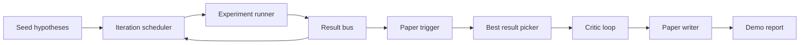
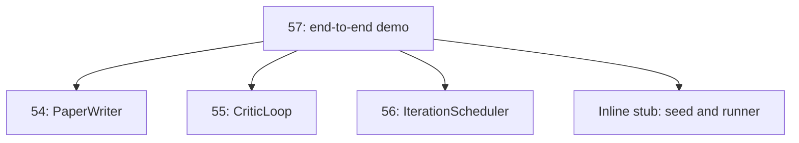
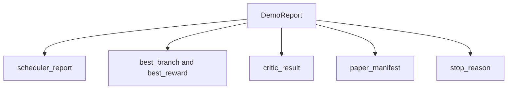

# 端到端研究 Demo

> Demo 是你之前写的每个契约都必须组合在一起的地方。如果其中任何一个泄漏了，这课就是抓住它的那一课。

**类型：** Build
**语言：** Python
**前置要求：** 第19阶段第50-53课
**预计时间：** ~90 分钟

## 学习目标

- 端到端串联自动研究循环：hypothesis seed、experiment runner、scheduler、critic loop、paper writer。
- 通过普通 Python import 组合前面四课 Track D 的原语，不用框架。
- 运行循环到自终止，输出一份 demo report 列出每个阶段的输出。
- 保持 demo 确定性，测试套件可以断言最终形状。
- 当任何阶段的契约被打破时，暴露清晰的失败模式，使下一阶段不会用坏掉的输入运行。

## 这里组合了什么



五个阶段。Seed 是三个假设的列表。Scheduler 在三个并行 slot 上跑六个实验。Bus 报告一个或多个论文触发。Picker 选出单个最佳结果。Critic loop 在基于该结果构建的草稿上迭代。Paper writer 输出最终的 LaTeX、BibTeX 和 manifest。

## 为什么用 import，不是 copy

前面每课附带一个 `main.py`，里面有公开的 dataclass 和函数。Demo 通过调整 `sys.path` 到每课的父目录来 import 它们。这不是框架接线——和前面课程的测试文件已经在用的 import 方式一样。



Inline stub 代替了第50到53课：一个小型的种子假设生成器和一个同步奖励函数。用户可以通过调整两个 import 把 inline stub 换成那些课的真实原语。

## 确定性保证

Demo 在构造上就是确定性的。Experiment runner 用 seeded numpy。Critic loop 的 reviser 按固定维度、固定顺序遍历。Paper writer 的 prose generator 是第54课的 mock 版本。Scheduler 的 UCB picker 按迭代顺序打破平局，不靠随机选择。

给定相同的 seed，demo 输出相同的 report。测试通过运行 demo 两次并比较 manifest 来断言这个性质。

## Demo report 的结构



每个字段原样来自上游阶段。Demo 不变换任何输出；它组合它们。这就是 demo 要测的东西。

## 失败模式处理

每个阶段要么成功，要么抛出 typed error。

```text
Scheduler ........ returns SchedulerReport with stop_reason
                   in {queue_empty, max_experiments, deadline}
Best-result pick . raises NoTriggerError if no paper trigger fired
Critic loop ...... returns LoopResult with status converged or stopped
Paper writer ..... raises PaperValidationError on contract break
```

任何阶段的失败都会让 demo 短路，抛出 typed exception。测试固定了这个契约：`test_no_triggers_raises_typed_error` 和 `test_best_picker_raises_when_no_triggers` 断言 picker 在没有分支触发 trigger 时抛出 `NoTriggerError` / `BestResultError`，writer 永远不会被调用。

## Best-result picker

Scheduler 按分支输出论文触发。Picker 在所有触发中选择均值奖励最高的分支。平局按 branch id 字母序打破，保证 demo 确定性。Picker 是一个小型纯函数；测试在固定的 scheduler report 上固定了它的行为。

## 接入 critic loop

第55课的 critic loop 操作 `MiniPaper`。Demo 从选中的分支构建 `MiniPaper`：abstract 用 branch id 填充，seed 两个 section（Introduction 和 Results），`originality_tag` 根据分支均值奖励设置（`>= 0.8` 为 high，`>= 0.6` 为 medium，否则 low）。

然后 reviser 迭代草稿直到收敛。输出送入 paper writer。

## 接入 paper writer

第54课的 paper writer 操作完整的 `Paper` 结构，包含 figure 和 bibliography。Demo 通过 `mini_to_full_paper` 将收敛后的 `MiniPaper` 升级，为选中的分支附加一个 figure，并从 critic 建议的 cite key 并集构建一个小型合成 bibliography。Demo 添加的每个 cite 也会加入 bibliography 列表，确保验证通过。

## 怎么读代码

`code/main.py` 定义了 `BestResultError`、`NoTriggerError`、`DemoReport`、`pick_best_branch`、`build_mini_paper`、`mini_to_full_paper` 和 `run_demo`。文件顶部的 import 一次性调整 `sys.path`，从各课拉取 `PaperWriter`、`CriticLoop` 和 `IterationScheduler`。

`code/tests/test_e2e.py` 覆盖了：demo 端到端运行并输出包含全部五个字段的 report、两次运行的确定性、没有分支超过阈值时的 NoTriggerError、writer 契约打破时的 PaperValidationError、paper manifest 包含选中分支的 figure，以及 scheduler stop reason 是期望值之一。

## 更进一步

三个值得在 demo 跑绿后接入的扩展。第一，持久化状态：每个阶段的结果写入小型 JSON store，重启后可以恢复而不用重跑便宜的阶段。第二，仪表盘：scheduler 和 critic loop 的 trace 事件渲染为一条时间线。第三，真实模型调用：把 mock prose generator 和确定性 critic 换成模型驱动的版本；接线不变。

Demo 的任务是证明组合就是架构。五课、四个 import、一份 report。下次你添加一个阶段，接线只多一行。
